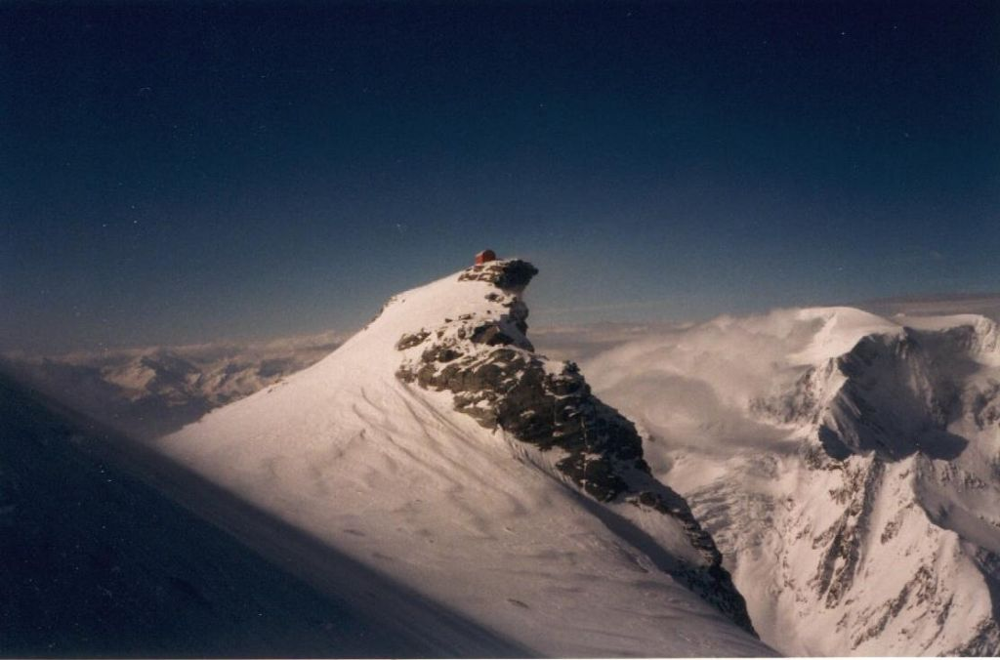
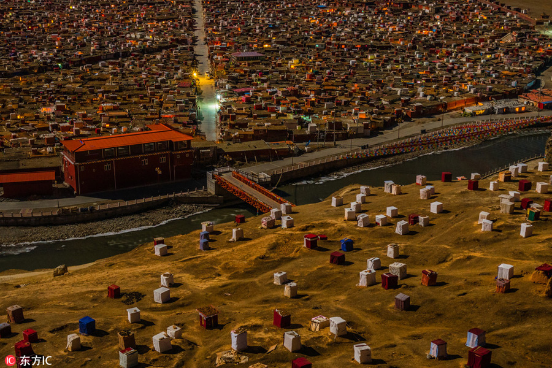

## Подушка, постройка, помещение, павильон, площадка, пристройка, подиум, палатка, пещера, покои, парапет, пьедестал, палисад, парк, плот, палуба, платформа, помост, площадь…

В бурлящих мегаполисах жизненно необходимы тихие спокойные пространства для того, чтобы уединиться и немного побыть наедине с самим собой, со своей внутренней сущностью. В парках и скверах нужны места для спокойного созерцания природных уголков, а на просторах полей и в глубине лесов такие помещения могут стать укрытием и временным местопребыванием людей, решивших посвятить некоторое время размышлениям и духовным практикам.

