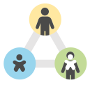
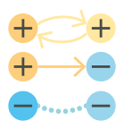
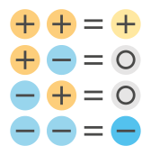
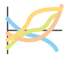
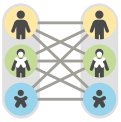
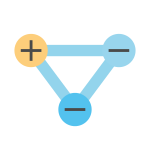
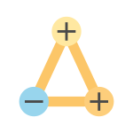
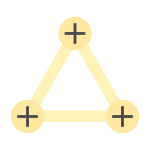
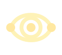
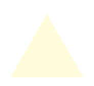

На основе наблюдений, описанных Эриком Берном и рядом других психотерапевтов в начале 1960-х годов был разработан новый инструмент изучения человеческой психики и работы с ней — транзакционный анализ. Это психологическая модель описания, анализа и трансформации поведения человека, включающая философию, теорию и методы, позволяющие людям понять самих себя и особенности своего взаимодействия с окружающими.

===

Ключевые философские предпосылки теории:

- С людьми все в порядке. Поэтому каждая личность подлинна, важна и достойна равного уважения.
- Положительное подкрепление усиливает ощущение этого.
- У каждого человека внутри есть ядро, способное любить и желающее положительного развития.
- Каждый (за исключением больных с сильными травмами мозга) имеет способность мыслить.
- Каждая из множества граней личности имеет для нее какой-то положительный смысл.
- Люди сами определяют свою историю и судьбу, поэтому эти решения могут быть изменены.
- Все эмоциональные трудности излечимы.

Основные модели и концепции Берна можно разделить на 4 категории:

- **Структурный анализ** индивидуальной психики,
- **Транзакционный анализ** межличностных взаимодействий на основе структурного анализа участвующих в них личностей,
- **Анализ игр** — повторяющихся последовательностей взаимодействий, ведущих к результатам, подсознательно одобряемым их участниками.
- **Анализ сценария** — жизненного плана, который может включать долгосрочное вовлечение в определенные игры с целью достижения жизненных целей человека.

Транзакционный анализ — это рациональный метод понимания поведения человека, основанный на заключении, что каждый человек может научиться доверять себе, думать за себя, принимать самостоятельные решения и открыто выражать свои чувства. Его принципы могут применяться на работе, дома, в школе, с соседями — везде, где люди имеют дело друг с другом.

Модель включает в себя 4 ключевых элемента:

- **эго-состояния** как роли, в которые играют люди,
- **транзакции** как единицы общения, состоящие из стимула и реакции,
- **жизненные позиции**, определяющих общее отношение человека к себе и окружающим,
- **сценарий** как план жизни, сформированный нами еще в детстве и определяющий «судьбу» человека

## Эго-состояния

Краеугольным камнем транзакционного анализа является положение о том, что один и тот же человек, находясь в некоей определенной ситуации, может функционировать, исходя из одного из трех эго-состояний, чётко различимых одно от другого.

Кратко их можно охарактеризовать следующим образом:

- **ребенок** — поведение, основанное на эмоциях и бессознательных реакциях.
- **родитель** — это стереотипы, привитые в детстве;
- **взрослый** — это объективная оценка настоящей ситуации;

В каждом из нас можно выделить эти три ключевых позиции восприятия себя и окружающего мира. В процессе взаимодействия с окружающим миром они могут быстро и часто меняться, или даже проявляться одновременно.

### Ребенок ("archaeopsyche")

Ребенок содержит в себе все побуждения, которые возникают в детстве естественным образом. Оно несёт живой интерес человека к исследованию окружающего мира, игре и самовыражению. Это состояние содержит также запись ранних детских переживаний (до 7 лет), реакций и позиций в отношении себя и других. Это выражается как «старое» (архаическое) поведение детства. По сути, Ребёнок – это тот кусочек детства, который нам удается сохранить до глубокой старости.

Детское эго-состояние у взрослых проявляется лишь мимолетно, так как вести себя по-детски не принято. Тем не менее детские проявления можно наблюдать в некоторых ситуациях, как правило связанных с сильными эмоциональными переживаниями.

В детском эго-состоянии человек тяготеет к употреблению коротких слов и междометий вроде «ого!», «здорово!», «фу ты!» и произносит их тонким детским голосом. Он принимает характерные для ребенка позы и жесты: опущенная голова, поднятые кверху глаза, косолапость. Сидя, он съезжает на край сиденья, раскачивается на стуле, ерзает или горбится. Прыжки, хлопанье в ладоши, громкий смех и крики — все это принадлежит к репертуару детского эго-состояния.

И это выходит за пределы наблюдаемого поведения, так как в такой момент взрослый человек не только ведет себя, но и воспринимает мир как ребенок.  Мы способны забыть о возрасте, до слезинок хохотать над удачной доброй шуткой, испытывать детский восторг от ощущения единства с природой и её энергиями. Мы готовы расплыться в широкой улыбке, отыскав единомышленника, беспричинно любить окружающих, находить смысл во всем, что происходит с нами и вокруг нас.

> «Ребенок проявляется в одной из двух форм. Приспособленный Ребенок проявляется в поведении, которое является производным от Родительского влияния и выглядит как послушание или замкнутость, уход. Естественный Ребенок проявляется в автономных формах поведения, таких как мятежность или потакание самому себе. Он отличается от независимого Взрослого преобладанием архаичных мыслительных процессов и другим типом проверки реальности. Нормальная функция «здорового» Ребенка – мотивация обработки данных и программирование Взрослого таким образом, чтобы получить максимальное удовлетворение». _Эрик Берн «Транзакционный анализ в психотерапии»_

Пока мы сохраняем в себе естественного Ребёнка, мы способны не только воспринимать жизнь, но удивляться и искренне радоваться её проявлениям.

Приспособленный Ребёнок – это постоянные сомнения и комплексы. Его легко определить в окружении по «маске Жертвы» – постоянно озабоченному и тревожному выражению лица. Обычно эта маска полностью соответствует его внутреннему состоянию – напряжения, боязни сделать лишний или неверный шаг, сомнения, борьбы с самим собой по любому, даже самому незначительному поводу. Жизнь для него – это движение по заранее определенной траектории, причем то, какой будет эта траектория чаще выбирает не он.

Ребенка младше года во взрослом встретить трудно, если же это произошло, значит у этого человека серьезные трудности. У «нормальных» взрослых людей такой маленький Ребенок проявляет себя в случае сильного стресса, сильной боли или большой радости. В этом эго-состоянии неудачи переживаются очень остро, нередко с обвинениями в адрес окружающих людей и обстоятельств, с неспособностью усвоить полученный опыт и с накоплением в себе эмоций и обид.

Пребывая в этом состоянии в любом возрасте мы позволяем себе счастье оставаться естественными – восторженными и милыми, радостными и печальными или упрямыми и покладистыми – такими же, какими были в своём детстве. Спонтанность, интуицию, искру творчества – ярче всего проявляющиеся в детском возрасте, мы переносим во взрослую жизнь и вновь проявляем в этом состоянии.

### Родитель ("exteropsyche")

Родитель — это взгляд через призму перенятых извне установок и моделей поведения. Внешне это часто выражается в предубеждениях, критическом и заботливом поведении по отношению к другим. Внутренне они переживаются как старые родительские назидания, которые продолжают влиять на нашего внутреннего Ребёнка. Человек часто оказывается в состоянии Родителя, когда выполняет привычную последовательность действий, каждое из которых совершает без раздумий, «на автопилоте». В такой ситуации достаточно контролировать соответствие заранее известным шаблонам поведения.

Родитель проявляет себя в нашей способности делать что-то автоматически, в общих фразах и в манерах. Он любит констатировать: «Нельзя», «Необходимо», «Должен».

Человек, в состоянии которого жестко доминирует эго-родитель, легко впадает в другую крайность: пытается везде и всегда контролировать ситуацию. В случае неудачи, корит и пилит себя по любой причине, во всём, что с ним происходит, ищет и находит свою вину.

Если подобный сценарий преобладает годами и десятилетиями, он становится причиной психосоматических расстройств. В этом случае состояние Родителя проявляет себя как деструктивное и протекает с тяжелыми последствиями. Пока родитель существует, сбежать от его контролирующего влияния на уровне закладываемых в детстве родительских программ-предписаний личность не сможет. Единственный способ вырваться из оков – переписать устаревшие родительские программы.

**Заботливый Родитель** – «живущий» в вас или в окружающих – это одно из самых счастливых состояний, которые может проявлять и испытывать человек. Он способен помогать, прощая ваши обиды и несовершенства. Он находит в этом удовольствие, поэтому такая помощь всегда окажется вовремя и воспринимается естественно, без напряжения. Всё что требует взамен Заботливый Родитель – это чуточку внимания к своей персоне.

**Контролирующий Родитель** всегда и везде стремится «вышибить клин клином». Человек в этом состоянии будет снова и снова обращать внимание на ваши ошибки и слабости, подчеркивать своё превосходство и наставлять на путь истинный по поводу и без повода. Такой Родитель готов считать ребёнка взрослым лишь тогда, когда ребёнок в полной мере начинает выполнять родительский сценарий.

Контролирующее состояние Родителя исполняет функцию совести и воздействует на человека даже в те моменты, когда его внешнее поведение определяют состояния Взрослого или Ребёнка. Зачастую, состояние «Родителя» используется в качестве модели при воспитании собственных детей. Поэтому новоиспечённый родитель, как правило, ведёт себя так же как с ним вели себя его родители. Если его ругали за разбитые тарелки, вскоре и он начнёт ругать своих детей. Эта реакция у него будет автоматическая, ему нужно учиться останавливать себя и включать внутреннего Взрослого.

### Взрослый ("neopsyche")

В состоянии Взрослый человек оценивает окружение и происходящее с ним объективно, способен просчитать вероятность и возможность тех или иных событий исходя из накопленного опыта. Находясь в этом состоянии, человек живёт по принципу «здесь и сейчас», обмениваясь с миром чувственной и логической информацией подобно компьютеру – в режиме реального времени. В состоянии Взрослого пребывает пешеход, переходящий улицу, хирург, проводящий операцию, или ученый, делающий доклад. Главные слова у Взрослого: «Это целесообразно», «Могу – не могу», «Давайте посчитаем», «Где польза?», «Давай обсудим ситуацию», «Можно найти правильное решение».

Взрослое эго-состояние — это компьютер, бесстрастный орган личности, который собирает и обрабатывает информацию и прогнозирует ситуацию. Взрослый собирает данные о мире с помощью органов чувств, обрабатывает их логической программой и, если это необходимо, выдает прогноз. Он воспринимает мир через диаграммы. В то время как Ребенок воспринимает мир в цвете и только с одной точки зрения, Взрослый видит мир черно-белым и наблюдает его с нескольких точек зрения одновременно. Во взрослом эго-состоянии человек временно отключается от своих эмоциональных и других внутренних реакций, так как они мешают объективно воспринимать и анализировать внешнюю реальность. Таким образом, в состоянии Взрослого у человека «нет чувств», хотя при этом он может осознавать чувства своего Ребенка или Родителя. Родительское эго-состояние часто путают со Взрослым, особенно если Родитель спокоен и внешне ведет себя рационально. Тем не менее Взрослый не только рационален, у него еще и отсутствуют чувства.

Состояние Взрослого предполагает адекватную оценку действительности и своих поступков, принятие ответственности за каждый из них. В позиции Взрослого человек сохраняет возможность учиться на своих ошибках и использовать накопленный опыт для дальнейшего развития. Он не распинает себя за допущенные промахи, а принимает ответственность и идёт дальше.

Вместо того, чтобы тащить за собой тяжкий эмоциональный хвост ошибок и поражений, он использует новый шанс и находит верный путь для их исправления с минимальными энегозатратами. С другой стороны, находясь под постоянным контролем со стороны Родителя и Ребёнка, Взрослый теряет способность принимать взвешенные решения. И тогда весь свой заработок за полгода Взрослый, попавший под влияние Ребёнка, потратит на пышное празднование дня рождения.

Зрелой личностью можно назвать человека, в поведении которого доминирует позиция Взрослого. Если с годами позиции Родителя или Ребёнка остаются доминантными, мироощущение и поведение человека в социуме перестают быть адекватными. Личности, претендующей «на зрелость», следует сбалансировать все три исходных состояния и сознательно сместить акцент на позицию Взрослого.

Вместе с тем, как считает Эрик, даже развив в себе конструктивную доминанту Взрослый, и достигнув искусства сдерживать свои эмоции, полностью и жестко изолировать в себе Ребёнка и Родителя не продуктивно. Время от времени они должны проявляться хотя бы для того, чтобы в нашем «жизненном супе» всегда хватало соли, перца и здоровой самокритики.

Все три состояния важны для межличностных взаимоотношений и выполняют определенные функции:

-  **Задача ребенка** — это созидание, создание эмоциональной картинки желаний, которая будет стимулом для дальнейшего развития. Ребенок действует спонтанно, творит, рождает идеи.
- **Задача родителя** — опека, обучение, наставление. Контроль за соблюдением правил, оказание помощи, конструктивная критика.
- **Задача взрослого** — приспособление к настоящей ситуации, поиск решения, конструктивный диалог. Другими словами он должен действовать в соответствии с объективной реальностью.

Например, принятие решения происходит следующим образом:

- ребенок испытывает желание что-то получить, чувствует эмоции;
- взрослый ищет пути решения задачи;
- родитель следит за правильностью выполнения, критикует, направляет, оценивает.

## Транзакции

Транзакция — это единица социального действия, которая состоит из стимула и реакции. Например, стимул: «Привет!», реакция: «Привет! Как дела?». Во время общения (обмена транзакциями) наши эго-состояния взаимодействуют с эго-состояниями нашего партнёра по общению. Эрик Берн определил минимальную единицу проявления внимания одного человека к другому и называл её «поглаживанием».

Зная, от имени какого из наших «Я» мы ведём беседу и на какую реакцию собеседника можем рассчитывать, мы можем влиять на конечный результат и качество общения. А психологическая гибкость, состоящая в умении адекватно оценивать ситуацию и передавать управление какой-либо одной стороне личности – залог нашего психического и физического здоровья.

Умение правильно использовать свои мысли, интонации, слова, выражения в повседневных диалогах – это величайшее искусство налаживать обратную связь с собеседником, слушать и слышать то, что он хочет донести или, напротив, скрыть. Овладеть этим редким умением, необходимым в сбалансированной и счастливой жизни призван помочь транзакционный анализ.

Транзакции бывают трёх видов:
- **Дополняющие, или параллельные**, (англ. reciprocal/complementary) — это транзакции, при которых стимул, исходящий от одного человека, непосредственно дополняется реакцией другого. Например, стимул: «Который сейчас час?», реакция: «Без четверти шесть». В данном случае взаимодействие происходит между людьми в одинаковых эго-состояниях (Взрослого).
- **Пересекающиеся** (англ. crossed) — направления стимула и реакции пересекаются, данные транзакции являются основой для скандалов. Например, муж спрашивает: «Где мой галстук?», жена с раздражением отвечает: «Я всегда у тебя во всём виновата!». Стимул в данном случае направлен от Взрослого мужа к Взрослому жены, а реакция происходит от Ребёнка к Родителю.
- **Скрытые** (англ. duplex/covert) транзакции имеют место, когда человек говорит одно, но при этом имеет в виду совсем другое. В этом случае произносимые слова, тон голоса, выражение лица, жесты и отношения часто не согласуются друг с другом. Скрытые транзакции, являются почвой для развития психологических игр. Теория психологических игр была описана Эриком Берном в книге «Игры, в которые играют люди». Анализ игр — это один из методов, используемых транзакционными аналитиками.

## Позиции

Берн писал, что «любая игра, сценарий и судьба человека основана на одной из этих четырех основных позиций». Он считал, что сперва идут самые ранние детские решения, а затем ребенок принимает жизненную позицию, создавая тем самым картину мира, которая оправдывает эти ранние поступки.

### Я — ОК, ты — ОК
**Успешная сотрудничающая позиция**

Ребенок, который выбрал позицию «Я — ОК, ты — ОК», скорее всего выберет сценарий победителя. Он считает, что его любят, и принимает решение о том, что его родители хорошие люди, которым можно доверять, распространяя впоследствии этот взгляд на всех окружающих.

### Я — не ОК, ты — ОК
**Избегающая депрессивная позиция**

Если ребенок избирает позицию «Я — не ОК, ты — ОК», то, скорее всего, он напишет для себя банальный или проигрышный сценарий. Для согласования своей основной позиции со сценарием он построит его вокруг тем, связанных с преследованием и проигрышем другим людям.

### Я — ОК, ты — не ОК
**Параноидная или нарциссическая позиция превосходства**

На первый взгляд, позиция «Я — ОК, ты — не ОК» может быть основой для выигрышного сценария. Однако такой ребенок убежден, что ему необходимо быть первым, при этом принижая других людей. Он может вести себя подобным образом, достигая своих целей лишь путем неустанной борьбы. Параноидный процесс характеризуется восприятием самого себя как «хорошего человека во вражеском окружении», а нарциссический — как «умный человек в мире дураков» (богатый, красивый, благородный и т.д.).

### Я — не ОК, ты — не ОК
**Безнадежная шизоидная позиция**

В этом случае ребенок убежден, что жизнь бесполезна и полна разочарований. Он чувствует себя приниженным и нелюбимым, полагая, что никто не в силах ему помочь, так как остальные тоже не ОК. Таким образом, его сценарий будет разворачиваться вокруг сцен, в которых он отвергает других, а другие отвергают его.

## Сценарии

С чего начинаются проблемы, которыми изобилует наш жизненный путь? Где их исток? Как считает Эрик Берн, возраст принятия ключевого сценарного решения – Я «хороший» или «плохой» – это интервал от 2 до 3 лет. Сначала формируется представление о себе или жизненная позиция личности. До 5-7 лет она участвует в формировании сценария.

Сценарий, закладываемый в этом возрасте, может быть как положительным, так и отрицательным. В первом случае он позволяет реализовать планы: разбогатеть, писать музыку и стать известным композитором или спортсменом, хорошим семьянином или просто счастливым человеком. Во втором – может включить негативные жизненные программы: установку на отсутствие денег, развитие алкогольной и наркотической зависимости и других проблем.

**Сценарий** — это «план жизни, составленный в детстве». Сценарий выбирается ребёнком на основе предложенных родителями или обществом. На выбор сценария влияют как внешние факторы, так и воля ребёнка. Берн приводит случай с двумя братьями, которым мать сказала: «Вы оба попадёте в психушку». Впоследствии один из братьев стал хроническим психическим больным, а второй — психиатром. Согласно теории сценария, каждый из нас уже в детстве знает важные для сценария моменты. Например, количество будущих детей.

**Контрсценарий** — некая последовательность действий, приводящих к «избавлению» от сценария. Контрсценарий закладывается в другом эго-состоянии. К примеру, для сценария «Ты должна страдать» контрсценарием может стать «Твоя жизнь наладится, если ты удачно выйдешь замуж». В данном случае Эрик Берн проводил аналогию контрсценария со «снятием проклятия злой ведьмы» (из сказки «Спящая красавица»).

**Антисценарий** — «сценарий наоборот», может сформироваться при невозможности действовать согласно сценарию. Человек, действующий прямо противоположно своему сценарию, тем не менее всё так же подвержен его влиянию. Сценарий продолжает руководить человеком, но то, что в сценарии нужно было делать хорошо, человек делает плохо, и наоборот. Такое “отрицающее” поведение человека всё так же зависимо от родительских установок и потому предсказуемо.

**Таким образом, антисценарий определяет стиль жизни человека, в то время как сценарий — его судьбу.**

Основные программные компоненты, закладываемые в сценарий формируются родителями до 7 лет. Именно в это время ребенок получает первые впечатления о жизни. Ребенок в этом возрасте, отвечая на важные для него вопросы, составляет свое первое впечатление о себе и мире: какой он, кто он, приятно ли учиться, хорошее ли место школа, можно ли доверять родителям, друзьям, что такое дружба?

Если его первоначальные ожидания обмануты, он разочаровывается в том что не оправдало ожиданий и замыкается в себе. Это не что иное, как защита: если я ограничиваю контакты с миром, то в следующий раз он не сделает мне так больно, а если и сделает, то боль будет намного меньше.

> «Жизненный путь человека – его судьба определяется тем, что происходит в его голове, когда он вступает в противоречие с внешним миром. Свобода дает ему возможность осуществлять собственные планы, а сила – вмешиваться в планы других».     Эрик Берн

При достаточном желании и усилиях сценарий можно изменить самостоятельно. Для этого необходимо:

- понять, в чём состоит ваш сценарий;
- научиться распознавать однозначные установки и изменить или избавиться от них;
- стараться избегать ситуаций, предварительно проанализировав повторяющиеся модели поведения, в которых вы неизбежно обречены на поражение;
- получить «разрешение» — отменить сценарий может авторитетный для вас человек.

## Игры в отношениях

Разбирая запутанные отношения между людьми на элементарные транзакции и отслеживая роли, которые принимают на себя участники коммуникации, можно обнаружить общие закономерности в мышлении и общении людей.

Универсальность метода заключается в том, что его можно успешно применять для анализа как внутренних личных, так и внешних социальных процессов. Он помогает обнаружить, что во взаимодействии людей часто возникает пересечение и путаница ролей, а за фасадом вербальных конструкций нередко скрываются скрытые послания, определяющие самые разнообразные психологические игры, в которые играют люди.

> «Основополагающая книга. Блестящий, поразительный каталог психологических спектаклей, которые люди разыгрывают снова и снова. Доктор предоставил исчерпывающие сюжетные линии, которые будут актуальны в ближайшие 10 000 лет». _Курт Воннегут о книге «Игры, в которые играют люди», 1965 г._

В ходе наблюдений исследователи выделили и проанализировали десятки различных игр: как безобидных светских игр вроде «Почему бы вам не… — Да, но..» или супружеской «Видишь, как я старался» до игр преступного мира вроде «Надуем Джо» и игр на всю жизнь: «Алкоголик», «Должник», «Смотри, что я из-за тебя сделал» и прочих.

Развиваясь в кругах практикующих психотерапевтов, модель наполнялась примерами преимущественно патологических ситуаций, с которыми пациенты были вынуждены обращаться за помощью. Обобщая анализ игры «Алкоголик», требующей как минимум трёх ролей, **Стивен Карпман** предложил свой знаменитый драматический треугольник, описывающий структуру различных травматичных отношений, лишенных жизненной энергии.

Дополненная и расширенная открытиями позитивной психологии, преимущественно наблюдающей за здоровыми и счастливыми людьми, эта концепция расширяется до эволюционной лестницы, продвижение по которой говорит о полноценном психологическом взрослении и самореализации человека.

## Импульс — Действие — Оценка

За нулевой уровень развития можно взять структуру сознания маленьких детей и очень небольшого количества взрослых. На этом уровне эго еще не сформировано, поэтому названия сформулированы как качества, а не как личности (Не деятель, а действие).

В нежном детском возрасте до 3-х лет ребенок еще не умеет делить мир на «хорошо» и «плохо». Любое побуждение, не проходя цензуры, тут же претворяется в действие. Эмоции текут свободно, и в теле подавленной энергии нет. Долго раздумывать над результатами своих действий особо некогда, да и нечем, понятийный аппарат не сформирован. Поэтому ребенок легко меняет направление движения и действия: от бабочки – к кубику – к машинке – к маме – к яблоку и т.д.

Энергия идет от Импульса к Действию, а Оценка результатов только формируется, поскольку формируется мышление.

Если он падает, колется, обжигается и получает прочие оплеухи окружающей среды, его Оценка это запоминает и ставит галочку на опасном месте, чтобы пометить, куда лезть в дальнейшем не стоит. Так происходит первоначальный набор опыта – первичное изучение жизни. По некоторым данным человек в этот период получает 90% всех знаний о мире, в котором ему предстоит жить.

Родители (воспитатели) в этот период обеспечивают ребенку условия для выживания и роста. Их задача – не перебрать на себя роль Оценки, что сделает невозможным для ребенка получение своего собственного опыта. Если они принимают решения за него и директивно об этом сообщают, то формируют у него страх перед жизнью, который и приводит впоследствии к тому, что Нулевой уровень развивается не в «+», а в «-».

Пресечение свободной деятельности ребенка в этот период, и дальше – после 3-х лет, когда он начинает осваивать более сложные действия, подражая взрослым, формируют Жертву.

Если же воспитание правильное, то ребенок, как самоорганизующаяся система, будет сам вести себя от одного опыта к другому. Человек идет в «+» и начинает свой Путь Героя, постепенно сам усложняя задачи, с которыми приходится иметь дело. И у него есть все шансы к возрасту своего расцвета (30-40 лет) полностью раскрыть свой потенциал.

## Игра в Спасение
**Жертва — Контролёр (Преследователь) — Спаситель**

Люди от природы склонны к сотрудничеству и обладают глубокой потребностью в совместной деятельности и взаимопомощи. Ситуации, где один человек нуждается в помощи, а другой может ему предложить эту помощь, часты в социальной жизни. Настоящая помощь может быть радостным и глубоко удовлетворяющим опытом сотрудничества, и важно разделить позитивную помощь и неприятный, разрушительный опыт, который можно назвать **игрой в спасение**. Игроки в ней придерживаются мнения, что людям, которые нуждаются в помощи, невозможно помочь, а также что они не могут помочь себе сами.

Начинается это, как правило, в раннем детстве. Если в семье прервано течение любви, ребёнок чувствует, что её ему не хватает. Чувствует себя недолюбленным, лишенным внимания и заботы, оттого несчастным. Он всячески старается быть хорошим ребёнком, послушным, взрослеть, выполнять свои обязанности, но никакие его успехи вниманием не сопровождаются.

Собственно говоря у ребёнка есть несколько вариантов постараться получить эту любовь. **Первый — это заболеть**. Такие дети очень часть простужаются, болеют ангиной и тому подобными заболеваниями, если, со временем, такая стратегия перестаёт работать, то болезни могут становиться более серьёзными или стратегия меняется. Данное поведение не рождается разумом, это бессознательное ребёнка ищет так нужную ему любовь, и готово выражать этот поиск в физиологическом плане.

Если эта стратегия сработала, то она рождает классическую «жертву». У ребёнка навсегда застывает в мозгу установка «чтобы получить нужное, нужно болеть или чувствовать себя плохо». Для него любовь становится равной жалости. И он, искренне веря в свои проблемы, старается только получать, оставаясь в этом состоянии «больного ребёнка» всю жизнь. В треугольнике Карпмана это и есть роль Жертвы.

**Второй вариант — начать обвинять себя**, считая, что он делает недостаточно. Как конь Боксёр в «Скотном дворе» Оруэлла он говорит «Я должен работать ещё больше». Отсюда и появляются «идеальные люди». Круглая отличница, красавица, общественница. Больше, выше, сильнее. В надежде, что родители оценят рано или поздно и полюбят. Отсюда же берутся люди, которые хотят «помочь всему миру», «догнать и причинить добро». Магическое мышление ребёнка рождает установку «Чем больше я сделаю добра, тем больше я получу в итоге». Почему магическое? Потому что подобная установка в разных вариациях есть во всех религиях. Именно такие люди ищут себе «Жертву», составляя с ней симбиоз. В треугольнике Карпмана они получили название Спаситель.

**Третий вариант — осознать, что «хорошими делами прославиться нельзя»**. Если на меня хорошего не обращают внимания, то может быть обратят внимание на плохого? И ребёнок становится «Плохим». Начинает хулиганить, приносит домой плохие оценки, начинает курить, с возрастом возможно и выпивать. И, зачастую, добивается своего силой или хитростью. В результате он может ощутить себя выше и умнее окружающих и начать в той или иной форме навязывать им свою волю.  Отсюда в треугольнике Карпмана берётся Контролёр.

Позиция Жертвы — беспомощность: «Я не в порядке, Ты в порядке» (я беспомощный и безнадежный; помогите мне). Позиция Спасителя дополняет позицию Жертвы: «Я в порядке, Ты не в порядке» (ты беспомощный и безнадежный, тем не менее я попытаюсь тебе помочь). Позиция Преследователя совпадает с позицией Спасителя: «Я в порядке, Ты не в порядке» (ты беспомощный и безнадежный, и это твоя вина).

Эти роли взаимозаменяемы, как и чувства, которые их сопровождают. В случае Жертвы — это чувство беспомощности и стыда, Спасителя — вины, а Преследователя — чувство гнева. Спасение обычно не удается и ведет к Преследованию. Хотя человек в разное время играет разные роли, у каждого из нас есть своя любимая роль и сопровождающие ее чувства, и эта роль может быть центральной темой всего сценария.

### Жертва

Характерная особенность Жертвы – нежелание брать на себя ответственность. Она убеждена в своей неспособности к самостоятельной жизни и всегда ищет Спасителя, а также часто привлекает себе Преследователя, потому что подсознательно не хочет выходить из своего пассивного положения, так как не хочет быть ответственной за свою жизнь. Если Жертве предлагается совет для разрешения её проблемы, она сразу же отвергает его, т.к. считает свои проблемы неразрешимыми. Из-за отказа от ответственности Жертвы часто страдают различными зависимостями: алкогольной, наркотической, обжорством и др. Это также является некоторым жестом самоотречения, вверения себя другим людям (зачастую – Спасителям), т.к. человек с зависимостью, опять же, не может полноценно о себе позаботиться.

**Основной посыл** Жертвы: «Жизнь непредсказуема и зла. Она все время делает со мной то, с чем я не могу справиться. Жизнь – это страдание».

**Эмоции** Жертвы – страх, обида, вина, стыд, зависть и ревность. В теле – постоянное напряжение, которое трансформируется со временем в соматичекие заболевания.

Жертву периодически засасывают депрессии, когда не хватает смелости пойти в событие, которое родит впечатление. Потому что впечатление заставит принять что-то, интегрировать в личность. Жертва к этому не готова, ее мир жесткий и инертный, она не согласна подвинуться ни в какую сторону. В Жертве – застой и неподвижность, хотя внешне она может суетиться как белка в колесе, быть от этого все время занятой и уставшей.

Роль беспомощной Жертвы связана с постепенной деградацией личности, так как сама она перекладывает ответственность с себя на своего Спасителя и отказывается вести полноценную жизнь.

### Спаситель

Игра в спасителя отличается от подлинного спасения в чрезвычайной ситуации. Как в драматической роли, в попытках спасителя есть что-то нечестное или невысказанное, или, в лучшем случае, смешанный мотив или тяга к тому, чтобы быть спасителем и иметь жертву, которой можно помочь. На самом деле, игра в Спасение тормозит реальное решение проблем и приносит путаницу и страдания, а не решения.

Драматический спаситель играет свою роль в основном из-за того, что он вынужден спасать, чтобы избежать взгляда на свои собственные тревожности и скрытые чувства. Спаситель также может играть свою роль из-за крайне низкой самооценки. В таком случае скрытый мотив его действий понятен: он желает поднять самоценность в своих глазах. Кроме того, спасители зачастую вступают в созависимые отношения, страдают от своего спасательства и считают своим долгом, крестом по жизни спасать даже тех, кто в этом не нуждается. Для Спасителей характерно постоянное чувство вины, самобичевание, обращённость на проблемы других людей в ущерб себе.

Следует отметить, что зачастую у Спасителя никто не просит себя спасти. Его помощь никому не нужна, он не спрашивает у предполагаемой несчастной жертвы, нужно ли её спасать. Такое спасительство также тесно переплетено с нарушением личных границ того, кого пытаются спасти. Кроме того, спасительство отнимает у Спасителя огромное количество ресурсов и сил, не позволяя ему заниматься собственной жизнью. Это наиболее опасная из трёх ролей, т. к. её сложнее прорефлексировать, чем все остальные, потому что на первый взгляд такой человек часто может казаться просто великодушным и эмпатичным.

Причины такого поведения часто уходят корнями в детство человека, в его отношения с родителями. Он или она спасает всех вокруг, желая быть “хорошей девочкой/ хорошим мальчиком”, получить одобрение со стороны своих реальных родителей или внутреннего Родителя, а также является безуспешной попыткой укрепить свою самооценку и самоценность, хотя в действительности, так как Спаситель постоянно пребывает в низкоресурсном состоянии, его самооценка не может быть стабильной.

Спаситель жалеет и спасает Жертву, сочувствует Контролеру. Контролер для Спасителя – тоже Жертва, которая нуждается в понимании и признании заслуг.

В нашем обществе представление о роли Спасителя особенно неадекватно. Поощряется альтруистичное поведение даже с теми людьми, которые обманывают нас, с теми, кто ведет себя эгоистично и несправедливо. Эта доктрина облегчает эксплуатацию рабочих и «маленьких людей» политиками и сверхбогатыми, так как требует от тех, кто «снизу», проявлять добрую волю, желание помочь, трудолюбие и другие качества, удобные для тех, кто «сверху».

Матери и жены особенно плохо понимают, насколько оскорбительным и ненужным бывает спасение. Им всегда внушали, что отказ от исполнения роли Спасителя губителен для Жертвы (на самом деле наоборот). Спасение считается не вредоносным актом (каковым оно на самом деле является), а проявлением альтруизма, щедрости и желания помочь. Причина такого положения дел — в том, что женщин приучают к роли бесплатной рабочей силы, которая предназначена для облегчения участи мужчин. Женам алкоголиков часто бывает трудно принять, что их самопожертвование, готовность терпеть и все прощать не помогают их мужьям, а вредят им.

Спаситель жалеет Жертву за её слабость, Контролера — за тяжелое бремя ответственности. Роль Спасителя «спасает» того, кто ее принял, от положения Жертвы и создает у него ощущение собственной значимости и силы, но это ее единственное преимущество. Каждая акция спасения заканчивается ростом эго Спасителя: «Без меня вы все погибнете!». Он смотрит свысока на Жертву, Контролера и весь мир. Это момент его триумфа – одна из немногих положительных эмоций, которые присутствуют в этом треугольнике.

Однако в теле – все то же напряжение. «Как мне вас жалко!» – фоновая мысль и эмоция Спасителя. Спаситель далек от понимания, что (даже) трагические изменения всегда ведут к развитию. Их нужно принимать и идти навстречу, а не сопротивляться.

### Преследователь (Контролер)

Роль Преследователя неизбежно приходит после того, как сыграны роли Жертвы и Спасителя. Любой, кто помогает человеку, который не хочет помочь себе сам, рано или поздно рассердится на Жертву. Каждый раз, когда человек находится в позиции Жертвы, он прекрасно сознает и свое приниженное положение, и то, что в этом положении его удерживает Спаситель, препятствуя любым самостоятельным действиям со стороны Жертвы. Поэтому любой, кто некоторое время играл Жертву, в то время как его партнер спасал его, тоже рано или поздно разозлится. Следовательно, можно с уверенностью предсказать, что любая транзакция Спаситель—Жертва обязательно превратится в транзакцию Преследователь—Жертва.

Преследователь находится в страхе, раздражении, гневе. Он живет в прошлом (вспоминает прошлые беды) и в будущем («предвосхищает», а на самом деле придумывает новые), в вечном желании «подстелить соломки». Мир для него – тоже юдоль страданий, так же как и для Жертвы. Его основной посыл: «как бы чего не вышло!»

Гнев и страх рождаются от посягательства на границы, ведь мир не устает провоцировать! Но на этом уровне личность панически боится изменений, поскольку считает, что любое новшество не может быть к лучшему.

Контролирующее поведение характеризуется использованием чувств страха, долга и вины для выстраивания жестких границ, которые жертва боится пересечь, чувствует обязанность их соблюдать и испытывает вину при сопротивлении. Зная, что человек нуждается в любви, в признании идентичности или подтверждении чувства собственного достоинства, Контролер может угрожать отказом давать или полностью забрать их, заставляя другого чувствовать, что он должен заработать их в результате соглашения.

Для Преследователя характерно стремление властвовать над другими, доминировать над Жертвами, буквально нападать на других людей. Контролер преследует Жертву, «строит» ее, заставляя исполнять свои предписания, и конечно, ради ее же блага! Жертва не ценит заботы, и это вечный источник конфликтов, как внутренних, так и внешних.

Подсознательно Преследователь испытывает глубочайшее чувство стыда и беспомощности, которое пытаются подавить, преследуя других. Он также не берет на себя ответственность за то, что причиняет боль другим, ибо считает, что те люди заслужили подобного отношения. Проповеди, угрозы, запугивания, многочисленные нравоучения и открытые конфликты – всё это является обыденными действиями Контролера.

Преследователь своим поведением пытается компенсировать свою никчёмность, проецируя её на своих Жертв. Такие люди часто не осознают того, кем они являются, чувствуя себя жертвами. Для Преследователей характерен следующий цикл: “Я просто пытался вам помочь (Спаситель), а вы на меня напали (Жертва), поэтому мне пришлось защищаться (Преследователь)”. Следует отметить, что из этой роли выйти проще всего, т. к. действия Преследователя имеют явную деструктивную природу.

Однако, в этом треугольнике Контролер – центр, где рождаются идеи и движение энергии. Как это происходит? Контролер чего-то пугается (новостей по телевизору, например), и начинает мотивировать Жертву к активным действиям, чтобы завтра не пропасть. Жертва изо всех сил выполняет предписания, устает, страдает. Жалуется Спасителю, и он ее утешает.

«Как я устал заботиться о вас всех!» – вопиет Контролер.

## Драматический треугольник — пространство манипуляций

Находясь в драматическом треугольнике, люди хронически не могут честно сказать, что же им действительно нужно. Почему так? Потому что они приучены «жить для других» и свято уверены, что другие взамен будут жить ради них. За фасадом самоотверженности скрываются эгоистические мотивы, а добиваться своего собственного счастья открыто и честно не позволяют принятые в детстве установки.

Родители и воспитатели  в детстве – нередко принимают роли Контролеров и Преследователей. Как следствие – манипулируют ребенком. Они сами крутятся в этом треугольнике страданий. Они учат ребенка быть удобным, а не свободным.

Конечно, Родитель-Контролер этого не осознает, он искренне уверен, что поступает всегда в интересах детей. Стелет соломки, предупреждает об опасностях, чтобы родное чадо не поранилось и не набило себе шишек. Однако именно раны и шишки — свидетельства реального опыта, который можно потом использовать. А поучения родителей приносят, как правило, лишь заученные фразы и, нередко, желание поступить наоборот.

Причина подросткового бунта – желание ребенка выйти из субличности Жертвы. Даже если бунт будет «жесток и кровав» с уходом из дома, разрывом отношений – это все равно в сторону жизни, в сторону эволюции, а не деградации.

О честности, искренности в игре в Спасение можно только мечтать, потому что люди смертельно боятся показать как настоящие свои потребности, так и актуальные чувства. Об ответственности за свою жизнь тут нет и речи. В несчастьях и негативных эмоциях всегда виноват кто-то внешний. Задача – найти его и заклеймить позором. Тогда человек чувствует, что он не виноват, а значит, по-прежнему может считать себя хорошим.

Важно понять, что основная задача в этих позициях – самоутверждение через «заслуживание» любви. Грусть ситуации в том, что любви они никогда не заслужат, потому что каждый зациклен на себе и не видит остальных. Юмор ситуации в том, что все это происходит не только во внешнем мире, но и во внутреннем. Каждый сам для себя является и Контролером и Жертвой и Спасителем, и по принципу подобия эти фигуры отображаются во внешнем Мире.

Люди, энергии которых крутятся в треугольнике Жертвы (а энергии там ничтожно мало!), не имеют шанса выйти их него, пока не услышат своих настоящих желаний. Каковы они?

- Жертва хочет освободиться и делать то, что она хочет, а не то, что предписывает Контролер.
- Контролер хочет расслабиться и пустить все на самотек и отдохнуть, наконец.
- Спаситель мечтает о том, что все как-то сами разберутся, и в нем не будет нужды. И он тоже сможет расслабиться и подумать о себе.

И всё это с точки зрения общественной морали – радикальный эгоизм. Но с точки зрения конкретного индивидуума ведет к конкретному человеческому счастью. Потому что счастье там, где реализация своих вполне осязаемых потребностей.

Нередко случается так, что Жертва, Контролер и Спаситель вместо боев во внешнем мире начинают обращаться внутрь себя. Это когда обвиняются не внешние враги, а внутренний Контролер начинает преследовать внутреннюю Жертву. «Я сам во всем виноват. Я никогда не могу принять верное решение. Я безответственное ничтожество, слабак и неудачник!»

Жертва может слабо посопротивляться, а потом впасть в депрессию, потому что сама понимает, что так оно и есть. Потом Спаситель поднимает голову и говорит что-то вроде: «Другие еще хуже! А я с понедельника начну новую жизнь, буду делать зарядку, мыть за собой посуду, перестану опаздывать на работу, и буду говорить комплименты жене (мужу). У меня все наладится!». «Новая жизнь» длится пару дней, или недель, но энергии не хватает не претворение в жизнь прекрасных решений, и скоро все скатывается в прежнее болото.

Начинается новый цикл. Контролер преследует Жертву «Опять, как всегда, ты безвольный, безответственный, никчемный…» И так далее. Это тот самый внутренний диалог, от которого так мотивируют нас избавляться все мастера медитации и прочих развивающих практик.

Да, все проблемы внешней жизни всегда сначала решаются внутри. Это происходит с момента принятия решения изменить сценарий. Проблема человека, который крутится в треугольнике драмы в том, что у него не хватает сил, чтобы полезные и радикальные решения претворить в жизнь.

Ресурсы в этом треугольнике скудны, потому что он замкнут на себя, и во внешний мир выходить боится. А конкретная личность имеет весьма исчерпаемые запасы, которые быстро заканчиваются. Особенно во внутренних боях между Жертвой, Контролером и Спасителем. Они активно борются друг с другом, и неудивительно, что люди болеют, теряя энергию и умирая преступно рано.

Треугольник Карпмана – это «раненый ребенок», и не важно, сколько ему лет – 10 или 70. Эти люди могут так никогда и не вырасти. Конечно, они всю жизнь мечутся в поисках выхода, но редко его находят. Для того, чтобы это сделать, нужно взбунтоваться против своих устоявшейся шаблонов поведения, позволить себе быть «плохим» для окружающих, «бездушным и безжалостным эгоистом, который живет только для себя» – (цитата из популярных обвинений Контролера).

Этот новый способ жить (для себя, а не для других) действительно может разрушить отношения с близкими, создать кучу неприятностей на работе и в устоявшемся кругу друзей и знакомых. Это может разрушить всю привычную жизнь! Поэтому для того, чтобы совершить побег от нудной, но предсказуемой безопасности требуется мужество. Человек, которого по-настоящему достало его безрадостное существование, может найти в себе силы. Через страх, вину, агрессию. Приложив усилия, он может перейти на новый уровень. И только тогда по-настоящему начинается его жизнь.

## Герой — Философ — Мотиватор

Второй треугольник, в котором уже гораздо меньше страданий и больше власти. Выйти в него можно только через полярность, когда все три первые субличности трансформируются в свои противоположности. Как выглядит смена на другую полярность?

Жертва трансформируется в Героя, Контролер – в Философа, а Спаситель – в Мотиватора.

Это самое сложное на пути эволюции – резко перейти из треугольника минус в треугольник плюс, потому что сил мало, а инерция тянет назад. Это все равно, что на полном ходу развернуть автомобиль в противоположную сторону. К тому же, всё окружение – против изменений. Оно будут цепляться за ноги и за руки, и вызывать в человеке чувство вины, только бы не дать ему освободиться. Психотерапия посвящена во многом именно этому процессу: вылечить раненого ребенка, который живет внутри личности из треугольника Страданий. И это иногда бывает путь длиною в жизнь.

В поведении переход на следующий уровень становится заметен по таким внешним признакам: человек больше не ведется на манипуляции, а актуализирует (высказывает и выполняет) собственные желания. Отныне его не увлекают чужие цели, и он (даже если его пытаются в них завлекать активно и последовательно, с использованием кнопок вины, обиды, страха и жалости), каждый раз спрашивает себя: «А мне это зачем нужно? Что я получу в результате? Чему я могу научиться, если сделаю то, что предлагается?» И если не находит своего выигрыша от реализации предлагаемой идеи, он в действие не ввязывается.

### Герой

Главная задача Героя – изучение себя и окружающего мира. Эмоции, которые являются для него фоновыми – интерес, азарт, воодушевление, гордость (если подвиг удался). Огорчение, сожаление – если нет. Скука, если случается долгий простой. В чувство вины Герой не впадает (а если это и происходит, то является показателем того, что он регрессировал на предыдущий уровень и превратился в Жертву).

Развитие – деяние сложное, и да, действительно героическое. Все время нужно преодолевать свои вчерашние убеждения, отказываясь от них, чтобы пойти дальше. «Подвиг» может быть во внешнем мире, и во внутреннем, не имеет значения. Масштаб его тоже не имеет значения. Поэтому с первого взгляда не всегда можно определить, Герой перед нами или нет. Но со второго становится понятно, и лакмусовая бумажка – те эмоции, которые он фоново переживает и то, «зависает» ли он в своих темах, или движется. В драматургии существует негласный принцип, по которому главный герой истории определяется по масштабу личной трансформации персонажа по ходу сюжета.

Отдых, осознание и принятие результата своих действий происходит, когда Герой трансформируется в Философа. Это – полярность Контролера из минусового треугольника. Контролер предписывает, преследует, следит за выполнением, Философ принимает все действия Героя, все его результаты.

Причем, следует учитывать, что далеко не все подвиги Героя в окружающем мире будут удачны. Он в своем неуемном воодушевлении ранит окружающий мир и ранится об него сам, иногда довольно болезненно – эмоционально и физически. Он может так «начудить» в азарте познания своих возможностей, что вся его привычная среда обитания вынуждена будет скрипеть и перестраиваться. Поэтому без спокойного философского отношения к своим результатам – никак.

### Философ

Философ, пребывая в спокойствии, замедленности, наблюдении со стороны, уверен в том, что все, что с ним же происходит – к лучшему. Не получили результат, зато получили опыт, который иногда важнее. Здесь трансформируется отношение к Эго. Приходит понимание, что Эго с его желаниями – «вкусно поесть, сладко поспать и жить так, чтобы вызывать зависть окружающих», должно трансформироваться на пути развития. И то, что этот путь тернист и ухабист – нормальное явление. Эго может сильно страдать в процессе – тоже нормальное явление.

Философ отрешенно принимает страдания своего эго, и это ему позволяет принимать себя. Даже если все окружающие говорят «фу, что ты натворил?», его принятие согласуется с  принципом: «если Я натворил, значит, мне это было нужно, и это не ваше дело».

Отрешенность может быть внутренней, незаметной, а может выставляться напоказ и быть дополнительным источником гордости индивида, например, если в его Герое много протестной подростковой энергии. И наличие демонстративности может многое сказать о его внутренней зрелости. Чем больше хочется спорить с миром ради самой энергии спора, тем человек менее зрел.

Зрелый Герой совершает свои подвиги не против кого-то, а потому что он сам так хочет. Его желания могут совпадать с желаниями общества, а могут идти наперекор. Другие для него тем меньше являются критерием, чем выше он стоит на лестнице эволюции.

Функция Философа в этой субличности – анализировать и делать выводы. Если Герой совершает что-то и терпит неудачу, Философ анализирует его действия «что хорошо, что плохо, что сделать так, чтобы завтра было лучше?». И если Героя эта тема по-прежнему интересует, он может повторить свое действие с учетом сделанных выводов. А может не повторять, если уже не интересно. Это зависит от степени его упрямства и от того, лежит ли очередное свершение на выбранном пути. Если нужный опыт извлечен и осмыслен, то можно идти дальше.

### Мотиватор

Третья субличность, которая является в этом треугольнике центром идей, это – Мотиватор. (Он является полярностью Спасителя).

Если Философ видит картину в целом, и как бы сверху, то Мотиватор постоянно находится в поисках вектора. Словно ищет мишень в мире. Наводит прицел, выбирая подходящий объект для самовыражения Героя. И когда находит, обращает на нее пристальное внимание. Его еще можно назвать Мотиватором, потому что он не только подзадоривает Героя в стиле «Слабо?», но и показывает, какие замечательные перспективы откроются перед ним, если подвиг будет совершен, какими лаврами он сможет покрыть свою голову, какой почет его ждет.

Мотиватор не занимается анализом и учетом своих возможностей, это дело Философа и самого Героя. Его задача – дать направление. Это самая непоседливая субличность из всех троих, потому что иногда не дает Герою сосредоточиться на чем-то одном и довести задуманное до конца. В Мотиваторе много детского любопытства и азарта, он очень подвижен и хаотичен. Его любимый вопрос «Что будет, если…?»

В отличие игры в Спасение, где Жертва почти не может сопротивляться Контролеру, у Героя много свободы. Он всегда может отказаться от предложения Мотиватора, или повременить с ним. Если личность достаточно зрелая, то Герой не бросается по первому зову. Он сначала отвечает на вопрос «Что будет, если…?» и насколько может, моделирует будущую ситуацию, соображая, с какими трудностями ему придется столкнуться по ходу дела. Он тщательно готовится, и тогда его действия имеют больше шансов на успех. С каждым очередным опытом он продвигается выше по эволюционной лестнице.

Мотиватор все время находится в состоянии сканирования мира, он ищет неизведанные доселе области, и спрашивает «Как это, почему нас там еще не было? Там может быть интересно!» и это всегда про расширение, развитие, и познание.

Однако, следует понимать, что развитие редко идет и вширь и вглубь одновременно. Поэтому данная стадия – это еще не взрослый, это активный, здоровый подросток. Его задача – идти вширь, изучая себя, свои возможности и мир, в котором можно проявляться. Причем, его акцент – на себе, и для этой стадии это совершенно нормально. О внимании к миру (в том числе окружающим людям), тут еще рано говорить. Но его эмоции и общее состояние уже значительно изменилось по сравнению с минусовым треугольником – в сторону реализованности и счастья.

Большинство людей на планете Земля, увы, в «минус первом» треугольнике. Поэтому Герои, Мотиваторы и Философы в дефиците. И как бы эгоистично они не выглядели, это гораздо более здоровая энергия. Человек, который прочно утвердился в «плюс первом» треугольнике, никогда не останавливается, и его жизнь всегда будет интересна.

В теле тут напряжение ритмично чередуется с расслаблением, и поскольку подавленных эмоций куда меньше (в идеале – почти нет совсем, все сразу актуализируются), то нет необходимости болеть. Да, с телом бывают неприятности, но это скорее от неосторожного обращения – травмы, переохлаждения, перегрев, переутомление и прочие побочные эффекты «подвигов».

## Между Жертвой и Героем — Авантюрист

Переходной стадией между Жертвой и Героем является стадия Авантюриста. Он куда охотнее, чем Жертва откликается на вызовы судьбы. И имеет многие признаки героя – смелость, отвагу, умение переживать лишения и делать выводы, так что с Героем его перепутать очень легко. Но между ними есть одна и существенная разница.

Авантюрист рассчитывает на везение, Герой – на себя. Поэтому победа для Авантюриста – случай или результат хитрой аферы, он любит трудиться поменьше, а получать побольше. Больше брать, чем давать. Он свято верит в удачу, которая неожиданно сваливается на голову и своей задачей считает – поймать ее за хвост. Об адекватном обмене энергией он подозревает, но считает что это для лохов. Или (на более высоком уровне) – для расчетливых, честных, аккуратных, к коим себя не причисляет, хотя втайне уважает и завидует.

Авантюрист пытается плавать в тех водах, где водится крупная рыба, рискуя быть съеденным ею. Но он прекрасно понимает, что основные ресурсы – там, и ему при известной ловкости может перепасть солидный куш. К тому же у масштабных фигур всегда есть чему поучиться.

Жизнь авантюристов полна приключений, они живут в своем мире и не пользуются уважением ни Героев, ни тем более Победителей. Жертвы тоже их не жалуют, но это больше от зависти. Но обаяния авантюристам не занимать. Именно спекулируя им на этой стадии можно продержаться всю жизнь, стать прототипом литературного героя, и даже войти в историю. Но для внутреннего развития лучше быстро отказаться от философии удачи и бесплатного сыра и понять, что честный обмен энергией с окружающей средой куда более надежен и плодотворен.

## Победитель — Созерцатель — Стратег

Люди, живущие в следующем треугольнике – это зрелые взрослые. И это те, кто имеет 90% ресурсов, хотя в мире таких людей не больше 10%. Это – треугольник Победителя.

Герой трансформируется в Победителя, Философ в Созерцателя, Мотиватор в Стратега.

Базовые эмоции Победителя – вдохновение и энтузиазм. Базовая эмоция Созерцателя – благость, покой. И только на этом этапе человек может медитировать, окончательно освобождаясь от внутреннего диалога. Никаких дополнительных усилий для этого не нужно – он прекращается сам собой, потому что на этой стадии развития уже не о чем беспокоиться. В мире Победителей – порядок, в нем можно ничего не улучшать, все и так хорошо. Но энергии тут очень много, и она не стоит на месте долго. Созерцатель рождает идею (именно в Созерцателе – центр идей в этом последнем треугольнике), и отправляет ее Стратегу.

Стратег испытывает радость от того, что есть такое замечательное развлечение – обдумать интересный проект, и довольство собой, когда придумает решение. Радость, удовольствие, вдохновение – его базовые эмоции.

В «плюс втором» треугольнике человек творит от щедрости, тут нет места нехватке и экономии, и следующего из них страха. В той среде, где обитают Победители, мир прекрасен, но не остановлен. Он развивается, и задача Победителя – быть активным развивающим фактором.

У Победителя обычно несколько направлений реализации: «Талантливый человек талантлив во всём» – это про него. Но так происходит не потому что Победитель не хочет складывать яйца в одну корзину (это философия Героя с остатками страха Контролера из треугольника Спасения).

В мирах Победителей яиц достаточно и всегда будет достаточно, они растут на деревьях и валяются под ногами. Желание творить – из желания играть. Это – выпестованное и взлелеянное желание Ребенка, который пришел в мир, чтобы стать творцом своего собственного мира.

Ему нет нужды критиковать и осуждать себя. Он уже изучил себя и окружающее пространство. Он знает его, как ребенок знает набор своих кубиков. Он придумывает, что из них построить и создает новые структуры из энтузиазма «Что тут еще можно сделать?». Радуется в процессе и восхищается результатами.

Победитель наслаждается процессом творчества как внутренним, так и внешним. Наслаждение жизнью, движением энергии, тем замечательным фактом, что человек является по-настоящему центром и творцом своего мира – основной пафос этого уровня.

Кстати, Победитель – вовсе не обязательно буржуй. Он может быть достаточно скромен и самодостаточен. Дело вовсе не в количестве ресурсов, а в истинном понимании, что их всегда достаточно. Если же что-то нужно, оно материализуется – нужные цепочки событий выстраиваются, нужные люди сами возникают и предлагают поддержку. Со стороны это выглядит мистически, но внутри своей жизни Победители относятся к изобилию как к нормальному явлению.

Созерцатель – женская субличность. Она принимает мир, оплодотворяется им и рождает идеи. Стратег – мужская субличность. Он направляет, разрабатывает план, указывает, где взять необходимые ресурсы.

На этом уровне напряжение дозируется и регулируется инстинктивно. Нет необходимости болеть, если конкретный индивид соответствует архетипу полностью, то есть, нет неотработанных тем из прошлого.

В реальности, так, конечно, далеко не всегда бывает. Удачливый и реализованный человек в творчестве или бизнесе может «провисать» в отношениях, или наоборот.

Например, Победитель может начать «спасать» и «воспитывать» Жертву, стремясь подтянуть до своего уровня. И… автоматически провалиться в игру в Спасение, где вчерашняя Жертва начинает его «строить», активно требуя дальнейшей заботы. Если он это принимает, то сам превращается в Жертву, а вчерашняя Жертва – в Преследователя.

Самый главный вопрос – «Чем Герой отличается от Победителя? Как можно перейти на следующий уровень?»

Герой занят собой – своими приключениями и своими реакциями. Мир для него – турник, на котором он изучает свои возможности и накачивает слабые функции. Герой зациклен на себе, хотя внешне может выглядеть как доброжелательный и любвеобильный. Но он – кокон, из которого готово будет выйти реализованное существо, когда будет готово к этому. Готовиться, конечно, он может всю жизнь и в итоге так и не родиться. А может родиться и принести миру новую теорию, объясняющую, как тут всё устроено; или новый способ коммуникаций; или хорошо работающую систему энергодобычи, или что-нибудь еще.

Что это такое – реализованное существо? Это сущность, которая творит, создает мир. Основное отличие Победителя от Героя – творчество, совершенствование мира. Не из желания:
- спасти,
- похвастаться,
- обогатиться,
- развлечься,
- развлечь других (и получить их внимание)…

…а из желания творить. То есть, делать то, чего до него не делали. Проявить в себе творца. Сделать, чтобы сделать. Обратная связь от людей не особо важна. Можно ее давать, а можно промолчать. Победитель делает нечто для того, чтобы материализовать свою энергию, а не для того, чтобы восхищались окружающие.

Восхищение-одобрение – обратная связь нужны Герою. Победитель же и сам знает, что то, что он сделал – хорошо. Потому что плохо он сделать не может. Его Созерцатель пребывает в тотальном принятии – «хорошо всё, что происходит» и критика других людей не может ее поколебать.

Победитель в этом смысле замкнут сам на себя, и настолько автономен, что в состоянии сам себя поддерживать.

## Интуиция

С интуицией в драматическом треугольнике совсем плохо. Индивид принимает за «прозрения» голоса своих внутренних страхов (то есть – Контролеров, Преследователей, Спасителей). Интуиция тут скорее – конструирование негативных ситуаций, нагнетание страхов или подстилание соломки. Цель человека на этом уровне – выживание, а значит – тотальная оборона. Он истерически цепляется за свои границы, его интуиция служит этому.

На уровне Героев с этим уже получше. Сигналы тем точнее, чем лучше проработаны субличности треугольника. В каждой из них интуиция выполняет свою роль, давая возможность идти к цели наилучшим образом. Кстати, в случае Героя «наилучший» – это не обязательно самый комфортный. Даже скорее наоборот, лучший тот, где больше опыта, и значит комфортным он точно не будет. Ведь цель Героя – познание себя и мира.

У Победителя с интуицией все отлично, он точно знает, что и когда делать, верит себе и ошибается редко. Его внутреннее чутьё не подводит. Стратегическая цель здесь – творчество, которое происходит не из желания облегчить себе жизнь, а из избытка энергии.

## Мудрость

И, наконец, нельзя не сказать и об окончательном преодолении любых ролей — это позиция Мудреца.

На этом уровне уже нет субличностей с разделением функций. Потому что нет целей существования. Само по себе существование – цель. Мудрец сливается с миром, чувствуя его совершенство, потому что на этом уровне уже нет понятия о «хорошо» и «плохо», соответственно – нет стремления двигаться от одного к другому.

Он может, быть, конечно, занят какой-то внешней деятельностью, и со стороны Героям он будет казаться Героем, а Жертвам – Жертвой. На самом деле внутри его сознания – полнейший штиль и благость. От его присутствия всем хорошо, он влияет на состояние мира, в котором живет, и других людей, даже просто оказавшись рядом.

Мудрецы (их мало, к сожалению) становятся известны, даже если ничего для этого не делают. Свет, который они распространяют, привлекает других людей, и они тянутся погреться и получить благодать, просто побыв рядом.

Это – человек, реализованный полностью, принявший и проявивший свою Высшую суть. Мудрец может менять мир, не пошевелив пальцем – только изменением своего внутреннего состояния. Но он чаще всего не вмешивается в ход событий, потому что видит совершенство мира, которое не видят другие.

Спешить туда не стоит, да и не получится. Это состояние приходит само, как естественный этап, или не приходит никогда. Есть версия, что «все там будем» не в этой жизни так в следующей. Темп развития у каждого свой.

## Источники

- [Люди, которые играют в игры. Психология человеческой судьбы](people-play.pdf) / пер. с англ. А. А. Грузберга; терминологическая правка В. Данченка — К.: PSYLIB, 2004.

- [Игры, в которые играют люди](games-people.pdf) / Пер. с англ., предисловие и примечания А. И. Фета. — Nyköping (Sweden): Philosophical arkiv, 2016. — 164 с. — ISBN 978-91-983073-2-0.

- [Сценарии жизни людей. Школа Эрика Берна](scenarios_lives.pdf), Клод Штайнер  / пер. с англ. Е. М. Клиориной. — СПб : Питер, 2003.

- [Выход из треугольника Карпмана](https://econet.ru/articles/111168-vyhod-iz-treugolnika-karpmana), Юлия Головкина

- [The New Drama Triangles](thenewdramatriangles.pdf) (англ.). [Karpmandramatriangle.com](https://karpmandramatriangle.com/)
