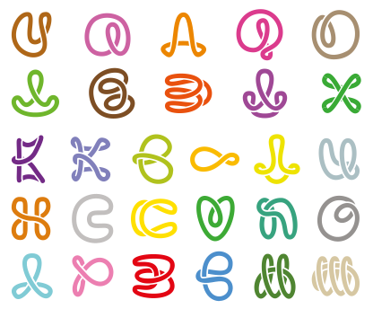

> "Таким образом, какими бы ни были различия в определении дискурса, мнения ученых- лингвистов сходятся в одном: дискурс — это иерархизированное речевое общение, сопровождающее процесс социально значимого взаимодействия людей, рассматриваемое с позиций их принадлежности к той или иной социальной группе или применительно к той или иной типичной речеповеденческой ситуации. Следовательно, дискурс — это одновременно и процесс языковой деятельности, и её результат.

> В.З. Демьянков в словаре ‘Англо-русских терминов по прикладной лингвистике и автоматической переработке текста’ [10] дал обобщающее описание того, что представляет собой ‘грамматика’ и, шире, ‘мир дискурса’. В.З. Демьянков писал: «Discourse – дискурс, произвольный фрагмент текста, состоящий более чем из одного предложения или независимой части предложения. Часто, но не всегда, концентрируется вокруг некоторого опорного концепта; создает общий контекст, описывающий действующие лица, объекты, обстоятельства, времена, поступки и т. п., определяясь не столько последовательностью предложений, сколько тем общим для создающего дискурс и его интерпретатора миром, который ‘строится’ по ходу развертывания дискурса. Исходная структура для дискурса имеет вид последовательности элементарных пропозиций, связанных между собой логическими отношениями конъюнкции, дизъюнкции и т. п. Элементы дискурса: излагаемые события, их участники, перформативная информация и ‘не-события’, т. е. а) обстоятельства, сопровождающие события; б) фон, поясняющий события; в) оценка участников событий; г) информация, соотносящая дискурс с событиями».

Дискурс — язык и система целенаправленного мышления и взаимодействия людей.

Каждая сложившаяся группа людей, объединенная общей деятельностью, постепенно накапливает свой собственный специфический набор языковых форм и общих смыслов, обеспечивающих целостность и эффективность функционирования группы.

Фруктовый дискурс — язык и система совместной реализации проектов.

Для последовательного воплощения задуманных проектов даже самостоятельному деятелю необходима система обозначения различных их элементов. Для людей, объединившихся в группы для реализации совместных задумок, совершенно необходимо наработать ясный и прозрачный смысловой код, позволяющий эффективно взаимодействовать и поступательно двигаться к намеченным целям.

Мы предлагаем универсальный язык конструктивного общения с простой и прозрачной структурой. Ключом к результативной творческой деятельности людей является проектный подход, открывающий возможность для достижения деятелями состояния «потока».

Прозрачные принципы взаимодействия людей, по-разному вовлечённых в процесс совместной деятельности — ключ к целой вселенной возможностей открытого сотрудничества. Мы обнаружили общую структуру совместной реализации творческих проектов. Для этого мы выработали систему понятий, проясняющих идеи, цели, задачи и прочее. Это «фруктовый» дискурс — языковая среда совместной реализации проектов. Давайте применять всё это на практике, анализировать полученный опыт и совершенствовать дискурс вместе!

> В третьей трактовке дискурс рассматривается как сложное коммуникативное явление, отражающее динамический процесс использования языка в качестве инструмента общения, с помощью которого субъекты речевого взаимодействия в определенной ситуации имплицитно или эксплицитно выражают свои коммуникативные намерения (Н. В. Елухина, О. В. Коротеева, Е. С. Кубрякова, А. К. Михальская). В рамках данного подхода центр тяжести переносится с чисто лингвистического анализа дискурса на социальные факторы общения: «Дискурс начинает пониматься как сложное коммуникативное явление, не только включающее акт создания определенного текста, но и отражающее зависимость создаваемого речевого произведения от значительного количества экстралингвистических обстоятельств — знаний о мире, мнений и конкретных целей говорящего как создателя текста» (6, с. 18). Такая трактовка дискурса созвучна научным взглядам Н. В. Елухиной, которая рассматривает дискурс как «образец реализации определенных коммуникативных намерений в контексте конкретной коммуникативной ситуации и по отношению к определенному партнеру, представителю иной культуры, выраженной уместными в данной ситуации язы- ковыми и неязыковыми средствами. При этом адекватность речевого поведения коммуникантов оценивается успехом речевого взаимодействия, т.е. достижением коммуникативной цели, а также соответствием правилам речевого и неречевого поведения в данном культурном сообществе» (4, с. 9—10). Из этого следует, что необходимыми условиями дискурса являются коммуникативный контекст и условия общения. "

> Под дискурсом понимают особый идеальный вид коммуникации, осуществляемый в максимально возможном отстранении от социальной реальности, традиций, авторитета, коммуникативной рутины и т. п. и имеющий целью критическое обсуждение и обоснование взглядов и действий участников коммуникации или «дискурс рациональности».
>
> Такое понимание связано с именем немецкого философа и социолога Ю. Хабермаса