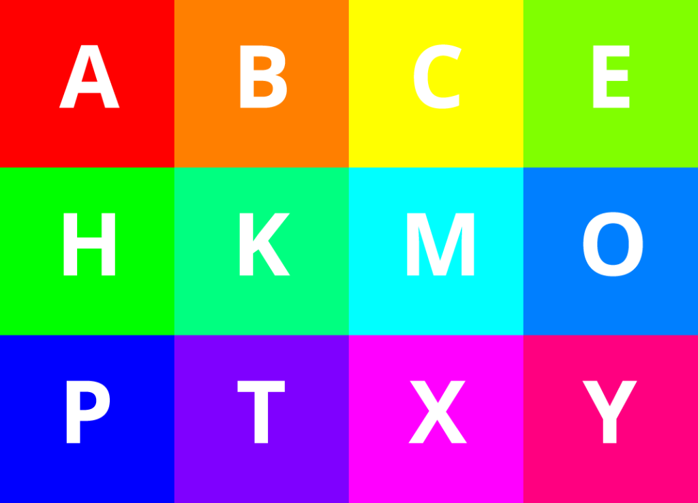
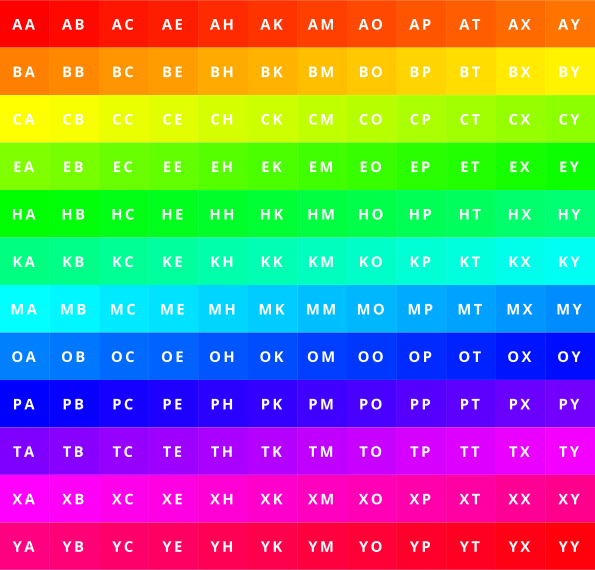
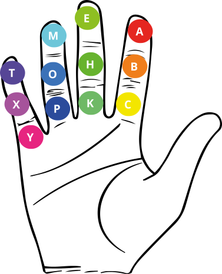
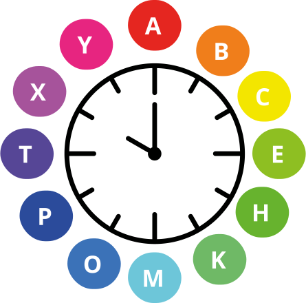
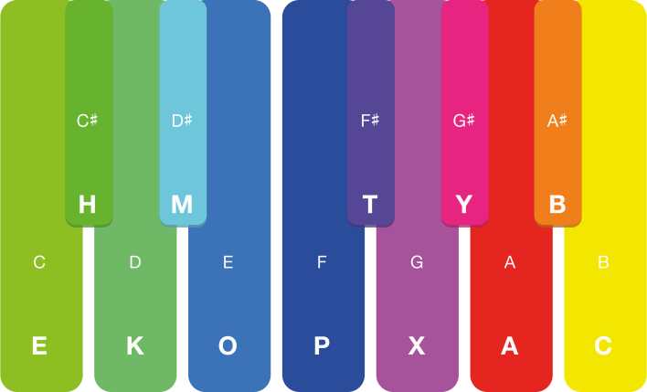
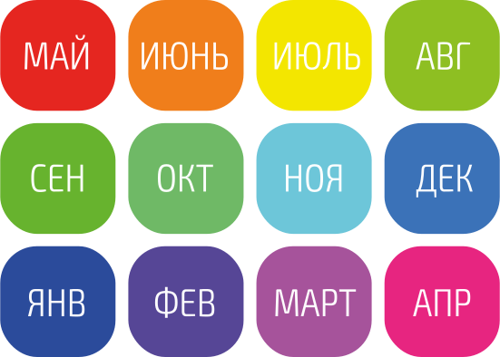

## International Letter Count and Account

Десятичная система счисления кажется единственной, но это далеко не так. Высокоразвитые цифровые технологии, например, основаны на двоичной системе. Не забыто слово “дюжина” и не даром во многих языках существуют отдельные слова для цифр 11 и 12. Оказывается, во многих сферах жизни можно столкнуться с двенадцатеричной системой.

На циферблате 12 часов, в году 12 месяцев. Музыкальных нот, оказывается, тоже 12. Видимый солнечный спектр тоже можно разбить на 12 частей. Сохранились знания о древней системе счёта на фалангах пальцев в двенадцатеричной системе. Священное число индуизма — 108=12х9. 12 имеет множество делителей: 2, 3, 4, 6 — очень удобное для устного счёта свойство.

Десятичные цифры позволяют легко производить математические и счётные операции и хорошо годятся для учёта однотипных сущностей. Цифры выстраиваются в строгую последовательность и не терпят перестановок. Цифры можно заменить.

Кириллический и латинский алфавиты объединяют ровно 12 литер. Эти буквы уже давно используются для маркировки автомобильных номеров, например. Мы выстроили их в алфавитном порядке, сопоставили им цифры, цвета, месяцы и сформировали подходящие правила счёта и учёта в нестрогой последовательности.

---

В отличие от десятичных чисел, где каждый новый разряд заполняется в строгой последовательности от 1 до 9, от 10 до 99 и т.д, разряды буквенного учёта могут заполняться случайным образом, а сочетания букв можно выбирать для каждой сущности отдельно.

