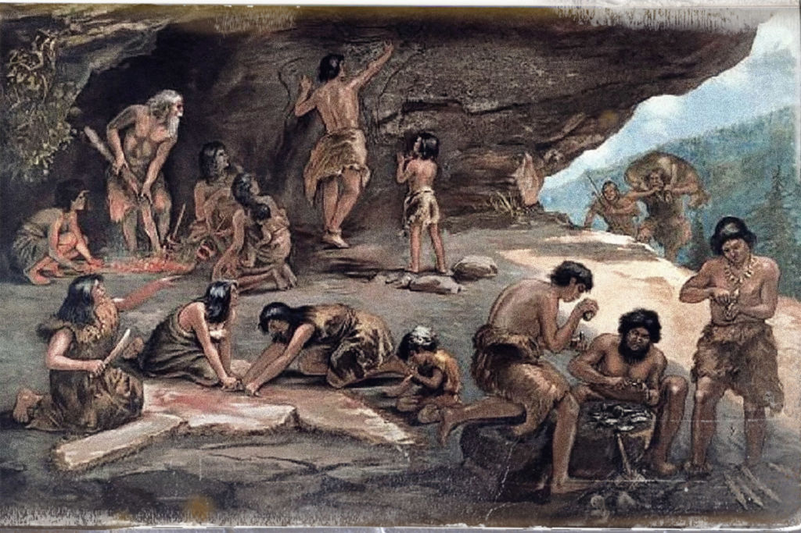
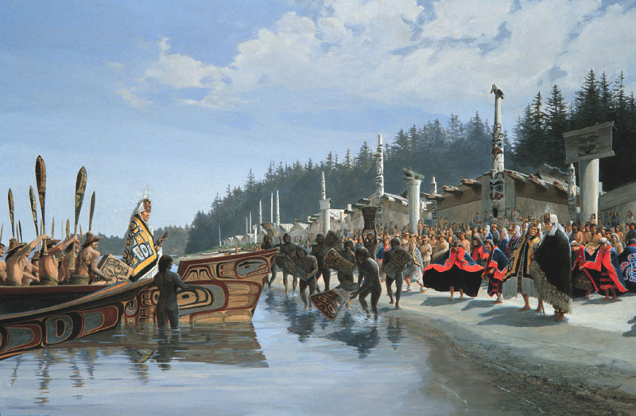
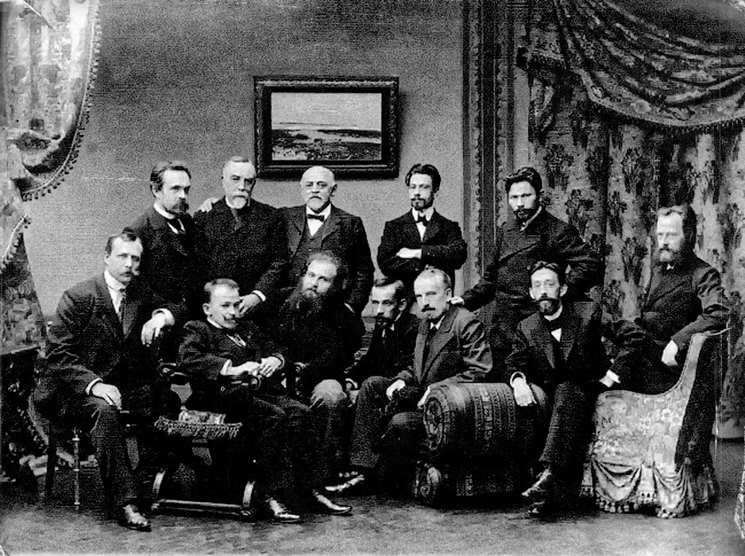
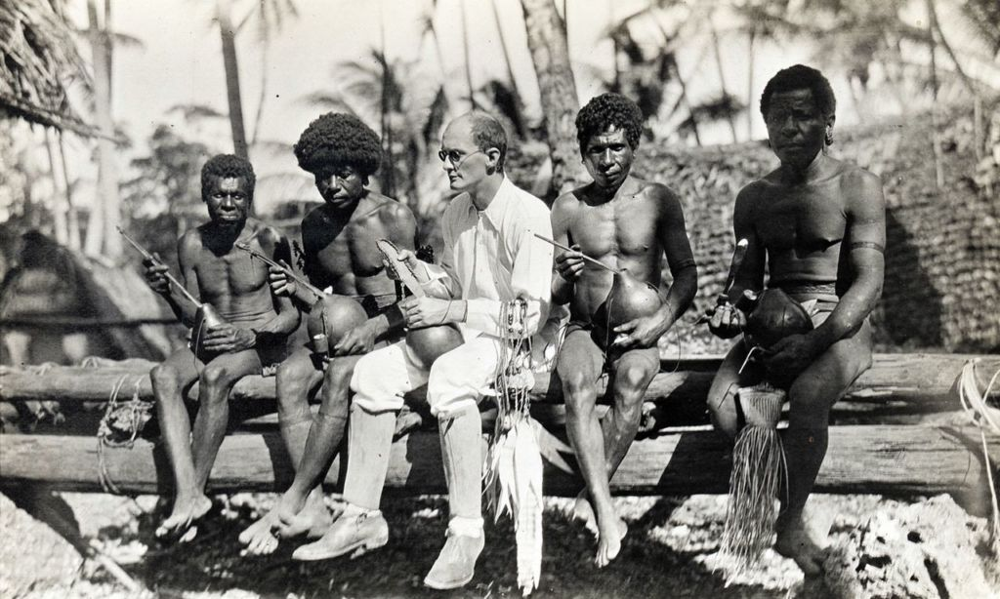
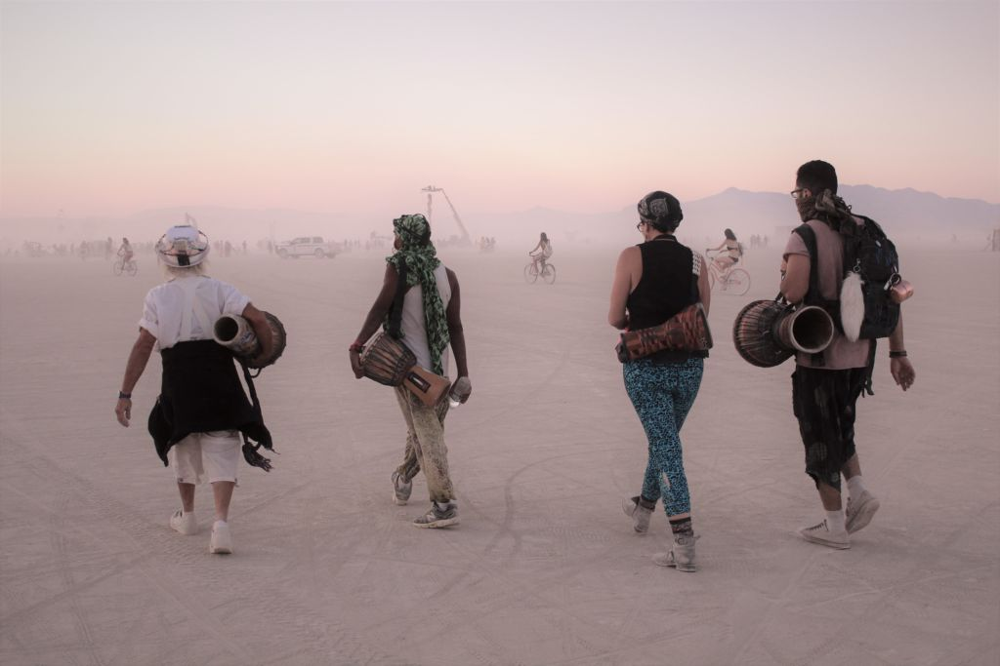
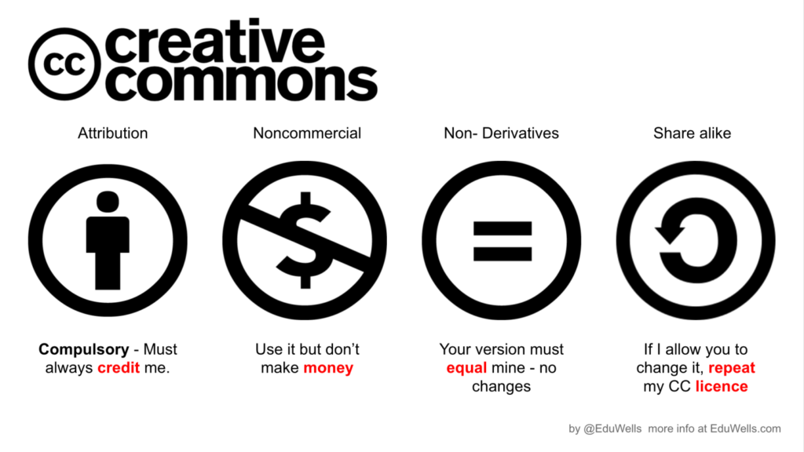
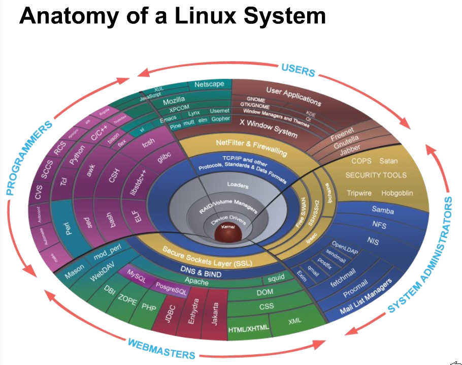
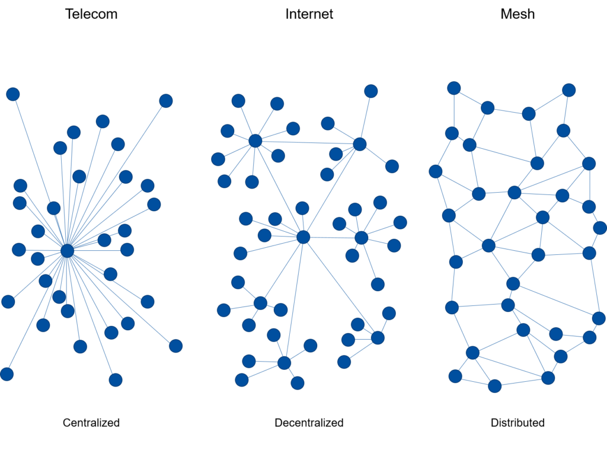

>«Рыночно-индустриальная система сама порождает скудость, дефицит, причем делает это в невиданных масштабах и в такой степени, к какой не смогли даже близко подойти другие общества. Там, где производство и распределение основаны на поведении цен, а вся жизнь зависит от приобретения и расходования, недостаток материальных средств становится явным, предсказуемым начальным пунктом всякой экономической активности.»
>
> —   Маршалл Салинс, антрополог

===

Рыночная система распределения благ начала широко распространяться и пришла к глобальному доминированию лишь в последние 400—500 лет. До этого такая форма обмена составляла лишь малую часть широкого спектра экономических отношений и существовала в основном на границах больших взаимосвязанных сообществ. Внутри них же выстраивались самые разнообразные формы взаимоотношений. В некоторых случаях полученные блага внутри групп могли делиться поровну или распределяться по статусу, но чаще всего каждый получал всего вдоволь и ещё оставалось. Да, как это ни удивительно для современного человека, архаические общества чаще всего представляли из себя общества изобилия.

## Изобилие прошлого

По данным современной антропологии уже в Каменном веке отношения в человеческих сообществах строились на перераспределении избыточного продукта. Живя в гармонии с природой, легко обнаружить её поразительную щедрость. Сбор растений и грибов, рыбалка и охота на повсеместных диких зверей не занимала так уж много времени и сил и в человеческих обществах всегда находилось место для ремесел, ритуалов и торжеств. Добытого хватало, чтобы каждый получил свою часть. И, в свою очередь, сделал свой вклад в общее благосостояние.

В раннем первобытном обществе практически не было границы между личным и общим: каждый привносил в общину столько, сколько мог и получал столько, сколько ему требовалось. Появление первых систем перераспределения избыточного продукта знаменует переход общества в позднюю первобытную стадию. Распознание и сопоставление даров отдельных членов сообщества приводит к формированию различных форм престижной экономики. Выделяются различные степени близости и взаимности людей в группе. Тот, кто сделал значительный вклад в общину, получает признание и статус. Частной собственности в древнем мире не существовало как категории и именно добровольная передача благ племени выявляла их подлинную ценность. Устойчивость и гармоничность связей в сообществе — основная инвестиция древней экономики. В качестве вкладов в сообщество принимался любой полезный труд от добычи пищи или воспитания детей до строительства домов или проведения ритуалов.

Когда начинают замечаться вклады отдельных людей, в группе начинают выявляться различия в способностях и, конечно, возрасте. Старейшины и одаренные люди, естественно, получили особый почёт и уважение первыми. Люди, стремившиеся ко все большему престижу, начали создавать системы, в которых они дарили не только созданное ими самими, но и полученное от других. Так они получили возможность значительно превзойти по статусу всех членов племени и стать единоличными лидерами общины — вождями. Они становились предводителями и полноправными распределителями родовой собственности. На такой высокой статус в племени могли претендовать лишь немногие, что со временем привело к установлению принципов его наследования. С расслоением в обществе появилась отдельная категория престижных благ, обращавшихся в контурах, отдельных от жизнеобеспечительных. Дар между людьми с большой разницей в статусе мог вырождаться в «тиранию щедрости», привязывающую человека и дающую почву для манипуляции. За разложением родового строя последовало распространение феодализма.

Ограничение браков внутри одного рода и племени — естественное требование эволюции и основа для возникновения различных форм дружественного взаимодействия общин друг с другом. Брачные ритуалы практически в любой культуре предполагают обильные дары и пышные праздненства. Но с первобытных времён существует куда больше поводов и причин для общения между порой даже сильно удаленными общинами. Торжественные собрания и обмен ритуальными дарами поддерживали сложные сети межплеменных отношений, служили способом взаимного обмена. Это могли быть ежегодные собрания в особом месте или регулярные визиты соседских делегаций. Дар представлял собой универсальный социальный, экономический и политический инструмент. Различные формы группового дарения антропологи обнаружили и у индейцев Аляски (потлач) и у аборигенов Полинезии (кула) и у многих народов Африки. И только на периферии таких собраний, между представителями все более далеких племен начинают формироваться бартерные, а затем и рыночные отношения.

## Новые традиции

Очевидно, что для кочевых народов обмен обременяющих вещей на высокий статус в группе — оптимальная социальная практика. Для оседлых земледельческих общин со временем все большую роль стало играть производство, накопление и сбережение материальных благ. Но и в этих условиях сложные сети дарения продолжили играть центральную роль в большинстве сообществ, основанных на доверии и благодарности. Такие отношения можно обнаружить не только в гильдиях и содружествах прошлого. Храмы и религиозные общины с древних времен создаются и поддерживаются совместными усилиями и, преимущественно, за счет добровольных пожертвований. Другой яркий пример — современное научное сообщество, где учёные добровольно делятся результатами своей работы с другими, получая признание и доступ к работам остальных. Каждая новая работа основывается на уже существующих и возникающее в исследователе чувство благодарности за такую возможность выражается в ответном вкладе в сообщество. Публикация компиляций работ других без собственной научной новизны таким вкладом не считается, а закрытые коммерческие научные исследования воспринимаются в сообществе как менее престижные.

Там, где сильно ослабевает чувство общности и взаимосвязанности, люди начинают взаимодействовать как независимые владельцы частной собственности, процветают рыночные отношения. Добровольность и свободное определение ценности дара сменяются строгим расчётом стоимости товаров и принципом эквивалентности сделки. Обмен дарами создает тесные взаимосвязи, торговля товарами же оставляет каждого при своем. Исторически такой переход означал освобождение личности от общинных уз и появление у человека массы новых возможностей. Неслучайно индустриальная и цифровая революции произошли при доминировании рынка.

Но и при капитализме в обществах значительно распространен дарообмен. И не только в виде традиционных подарков на День рождения или Новый год. Во многих культурах дары принято приносить при знакомстве, на свадьбу, на новоселье, гостям. Среди коммерческих компаний распространено спонсорство, которое пусть и поддается оценке с точки зрения маркетинга, воспринимается сообществом как заметный добровольный вклад. Корпоративные подарки и сувениры и самые различные программы лояльности сотрудников и потребителей можно рассматривать как дар для формирования сообщества вокруг организации. Под другим углом можно взглянуть и на стремительный рост некоторых коммерчески убыточных предприятий — инвесторы постепенно учатся видеть ценность и значимость сетевого сообщества, формируемого компанией. Постепенно приходит понимание многомерности социального поля, которое наравне с финансовым придает важное значение социальному, интеллектуальному, культурному, политическому и другим видам капитала.

На заре капитализма среди предпринимателей была распространена благотворительность — буржуа стремились проявить себя в областях, пользовавшихся общественным престижем, и таким образом поднять свой социальный статус. В России 19 века, вдохновленные церковью, они строили школы, больницы, приюты. Проявляли свой вкус и мнение в поддержке культуры. Период широкого распространения меценатства помимо ярких имен Мамонтова, Морозова или Третьякова принёс и массу других примеров поддержки деятелей культуры предпринимателями. Меценаты по высокой цене покупали картины у художников, заказывали симфонии у композиторов, финансировали постановки спектаклей. Благодаря им открывались галереи, музеи, театры.

С появлением Интернета общество обнаружило новое изобилие — информационное. Несмотря на все попытки регулирования и коммерциализации, в сети с самого начала процветают сообщества, построенные на добровольных вкладах участников, будь то файлы на торрентах, статьи в Википедии или код в программах с открытым исходным кодом. Делиться информацией в сети принято и приятно. Как дары сетевому сообществу можно рассматривать всевозможные сайты, тематические блоги, каналы, подкасты, комментарии, отзывы и многое другое. Так авторы находят свою аудиторию, сплетаются сообщества, совместно реализуются проекты. Конечно, в условиях рынка возникает все больше способов «обналичить» полученный статус в сети. Если раньше размещение рекламы было чуть ли не единственным способом монетизации в сети, то сегодня существуют десятки краудфандинговых платформ, сервисов по приёму пожертвований и донатов. Дары начинают двигаться во всех направлениях, сплетая сетевое сообщество новыми взаимосвязями. Чтобы не запутаться в этой паутине важно не терять из виду суть дарения.

## Современные связи

Несмотря на все превращения, сущность дарения не меняется. Эта форма обмена намного древнее и живет в нас глубже, чем рынок. В дарении задействован не только холодный рассудок, но наши эмоции и чувства. Дар порождает чувство праздника, разрыва рутинной повседневности. Он становится особым обстоятельством, связывающим дарителя и принимающего. Даже полностью ритуализированное дарение на Новый год и День рождения играет серьезную роль в поддержании семейных и дружеских связей в современном разрозненном обществе. Подлинный дар же спонтанен и рождается из чувства солидарности и распознавания другого как близкого или, в пределе, как самого себя. Акт дарения приносит радость обоим его участникам и порождает волну благодарности в обществе. В конце концов вся наша культура достается нам как дар наших предков. И пусть они ничего уже не ждут в ответ, но благодарность к их трудам и заслугам рождает в нас стремление изучать, развивать и передавать это наследие дальше. Как когда-то торговля помогала человеку освободиться от уз архаической общины, так сегодня дарение помогает преодолевать разобщенность современности.

Дарение кажется совершенно естественным для человека. Мы дарим открытки и цветы, с радостью принимаем подарки и с благодарностью отвечаем на них, напрямую или символически, безо всяких инструкций и институций. Точные подсчёты и глубокий анализ взаимозависимостей противоречат самой сути дарения, которая требует некоторой неопределённости и таинства. Это — его главное отличие как от рыночной сделки, так и от взятки или подкупа. Если донор, сделавший дар первым, получает подарок, то не в качестве прямого ответа получателя, а в соотстветствии с новым статусом в установившихся отношениях. Несмотря на свою древность и кажущуюся простоту, феноменология дара неоднократно порождала сложнейшие философские дискуссии.

Современная социология выделяет в социальных сетях, поддерживаемых постоянными обменами, несколько уровней или кругов: ядро — семья, в рамках которой осуществляется основная часть обменов дарами; близкие друзья; коллеги и знакомые, с которыми у членов семьи складываются формальные и неформальные отношения в составе малых сообществ. По мере движения от ядра к периферии отношения становятся все более дистанцированными и безличностыми и все больше основываются на расчёте. Однако, с развитием глобальных сетей провести границы таких сообществ становится все труднее. Дарение способно стать важным инструментом для глубокой интеграции новых сетевых сообществ, не ограниченных территориальной и национальной принадлежностью.

## Структура дарения

Только в конце 20 века была разработана процессуальная модель дарения, позволяющая проникнуть в суть дара без искажающих её рыночных метафор. Ещё классик Марсель Мосс (1925), изучая данные антропологических наблюдений в отдаленных племенах, выделил в основе отношений дарообмена три базовых обязательства: давать, получать и возмещать. Джон Шерри (1983) предложил рассматривать дарение как непрерывный цикл взаимностей в цепочках передачи даров и символических подарков между партнерами. Донор и реципиент при этом проходят три основные стадии, определяющие транзакции дарения, — созревание, претворение и переформулирование. Этот взгляд открывает широкие возможности по изучению и освоению дарения в современном обществе.

**Созревание** происходит на стороне донора, который выражает мотивацию, производит внутренний и внешний поиск, покупает или создает дар. Ценность дара определяется не только объективными качествами предмета дарения, но и социальными статусами участников такого обмена. Учесть множество разнородных факторов во взаимоотношениях людей интеллекту помогают чувства, направляющие и наполняющие дар особой силой.

Этап **претворения** включает не только непосредственно передачу дара, но и ответ принимающей стороны, а также оценку этого ответа донором. Предложение дара всегда может быть отклонено получателем. Эта норма, кстати, [закреплена законодательно](/research/russian-gift-law/). Но и принять дар можно очень по-разному. Один из главных этических принципов в самом масштабном эксперименте по экономике дарения в США Burning Man предполагает умение принимать — открываться и искренне радоваться полученному, не пытаясь по привычке тут же ответить взаимностью. Объединенное дарообменом сообщество раз в год возводит в пустыне целый город, чтобы вместе весело провести время вне социальных рамок, без денег, коммерции и рекламы и не оставляя за собой следов.

Стадия **переформулирования** рассматривает размещение дара, его потребление, демонстрацию, хранение или обмен. В большинстве культур на подаренное налагаются определённые ограничения. Как правило подаренное требуется торжественно употребить или даже уничтожить, но не направить на личное обогащение. Взаимность дарения приводит к переориентированию отношений и обмену ролями между партнерами. Но эти отношения далеко не всегда замкнуты на двух участников. Дар запускает цепочки проявления благодарности во всех направлениях и тот, кто сегодня получил щедрые дары от окружающих, завтра сам одарит кого-то из своего нового состояния. Так устанавливаются тесные социальные связи, групповая идентичность и благополучие. И не только в пустыне.

## Пожертвование — целенаправленное дарение

Дары между личностями формируют и укрепляют связи в семье и небольших коллективах. Их цель — принести близким или друзьям пользу и/или приятные эмоции. На смену архаическим ритуальным обменам дарами между племенами пришла благотворительность и меценатство. А теперь мы видим стремительный расцвет добровольной поддержки общественно-полезных проектов в сети. Краудфандинг — одна из попыток придать этому процессу рыночную структуру. На каждый вклад предусмотрено заведомо определённое вознаграждение. Порой это становится больше похоже на простой предзаказ или покупку вещей вскладчину, но нередко в ответ на ощутимые дары предусматриваются лишь символические подарки, а по статистике не менее 10-15% всех вложившихся в проекты на подобных площадках просто не забирают свои вознаграждения. Для экономиста это может показаться странным, но с пониманием природы дарения все становится на свои места.

Нередко проекты, на которые собирают средства горящие идеей авторы, несут для людей не столько личную, сколько общественную и культурную ценность. Вкладывая время, энергию и материальные ресурсы в такие начинания, человек таким образом приобщается к тем, на кого направлен этот проект. Так каждый может выражать свои ценности и отношение к будущему. К тому же дар на конкретные общеполезные цели не окрашивается личными отношениями и не ставит получателя в зависимое положение от донора. Он становится новым вызовом для человека, публично заявившего о своих намерениях. Не удивительно, насколько часто кампании по сбору средств значительно превышают первично заявленные масштабы. Таким образом люди выражают свою насущную потребность в причастности к обновлению культуры и мира вокруг.

Наблюдая последствия гегемонии рыночных отношений в обществе, мы постепенно начинаем замечать ограниченность предоставляемых ими возможностей. Надежда на то, что государство сможет исправить возникающие в такой ситуации перекосы исчезает вслед за все более плотным слиянием его с корпоративным миром. Логика прибыли и хладнокровного расчёта прекрасно работает в производстве и продаже товаров и услуг, но плохо справляется с развитием культуры. Патенты из способов поддержки изобретателей превратились в инструменты сдерживания распространения инноваций, а институт авторского права, взрастив целые касты продюсеров и юристов, противопоставил себя свободному распространению знаний и стремится к максимальному контролю за движением информации.

В основе глобальной сети всегда лежало стремление к свободному обмену знаниями и в ответ на усиление авторского права появились открытые лицензии Creative Commons, использующие юридические инструменты для защиты всеобщего культурного достояния от присвоения людьми и корпорациями. Сегодня всё больше проектов, делающих тот или иной вклад в культуру или общество, напрямую находят живой отклик у своей аудитории, выражающийся как в моральной, так и в материальной поддержке. Для людей важно не только поддержать ценные для них начинания, но и приобщиться к сообществу неравнодушных людей. Теперь так не только собирают средства на запуск новых продуктов на рынке, но и финансируют экологические и социальные программы.

С ростом информированности и осознанности людей приходит понимание взаимосвязанности нашего глобального общества. За родовой и племенной идентичностью последовала национальная и государственная. А по мере разочарования в политических институтах им на смену приходит глобальная идентичность, где каждый человек видит себя в контексте всего человечества и все более ответственно относится к возможности проявить себя в нём. Ведь дар — это всегда акт самовыражения, идущий из самой глубины человека. Именно на этом этапе развития общества становится возможным максимально проявить потенциал целенаправленного дарения.

Одни дарят свои идеи, время и энергию сообществу в виде полезных проектов, другие выражают своё отношение и поддержку прямым участием и материальными дарами. Благодарность выражается в символическом признании вкладов дарителей и чувстве единения, возникающем в сообществах. Для того, чтобы сделать мир немного лучше больше не нужна поддержка крупного бизнеса или государства, сетевые сообщества способны даже превзойти их возможности. Коммерческие компании и правительства оказываются не в состоянии разрабатывать и поддерживать такие масштабные проекты, как всеобщая энциклопедия (Wikipedia) или открытая операционная система (Linux).

## Нить, сплетающая сеть

Несмотря на кажущееся продолжение гегемонии рынка в общественных отношениях, принцип эквивалентности обмена постепенно теряет своё значение. Человек все больше уделяет внимания не личному удовольствию или обогащению, а общественному благу и решению локальных и глобальных проблем. Получая в ответ на свой значимый вклад лишь символическую ценность, человек обретает свидетельство его соучастия в важном проекте, знаком принадлежности к новому сетевому племени. На ранних этапах современных стартапов вложения сил и времени в общее дело оцениваются наравне с финансовыми инвестициями. Экономисты продолжают строить сложные теории стоимости и искать методы монетизации дарообменных отношений, но дар, каждый раз по-новому преломляясь в возникающих социальных системах, сохраняет свою суть нетронутой и продолжит играть ключевую роль во взаимоотношениях людей и сообществ и впредь.

Дарение в своих самых разнообразных формах является универсальным инструментом для создания и поддержания человеческих сообществ. Хотя наше современное общество предельно атомизировано, сегодня каждый имеет доступ во всеобщую сеть. А в ней возможно найти тех, с кем действительно по пути. Однако, мы нередко оказываемся разобщены и в сети. Эту отделенность призваны преодолеть самые разнообразные формы сетевого взаимодействия. Широкое распространение получили встречи, где люди дарят друг другу одежду ([свопы](https://thecity.m24.ru/articles/1057)) или другие ценности ([фримаркеты](https://ru.wikipedia.org/wiki/Really_Really_Free_Market)). В последнее время много шума вокруг так называемых донатов на стримах. Зрители прямых эфиров в сети не только выражают поддержку авторам небольшими денежными переводами, но и вместе с этим связываются друг с другом определенными статусными отношениями. И, даже несмотря на анонимность большинства дарителей, принимая дары ведущий трансляции эмоционально открывается и становится ближе к своей аудитории.

Не стоит недооценивать и роль старомодной почтовой открытки, коробки конфет или букета цветов. Дар так легко пронизывает любые социальные границы, что государственным служащим, а также образовательным, социальным и медицинским работникам дарение ограничено законом. Периферия сообществ и межгрупповой обмен — территория, на которой издавна развивался рынок. Обмен, не включающий человека в сообщество — торговля. На уровне международных отношений, например, бывает очень трудно провести четкую грань между даром и подкупом. По той же причине законом ограничено дарение между коммерческими организациями.

## Дарение сегодня

Физические лица могут дарить друг другу ценности свободно. Если это не дом или машина, никакой регистрации сделки не нужно, налогов тоже никаких не предусмотрено. И это могут быть не только дары в общем человеку, но и пожертвования на конкретные его цели и задачи. Такой принцип лежит в основе краудфандинга, так многие собирают донаты на своих каналах. Человек начинает какой-то новый проект и приглашает его поддержать. Те, кому нравится это начинание, дарят средства автору, приобретая некоторый уровень включённости и соучастия. А автор получает ощутимый отклик от аудитории и продолжает развивать начатое с ощущением благодарности и солидарности с возникающим сообществом.

Можно предположить, что с развитием глобальной сети сила дарения будет проявляться в новых удивительных формах. Которые, конечно, породят и новые одномерные рыночные симулякры. Так за возникновением технологии распределенных сетевых денег последовал бум утопических проектов, обещавших вкладчикам удивительные образы децентрализованного будущего. Спекулянты, желающие сорвать большой куш, наводнили биржи деньгами, и все заполнила беспощадная гонка за прибылью. Закономерно, что в большинстве случаев единственное, что в последствии объединяло сообщество вкладчиков таких проектов — были обманутые ожидания и ничего не стоящие цифры на крипто-кошельках. Возможно, за лопнувшим пузырём доткомов можно было разглядеть новый виток развития глобальной сети. Интернет даже при таком широком распространении коммерции и рекламы, продолжает сплетаться добровольными вкладами пользователей по всему миру. За стремительными взлетами и падениями курсов не так легко разглядеть реальное развитие новой сетевой экономики.

Классическая благотворительность, направленная в пользу нуждающимся никуда не уходит, а становится все более удобным инструментом для благородных поступков людей благодаря проектам вроде [CharityVest](https://www.charityvest.org/), где с одного счёта любой американец может распределять свои пожертвования среди сотен некоммерческих организаций. Разработка программ с открытым кодом может обойтись без инвесторов и коммерциализации благодаря платформам вроде [OpenCollective](https://opencollective.com/) с полностью прозрачной системой не только сбора, но и расходования средств. [Patreon](https://patreon.com/) помогает творческим людям сформировать многоуровневое сообщество на основе ежемесячных подписок, в то время как [Ko-Fi](https://www.ko-fi.com/) позволяет просто подарить автору интересного контента одну или несколько виртуальных чашек кофе — 3 доллара в эквиваленте. Появляются некоммерческие платформы, созданные сообществом для развития проектов с открытым исходным кодом, например — [LiberaPay](https://ru.liberapay.com/). На наиболее популярной площадке для размещения такого кода [GitHub](https://help.github.com/en/github/administering-a-repository/displaying-a-sponsor-button-in-your-repository) недавно появилась встроенная система спонсорской поддержки без комиссии. Жаль, что этот и другие подобные сервисы, доступны лишь в ограниченном числе стран, не в России.

В России тем временем появляются их отечественные аналоги. Начиная с [Planeta.ru](https://planeta.ru/) и [Boomstater](https://boomstarter.ru/), построенных по модели американского [Kickstarter](https://kickstarter.com/) или [IndieGoGo](https://indiegogo.com/) и заканчивая недавней калькой с Патреона — [Boosty](http://www.boosty.to/). Активно развиваются российские площадки для приёма донатов на стримах — [DonationAlerts](http://www.donationalerts.com/), [DonatePay](http://donatepay.ru/) и другие. Однако, несмотря на все усилия коммерческих компаний встать между производителями и потребителями контента в сети, дистанция между ними сократилась и значительная часть добровольных пожертвований люди переводят друг другу напрямую. Стремящимся к учёту и контролю потоков корпорациям и государству распределенные сети взаимной поддержки людей могут казаться непонятными и неудобными, но именно они могут помочь хотя бы частично смягчить последствия столь долгого господства госкапитализма.

## Дар для будущего

У дара есть все шансы стать универсальным средством воссоединения разделённых современной цивилизацией людей, позволить осуществиться крупнейшим общественным трансформациям. В условиях кризиса в экономике, политике, культуре, дарение способно взять на себя любые их функции, помогая прокладывать новые пути перераспределения информации и ресурсов. Неспособность бизнеса и государства справиться с вызовами, стоящими перед человечеством в 21 веке, порождает в человеке стремление действовать иным путём. И, связываясь с единомышленниками с помощью добровольных вкладов в общее дело, он вскоре может обнаружить себя частью качественно новых сетевых социальных структур, способных активно действовать на основе солидарности и взаимопонимания. Возникновение и распространение соответствующих новому времени ритуалов и форм дарения, укрепляющих сообщества, позволит людям осуществлять осознанные масштабные преобразования.

Задолго до того, как были придуманы деньги и способы расчёта прибыльности инвестиций, люди изготавливали инструменты и средства передвижения, строили колоссальные сооружения и создавали великие произведения искусства. И после того, как мы перестанем обращать столько внимания на расчёт и личную выгоду, люди смогут, наконец, сообща воплотить то, что так не выгодно корпорациям, так тяжело даётся бюрократии и так легко обходят вниманием политики. Отделить часть себя и вложить её в общность, с которой ты солидарен — путь к соединению новых сетевых племён, в которых человек сможет ощутить свою значимость и глубокое взаимопонимание с единомышленниками. Распределёнными осознанно скоординированными усилиями возможно не только достичь масштабных общественно-полезных целей, но и создать условия для развития и самореализации вовлечённых в такие проекты людей.

В дарении участвует не только рассудок, но и чувства, что заметно влияет на систему ценностей внутри сообщества. Каждый вклад в него не только сопоставляется с фигурой и статусом дарящего, но и воспринимается как акт его самовыражения, с глубоким вниманием даже к мелким деталям. Небольшой дар проекту от малообеспеченного, но горящего идеей человека, может оказаться не менее ценным, чем щедрый вклад занятого своими делами предпринимателя. Всё это рисует картину удивительного мира многомерных сетевых взаимоотношений, к которым человечество движется в своей эволюции. А древний, но всегда новый дар видится универсальным средством их построения и поддержки.

Каждый человек уже сегодня может начать активно выражать своё мнение и видение будущего, добровольно поддерживая общеполезные проекты. Каждый, кто делает вклад в развитие мира соразмерно своим возможностям и интересам, становится участником новых сетевых сообществ, объединенных общими ценностями и целями. Разнообразные формы дарения не только помогут сформировать такие добровольные объединения, но и способны стать универсальным средством их устойчивого развития. А активная поддержка включенного сообщества творит чудеса. Именно распределенные содружества проектов принесут будущим поколениям дары обновленной культуры.

## Источники

1. [Сусоколов А.А. — Культура и обмен. Введение в экономическую антропологию](Culture1.pdf) — М.: SPSL – «Русская панорама», 2006. – 446 с.
2. [Хайд Л. - Дар. Как творческий дух преображает мир.](hyde_gift.pdf) — М.: Поколение 2007 — 480 стр.
3. [Бодрийяр Ж. — Символический обмен и смерть.](bodriyar.epub) — М.: “Добросвет” 2000 — 387 стр
4. [Ильин В. И. — Подарок как социальный феномен.](Ilyin.pdf) — «Рубеж: альманах социальных исследований». Вып. 16/17.
5. [Мосс М. — Очерк о даре: общества, обмен, личность.](ocherk_o_dare.pdf) — М.: Наука; Главная редакция восточной литературы, 1996.
6. [Пискунова Л.П. — Меценатство как социальный институт](piskunova.pdf)
7. [И.В. Троцук, А.В. Морозова — Дарение цветов: особенности ритуализированной практики в современном обществе](morozova.pdf)
8. [John F. Sherry Jr. — Gift giving on Anthropological Perspective](Gift20Giving.pdf) — The Journal of Consumer Research, Vol. 10, No. 2, (Sep,1983), pp. 157-168
