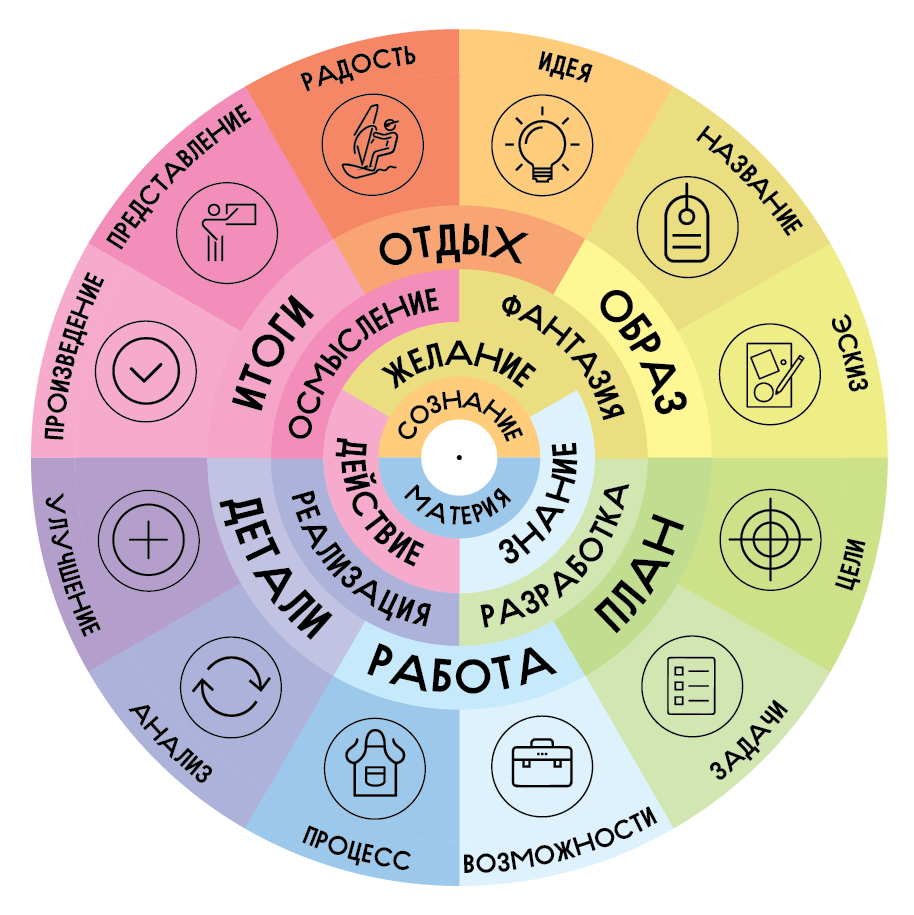

Способность осознанно трансформировать окружающий мир — неотъемлемая часть человеческого существа. Обнаружить необходимость, изучить возможности и произвести, пусть небольшие, но разумные изменения в нашей действительности способен каждый. Творчество начинается с самых первых попыток что-то улучшить в себе или мире. И, раскрываясь в нас, оно нередко становится главным источником радости и наполненности жизни.

Интересоваться чем-то, внимательно это изучать, обучаться и реализовывать свой потенциал во всё более сложных начинаниях — естественно для людей. Однако не всегда этот процесс идёт с желаемой скоростью. Бывает, не хватает времени и ресурсов. Нередко человек сталкивается в процессе с кажущимися непреодолимыми трудностями и может потратить немало сил, чтобы их преодолеть. Кто-то может подолгу ждать вдохновения, а для кого-то каждый день становится его уникальным произведением. А ведь это доступно каждому!

Творчество способно связать вместе самые простые обыденные вещи и глубочайшие истины Вселенной. И оно способно приносить нам подлинную радость самореализации. Когда движешься к ясным целям, знаешь, что нужно делать, справляешься с трудностями и получаешь незамедлительную обратную связь, можешь полностью сконцентрироваться на деятельности и ощутить глубокий контроль и погруженность. Так человек открывает для себя состояние потока, которое делает творческий процесс даже более ценным, чем его результаты.

**Технический проект**

— процесс создания изделия полезного для эффективного решения объективных задач.

**Авторский проект**

— процесс выражения авторского замысла в уникальном произведении.

Каждый, кто хоть раз воплотил задуманное — реализовывал проект. Ключевая черта проекта — его конечность. Ясность целей проекта определяется их точностью, измеримостью, достижимостью, экологичностью и своевременностью. О замках в облаках можно долго мечтать и не иметь возможности двинуться навстречу задуманному. Но стоит сформулировать желаемое поточнее, как сразу открываются новые возможности, способные помочь продвинуться в выбранном направлении. Так начинается движение.

Задумать огромный проект жизни и воплощать его десятилетиями — героический поступок, на который способен далеко не каждый. Но понимание того, что достижение даже самых сложных целей можно разбить на относительно простые этапы, даёт человеку уверенность в значимости прилагаемых усилий. Одни и те же принципы работы над проектом проявляются и в небольшой задачке на полчаса и в крупном начинании, реализуемом группой людей месяцами. Это похоже на фрактал, где можно рассматривать как проект хоть одно простое действие, хоть всю свою жизнь. Важно найти в этой бесконечности свой собственный масштаб, позволяющий комфортно и устойчиво направлять свое внимание и усилия.

Любое творчество пульсирует проектами. От едва уловимой идеи и грубых набросков до полной реализации задуманного проходит и художник и столяр, и керамист и поэт. Обычно это приходит с опытом и многие даже не осознают до конца свои методики работы. Однако глубокое понимание творческого процесса помогает не застревать и поступательно двигаться к намеченным целям. А по мере реализации различных проектов приходит понимание творческого цикла, раз за разом проходя который, обнаруживаешь себя обновленным в обновленном мире. И этот цикл становится лишь витком в удивительной спирали развития и самосовершенствования.

## Проектный цикл

### Идея

Размышляя о совершенстве, можно найти способ приблизиться к нему хотя бы на шаг. Идеи буквально витают в воздухе вокруг и можно научиться их замечать. Мысли, достойные реализации, посещают каждого из нас. И ведь каждому дано множество способов ловить эти новые смыслы. Внимательно наблюдать окружающий мир и вдохновляться гармонией природы, играть словами и давать волю фантазии, обнаруживать важные проблемы и находить для них решения, да и просто быть открытым к новому опыту и осознаниям.

### Название

Идея появляется как образ и требует четкого обозначения. Двух-трёх слов хватит, чтобы ухватиться и сконцентрироваться на ней. Теперь достаточно просто уделять ей внимание, чтобы полнее раскрыть её для себя.

### Эскиз

Однако только слов мало. Чтобы рассмотреть проект в подробностях, нужна его визуализация. Достаточно карандашного наброска, чтобы намного лучше понять, о чём речь. А подробная схема и чёткий чертёж помогают сберечь массу лишних усилий. С ними легче не только самому лучше понять суть проекта, но и донести её до окружающих даже тогда, когда до заметных результатов ещё далеко.

### Цели

Чтобы создать полноценное произведение, нужно наметить его отличительные особенности. Определяя особенности результатов, рисуешь образ будущего, в котором проект завершен. Как это будет выглядеть? Что важно учесть? Что ценного в проекте и какую пользу он может принести? Однажды выявив цели, уже не потеряешься в пути.

### Задачи

Образ идеи и четкий готовый результат соединяет цепочка задач, требующих выполнения. Понять порядок задач бывает сложно, особенно, когда делаешь что-то в первый раз, но лучше больше внимания уделить планированию, чем раз за разом заново переделывать проект.

### Возможности

Подробное продумывание проекта помогает точно определить то, что понадобится для его реализации. Отлично, если имеются необходимые инструменты, достаточно материалов и есть необходимые навыки для их использования. Но и без того можно находить пути решения творческих задач: знания и опыт находятся в глобальной сети, навыки и умения получаются практикой, а инструмент можно одолжить в открытой мастерской или у тех, кто готов поделиться своим.

### Процесс

Когда нашлось всё необходимое — время действовать. Путь к любой цели состоит из отдельных маленьких шагов, каждый из которых несёт радость опыта и самовыражения. Когда умелец получает возможность воплотить свой замысел, он ощущает вкус подлинной творческой свободы. Задуманное на глазах воплощается в жизнь, становясь плодами самореализации.

### Анализ

Не все можно заранее предугадать. Особенно — с первого раза. В процессе реализации проекта важно внимательно наблюдать за тем, что получается и учитывать все обнаруженные нюансы. Удачи и промахи, похвала и критика — всё это обратная связь. Принять, изучить, учесть и двигаться ещё точнее к цели.

### Улучшение

Реализация идеи сопровождается постоянным поиском наиболее точных средств передачи изначального замысла. Воплощая чистые идеи в материальные формы, можно увидеть следующий шаг к идеалу. Обратная связь превращается в усовершенствования и обновлённый проект уже почти готов.

### Произведение

Проект всегда конечен. Он может быть ограничен определённым сроком, достижением целей или выполнением заданных условий. Когда изначальные и уточнённые цели достигнуты, проект пора закрывать, постепенно освобождая внимание для чего-то нового. Важно не слишком цепляться за проделанную работу, но уметь ценить воплощённое вдохновение, чтобы найти произведению подходящее место и применение.

### Представление

Творческий опыт ценен сам по себе наряду с тем, что получилось в проекте. Приятно показать удачные произведения окружающим или поделиться наработками в презентации. Отличный способ глубже понять предмет — поделиться знаниями о нём с другими. Полезно составить подробные инструкции на будущее или распространить свои навыки и умения в формате мастер-классов или целого курса. Результаты проекта — это не только само произведение, но и весь его социально-психологический эффект.

### Радость

Легко и радостно становится внутри, когда реализуется задуманное. Идеи, ещё недавно лишь плод воображения, теперь можно напрямую воспринимать в воплощенных формах. Проекты — это способ не только глубоко заглянуть в собственный внутренний мир, но и разглядеть в многообразии проектов то, как человеческая реальность соприкасается с совершенным миром чистых идей.

### Промежуток

Не важно, что результаты работы раз за разом остаются где-то позади, это лишь признак движения вперед по пути. Удовлетворение, расслабление, праздность — необходимый штиль ума, когда утихает буря мыслей и дел. В этой тишине можно уловить даже самые тонкие идеи и смыслы. А после освежающего перерыва легко браться за новые проекты.

**Виды творческих проектов:**
* Инженерный
* Художественный
* Музыкальный
* Научный
* Педагогический
* Социальный
* Изобретательский
* Культурный
* Организаторский
* Предпринимательский
* Философский
* Игровой

Творчество заполнит в любые заданные рамки, но искусство — это всегда выход за границы правил и норм. Неразрывный процесс можно делить на любое число этапов, шагов и фаз, пытаясь найти в нём чёткий ритм и порядок, но стоит помнить при этом, что препятствий для самореализации в действительности нет.
