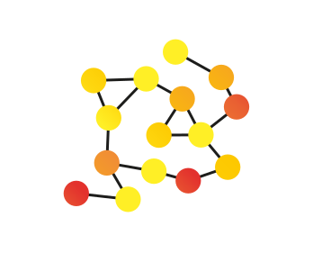
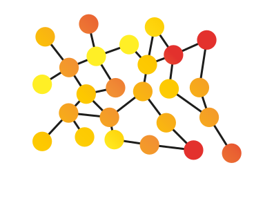
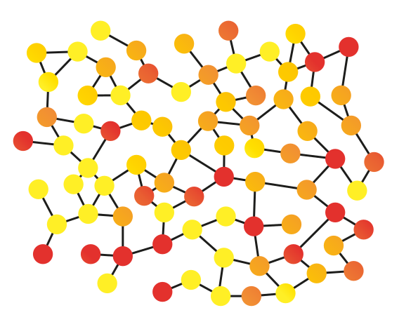

Изобретение и повсеместное внедрение средств мгновенной глобальной коммуникации неизбежно изменит всю мировую культуру. Культурные изменения, такие редкие и долгие в прошлом, теперь происходят всё стремительнее и всё более осознанно. Несмотря на информационный шум, генерируемый рекламой, развлекательными каналами и всяческими лентами новостей, **люди могут теперь сотрудничать друг с другом не взирая на расстояния, создавать сложные сети взаимоотношений и совместно координировать коллективные усилия**. Корпоративное управление средствами общественной коммуникации — совершенно обыденный факт для современности, но эта ситуация больше похожа на временный компромисс, чем на вершину развития информационных технологий. Сеть, конечно, изменит и это. 

Уже есть много примеров стремительного развития новых информационных каналов и сред общения, в кратчайшие сроки меняющих или даже создающих новые способы эффективного взаимодействия людей. Сколько товаров и услуг продали люди через сайты онлайн объявлений, сколько полезных ответов получили они на сетевых форумах, насколько изменили жизнь каждого из нас смски и чаты…

**У сети есть козырь: она сознательна**. Даже несмотря на то, что можно отвлечь внимание огромного большинства пользователей, многие неизменно обнаруживают в сети возможности плодотворно общаться, о чём-то договариваться, приходить к взаимопониманию и, в результате, совместно скоординированно действовать. В такой среде знания становятся общими, связи — горизонтальными, а деятельность всё более осознанной. И когда знания в сети накапливаются, общественное сотрудничество набирает достаточно силы, чтобы создавать продукты по масштабу и качеству порой значительно превосходящие возможности централизованных корпораций.

## Потенциал сети

Яркими примерами массового горизонтального сотрудничества могут служить [Википедия](http://wikipedia.org/), некоммерческий проект совместно редактируемой универсальной энциклопедии, или [Linux](https://ru.wikipedia.org/wiki/Linux), распределённо разрабатываемая операционная система с открытым исходным кодом. А когда различные корпорации включаются в равноправные сети и начинают конструктивно договариваться, получаются такие масштабные проекты как современный Интернет, сформированный и соединённый во многом благодаря рекомендациям Консорциума Всемирной паутины. Когда-то знания, достаточные для принятия стратегических решений, можно было удержать в голове одного высшего руководителя, теперь решения всё чаще принимаются сообществами людей. Солидарность — двигатель нового времени. Благодаря всей полноте возможностей информационного обмена, мы уже сегодня можем намного лучше понимать друг друга и предпринимать совместные эффективные действия. Теперь флэшмобами мало кого удивишь, а ведь совсем недавно волна таких внезапных скоординированных действий масс незнакомых друг с другом людей потрясала. Куда делись эти флэшмобы? **Теперь для сети это слишком просто.**

Осознавая невероятные возможности сетевой координации усилий, людям уже мало простых развлечений. Каждый, кто смог понять, как использовать сеть в том или ином деле, нередко добивается колоссального успеха, ведь вся сила современности содержится в постоянно растущем числе и численности человеческих сообществ. Директор управляет только своей компанией, президент управляет только одной страной, а сеть позволяет сотрудничать людям не взирая на границы и социальные роли. И решающим фактором в таком соединении становятся доступные людям средства коммуникации. В то время как социальные сети и СМИ позволяют быстро распространять эмоциональные реакции, существуют средства для куда более осознанной коммуникации людей. Гипертекстовый движок Википедии позволяет создавать любые массивы взаимосвязанной информации, сеть [Блаблакар](http://blablacar.ru/) оптимизирует автомобильные перевозки, а сколько DIY проектов реализовано благодаря публикациям на [Instructables](http://instructables.com/)!

Многие корпорации не стоят на месте и под давлением современности внедряют распределённые сетевые методы организации своей работы, в то время как растущая доступность таких средств заставляет их всё больше конкурировать с небольшими быстро развивающимися предприятиями. Сегодня бывает и так, что общественные начинания вроде коллективных закупок на форумах, превращаются в успешные коммерческие стартапы купонных распродаж и, наоборот, так, что продукты частных корпораций открывают свои исходные коды, превращаясь в общественные коллективные проекты. Наверняка ещё какое-то время у крупнейших транснациональных корпораций будет хватать средств побеждать и скупать своих независимых конкурентов, но **уже сегодня существует множество довольно крупных начинаний, которые попросту невозможно победить или купить.**

## Право говорить и делиться

Распределённые проекты с открытым исходным кодом, создаваемые сообществами солидарных людей, значительно более независимы от внешних воздействий. Патенты, лицензии и авторские права позволяют их владельцам легально применять силы государственной машины против свободного распространения информации. Государства и сами стремятся контролировать всё подряд. Но и эта сила не сможет удержать стремления человечества свободно делиться информацией друг с другом. Свободные лицензии вроде [Creative Commons](https://creativecommons.org/) или [GNU/GPL](https://www.gnu.org/licenses/gpl-3.0.html) — примеры удачных “хаков” этой системы, направляющие её силу против тех, кто попытается присвоить себе общественную собственность.

Ужесточение ограничений потоков информации приводит только к ускорению развития средств её свободного обмена, что только приближает момент всеобщего осознания тщетности попыток ограничить распространение знаний. Можно заблокировать трекер, но уничтожить децентрализованную торрент-сеть не смогло бы ни одно правительство. Можно пробовать бороться с [Tor](https://www.torproject.org/) сотнями способов, но отменить луковичные сети сможет только ещё более надёжный и доступный метод шифрованого децентрализованного общения. Новый сетевой мир живёт по своим правилам и, как только у него набирается сил, он с легкостью сметает устаревшие нормы и принципы существования.

Каждый новый шаг в этом победном шествии сети производится за счёт коллективного применения всё более эффективных средств коммуникации и обмена знаниями. Социальные сети разрушили информационную монополию СМИ. Сообщениям в [Твиттере](https://twitter.com/) хватило длины в 140 символов, чтобы стать одним из основных средств координации государственных переворотов «арабской весны». Массовое распространение бесплатных мессенджеров лишает коммуникационные компании сверхприбылей, а [Биткоин](https://bitcoin.org/ru/) всего за несколько лет превратился из невинного программного эксперимента в глобальную децентрализованную экономическую систему с открытым исходным кодом и колоссальным постоянно растущим оборотом.

## Иллюзии контроля

Соблазнам контроля и монетизации удаётся в какой-то степени сдерживать стремление людей свободно общаться и открыто сотрудничать, но с каждым годом ценности власти и личного обогащения все больше заменяются ценностями открытости и равноправия. Когда отдельный руководитель уже не может справиться с постоянно растущими потоками информации, а люди начинают понимать, что искреннее равноправное общение намного ценнее, чем рыночные взаимоотношения клиент-продавец, на смену вертикальным иерархиям приходят горизонтальные сетевые структуры. С их развитием меняются сами представления об общении, информации, знаниях. Человек нового времени убеждён, что информация должна быть открытой, что знаниями принято делиться, а неограниченное общение с другими людьми — право каждого. Закрепляясь так в культуре, принципы горизонтального сетевого сотрудничества всё более ускоряют процесс глобальной трансформации.

Конечно, культурные изменения — процесс нелинейный и постепенный. Культура по своей сути обладает значительной инерцией, что мы раз за разом наблюдаем, когда одна новая технология приходит чтобы заменить собой «устаревшую», но в конце концов занимает свою собственную нишу где-то рядом. Видео-каналы и Интернет-трансляции всё более популярны, но миллионы людей по-прежнему смотрят телевизор, а виниловые пластинки хорошо продаются даже тогда, когда лазерные аудиодиски многим покажутся анахронизмом. Новый сетевой мир не стремится занять место прежней иерархической централизации, он стремится раскрыть свой потенциал, пронизывая существующие и формируя новые сферы человеческой деятельности.

Сеть всё больше проникает сквозь ранее нерушимые границы. ЦРУ выложило в онлайн-доступ [свои рассекреченные документы](https://www.cia.gov/library/readingroom/), всё больше компаний используют внутренние социальные сети как элемент управления, и, что, пожалуй, наиболее важно, массы незнакомых людей из самых различных географических регионов и социальных слоёв создают всё более влиятельные сообщества и инициативы. Краудфандинговые платформы открывают возможности для реализации новых проектов и общественных инициатив с доселе немыслимыми масштабами и скоростью. Множество стартапов изначально создаются распределёнными интернациональными командами людей, координирующих усилия с помощью всё более совершенных сетевых инструментов сотрудничества, таких как гибкие методологии разработки (например, [SCRUM](https://ru.wikipedia.org/wiki/SCRUM)) или горизонтальные системы управления организацияей (например, [Холакратия](https://ru.wikipedia.org/wiki/Холакратия)).

## Место для каждого

Снижение трансакционных издержек может не только значительно повышать эффективность взаимодействия сотрудников компаний или чиновников в государстве, но и позволяет возникнуть и стремительно развиваться добровольным автономным объединениям граждан. С каждым днём людям всё проще договариваться друг с другом об обмене вещами и взаимными услугами. С каждым годом появляется всё больше солидарных сообществ, способных не только активно расти и развиваться, но и оказывать всевозрастающее влияние на различные сферы жизни. Таким образом, человеку всё менее необходимо быть частью какой-то одной компании, города, страны. **Намного важнее входить в достаточное число сообществ и оставаться в сети.**

Решающее значение в этой ситуации имеют темпы развития новых сетевых инструментов, упрощающих сбор и обработку информации, проведение переговоров и принятие решений, контроль и учёт результатов совместной деятельности. Растущая цифровая грамотность открывает перед людьми широкий набор таких инструментов от электронной почты до сервисов совместного редактирования документов, от чатов и видеоконференций до общих календарей и систем коллективного решения задач. Нельзя поспорить с тем, что значительную часть этих новых средств создают (или в конце концов покупают) крупные коммерческие корпорации, оставляя отдельным людям лишь роли пользователей-клиентов, но сеть стремительно набирает силу и всё более заметными становятся децентрализованные решения с открытым исходным кодом. Около четверти всех сайтов в Интернете использует открытый движок [WordPress](http://www.wordpress.org/), написанный на открытом языке программирования [PHP](http://www.php.net/), работающем на базе совместно разрабатываемого сервера [Apache](http://apache.org/), запущенного в среде свободно распространяемой операционной системы [Linux](https://www.linux.org/). Всё большее распространение получают системы обмена сообщениями на базе открытых протоколов вроде [XMPP](https://xmpp.org/), а пользовательские веб-браузеры приобретают всё большие возможности не только по отображению содержимого веб-страниц, но и по исполнению программных кодов и взаимодействию напрямую друг с другом, например по протоколу [WebRTC](https://webrtc.org/). Это говорит о том, что разработчики сетевых стандартов твёрдо убеждены в ценностях свободного децентрализованного распространения информации.

Интересно проследить, как стремление людей к открытому и свободному обмену информацией стремительно меняет сложившийся порядок в различных сферах буквально на глазах. Когда-то иметь телефон было настоящей роскошью, было время, когда мобильная связь была прерогативой исключительно богатых слоёв, теперь же практически каждый имеет возможность мгновенно связываться с другими людьми десятками различных способов. И способы эти имеют значение. Люди продают и покупают вещи на страницах онлайн-магазинов, обмениваются отзывами и мнениями в интернет-каталогах предметов и произведений искусства, получают ответы на сайтах вопросов, делятся музыкой, видео-сюжетами и своими рассуждениями на страницах специализированных сервисов. В то время как одни компании блокируют своим сотрудникам доступ к социальным сетям, другие полностью строят свои бизнес-модели на их использовании. Одним из ключевых звеньев, которого все еще не хватает в этом спектре средств взаимодействия, видятся сервисы и среды открытой совместной координации усилий.

## Среда разработки

Люди ежедневно загружают миллионы исправлений в инновационные проекты с открытым кодом, при этом не редко координируя усилия с помощью морально устаревших почтовых рассылок. Общение в Википедии продолжается в форме поочерёдного редактирования и сохранения специальной страницы. Но и в этой сфере уже сегодня происходят стремительные изменения. Так крупнейшая платформа для совместной разработки программного обеспечения (и не только) [GitHub](http://www.github.com/), абсолютно бесплатная для проектов с открытым кодом, предоставляет все необходимые возможности для продуктивного общения и взаимодействия разработчиков: помимо размещения исходных кодов приложений они могут делиться идеями и сообщать друг другу о проблемах в программах друг друга, а также скоординированно решать их, общаясь в соответствующих ветках переписки. Теперь пользователи этой платформы имеют также возможность подключить к своим репозиториям полноценный чат с неограниченной сохраняемой историей переписки [Gitter](https://gitter.im/).

Когда-то эффективные системы управления проектами были доступны лишь наиболее продвинутым корпорациям, а теперь таких систем, как, например, [Basecamp](http://www.basecamp.com/), существуют десятки. Такие сервисы по-прежнему рождаются в околокорпоративных сферах и, как правило, несут в себе их уже устаревшие ценности. Примером этого может служить распространённость модели монетизации большинства подобных сервисов, построенная на тарификации в соответствии с количеством пользователей в организации. Например, корпоративный сервис управления проектами [Wrike](https://www.wrike.com/), оценивает свои услуги от 10 долларов в месяц с пользователя, а один из лидирующих на этом рынке проект [Asana](https://asana.com/) попросит чуть больше 8 долларов за каждого пользователя в командах более 15 человек.

## Ценность открытости

Как замечают некоторые наблюдатели, такой принцип тарификации подобных сервисов не только значительно ограничивает потенциал открытого сотрудничества, но и **вынуждает децентрализированные сообщества формировать единый финансово-регулирующий центр**, принимающий решение о включении того или иного человека в команду и контролирующий затраты на её поддержание. Раньше сервис для управления проектами Basecamp взимал плату за каждый дополнительный проект, созданный в его среде. Очевидно, что такое решение также значительно ограничивало возможности развития команд пользователей сервиса. Команда Basecamp прислушалась к критике этого аспекта и сменила тарифную политику на взимание фиксированной платы с компаний любого масштаба (99 долларов в месяц). Преподавателям и студентам официальных учебных заведений и зарегистрированным некоммерческим организациям предоставляются скидки, но понятно, что простые пользователи Интернета не смогут использовать этот инструмент для ситуативной кооперации.

Анализируя эту ситуацию становится ясно, что только **бесплатный и доступный большинству современных Интернет-пользователей сервис** сможет по-настоящему открыть ящик Пандоры открытого сотрудничества. Не удивительно, что сотни команд разработчиков по всему миру стремятся создать наиболее доступный и в то же время полнофункциональный инструмент совместной проектной работы. Однако, эта задача далеко не так проста, как может показаться. Стоит помнить о том, что времена, когда Интернетом пользовались в основном только гики и программисты, прошли. Теперь большинство пользователей обладает лишь начальными навыками работы с браузером и подключается к сети уже чаще не с помощью ПК, а используя планшеты и смартфоны. Это определяет повышенные требования к качеству дизайна интерфейсов, к качеству пользовательского опыта использования сервиса. Именно поэтому несмотря на то, что [список программ для сотрудничества на Википедии](https://en.wikipedia.org/wiki/List_of_collaborative_software) продолжает расти почти ежедневно, реальное развитие общественной кооперации происходит довольно медленно.

Сложные программные продукты требуют значительных усилий больших команд разработчиков, что приводит к серьёзным затратам на создание продукта, которые, как правило, оплачиваются из средств венчурных инвесторов и требуют в последствии многократной компенсации через монетизацию сервиса. Поэтому наиболее мощные платформы либо оказываются либо слишком дорогими, либо слишком сложными для простых пользователей сети. Интересно замечать, как быстро лучшие решения таких высокозатратных проектов копируются другими командами, выпускающими свои собственные продукты, работающие уже по другим принципам монетизации. Так, например, если пользователи вышеупомянутого Basecamp платят непосредственно за доступ к системе, во многом копирующий их конкурентный сервис [Freedcamp](http://www.freedcamp.com/) предоставляет доступ пользователям бесплатно, однако серьёзно ограничивая дисковое пространство, доступное проекту. За дополнительные гигабайты места придётся платить. Вычислительные мощности и хранение данных обеспечивается далеко не бесплатной инфраструктурой, однако эта стоимость в действительности не сравнима с аппетитами инвесторов и акционеров компаний, стремящихся извлекать значительные прибыли из их перепродажи.

## Поймать волну

Делать силами большого коллектива оплачиваемых сотрудников бесплатные приложения часто оказывается провальной идеей. Нередко можно увидеть как после некоторого периода работы такого бесплатного сервиса он просто оказывается заброшенным из-за убыточности и бесперспективности его монетизации. Так произошло, например, с запущенной в 2004 году практически одновременно с Facebook социальной сетью [Multiply](https://en.wikipedia.org/wiki/Multiply_(website)), по функционалу значительно опережавшую своё время. Недостаточная скорость роста пользовательской базы и экономическая нерентабельность этого направления привела команду разработчиков к продаже проекта международной медиа-группе [Naspers](https://www.naspers.com/) и последующему переключению площадки на интернет-торговлю с полным отключением социальных функций сайта к 2012 году. 3 марта 2017 года корпорация Google закрыла бесплатный сервис группового общения с встроенным поиском [Spaces](https://www.youtube.com/watch?v=KxeykhZxj54), предлагая взамен чаты в [Hangouts](https://hangouts.google.com/).

Можно наблюдать и примеры того, как компании делают удачную ставку на дешевизну или полную бесплатность продукта с целью быстрого охвата максимально широкой аудитории, которая в последствии становится средством капитализации и, соответственно, монетизации компании. Так изначально бесплатный сервис совместного управления проектами по методологии канбан [Trello](https://trello.com/), запущенный в 2011 году начал вводить платные премиум-функции в 2013 году, а в 2017 году был куплен крупной австралийской IT-корпорацией [Atlassian](https://www.atlassian.com/ru) за 425 миллионов долларов. Однодолларовое чат-приложение [WhatsApp](https://whatsapp.com) быстро набрало базу в полмиллиарда пользователей, и в 2016 году было выкуплено корпорацией [Facebook](https://facebook.com) за баснословные 19 миллиардов долларов, а популярный бесплатный мессенджер [Skype](https://skype.com) был приобретён компанией [Microsoft](https://microsoft.com) за немалые 8,5 миллиардов. А такие крупные коммерческие компании знают цену своим деньгам и умеют отбивать свои вложения. Эти факты заставляют всегда помнить о том, что **даже бесплатный независимый сервис сегодня может уже завтра быть продан** его владельцами тому или иному гиганту IT-индустрии.

Конечно, не стоит руководствоваться только страхами, ведь бывает и по-другому. Ведь крупнейшие мировые корпорации и сами делают множество продуктов с богатым бесплатным функционалом, предоставляя всем удобные облачные хранилища вроде [Google Drive](https://drive.google.com) или [Яндекс Диска](https://disk.yandex.ru) и инструменты для совместного редактирования документов, например [Google Docs](https://docs.google.com) или [Dropbox Paper](https://paper.dropbox.com). С другой стороны проекты независимых разработчиков тоже находят способы защиты своих сетей от политики крупных коммерческих компаний. Так, социальная сеть для творческих людей [Ello](http://www.ello.co/) жестко закрепила в своих принципах отказ от предоставления данных о своих пользователях третьим лицам, в том числе рекламодателям, отказ от рекламы, отказ от необходимости указывать свои настоящие контактные данные при регистрации (эти условия останутся действительными даже в случае перепродажи компании). Удобный и совершенно бесплатный сервис управления задачами [Quire](https://quire.io/) заявляет, что останется бесплатным как минимум до конца 2017 года, и обещает, что даже после этого все используемые вами функции останутся доступными без всякой оплаты. Используемый в нем принцип неограниченно вложенных списков задач выглядит невероятно простым и эффективным способом организации практически любых видов совместной деятельности.

## Командная коммуникация

Интересно наблюдать, как множество различных команд уже много лет пытаются создать свой идеальный командный мессенджер. Развивающиеся как логическое продолжение зарекомендовавших себя в прошлом, но устаревших [IRC-чатов](https://ru.wikipedia.org/wiki/IRC), такие сервисы предоставляют возможность группового асинхронного общения. Такие виртуальные переговорные комнаты — не просто ещё один способ поболтать с друзьями, а полноценный инструмент командной работы. Первопроходцем этого нового витка в развитии чатов можно считать проект [HipChat](https://www.hipchat.com/), запущенный в 2010 году и купленый уже упомянутым Atlassian в 2012. Но наиболее известным на данный момент можно считать его усовершенствованную версию [Slack](https://slack.com/) (запущен в 2013 году), более приспособленную под нужды распределённых команд разработчиков и дизайнеров, но не только. В нём значительное развитие получили возможности подстройки сервиса под нужды конкретной команды, включая огромное количество возможных способов интеграции с другими интернет-сервисами. Оба сервиса используют всё более популярную бизнес-модель [freemium](https://ru.wikipedia.org/wiki/Freemium), в рамках которой пользователь получает некий базовый набор возможностей бесплатно, а за дополнительные опции вынужден платить по тарифу. Таким ограничением было выбрано доступное дисковое пространство и возможность неограниченного поиска по архиву сообщений. Такой “вирусный” подход позволяет быстро привлекать большое количество пользователей, привязывая их к системе и только затем подводя к необходимости оплачивать её использование. Платить придётся за каждого пользователя (ежемесячно по 2 доллара в HipChat и 8 долларов в Slack), что доступно только коммерческим командам и не позволяет использовать их как инструмент для кооперации добровольцев. Российская система управления бизнесом [Битрикс24](http://www.bitrix24.ru/) тоже использует freemium-модель и для тех, кому мало бесплатных опций (хоть и достаточно обширных), предлагает расширенный доступ по цене от 990 рублей в месяц.

Такие примеры успешных командных месседжеров породили целую волну последователей, пытающихся составить им конкуренцию на этом стремительно растущем рынке. Проект [Ryver](https://ryver.com/) предлагает бесплатный командный чат с планировщиком задач в виде платного дополнения. Амбициозный проект универсального средства для общения и координации в организации с очень неплохим функционалом [Glip](http://www.glip.com/) был куплен провайдером облачной телефонии [RingCentral](https://www.ringcentral.com/) в 2015 году за неназванную цену, попав, похоже, в хорошие руки: сервис предоставляет бесплатно создавать неограниченное записей, файлов, пользователей и интеграций, продавая лишь услуги видеосвязи и круглосуточной технической поддержки. Удачной реализацией доступного командного чата на начало 2017 года можно считать [Fleep](http://www.fleep.io/), где отсутствие ограничений по количеству участников, бесед, и поиску по истории сообщений, воспринимается как полная свобода общения, а возможность превращать сообщения в задачи помогают в практичной форме подводить итоги разговоров. Эта платформа создаётся бывшими разработчиками Skype, становясь площадкой для воплощения их постоянно развивающихся представлений о конструктивной онлайн-переписке. Однако, конечно, не исключено, что и этот стартап может быть продан в будущем одной из крупных IT-корпораций.

## Свободное программное обеспечение

Гарантией от приватизации средств связи может быть только свободное распространение инструментов общения с открытым исходным кодом. Большая радость видеть, что современное сетевое сообщество уже настолько окрепло и набралось знаний и опыта, что способно создавать такие масштабные открытые проекты, готовые конкурировать с высококачественными закрытыми решениями. Ярким примером совместного сетевого творчества является [Rocket.chat](http://www.rocket.chat/), командный мессенджер с открытым кодом, построенный на базе открытой JavaScript-платформы [Meteor](https://www.meteor.com/). Теперь каждый заинтересованный человек может развернуть на своём сервере сервис командного чата — для семьи или для небольших команд хватит вычислительной мощности не только одного небольшого компьютера, но даже микрокомпьютера размером с кредитную карту вроде [Raspberry Pi](https://www.raspberrypi.org/) или, например, более мощного [Odroid XU4](https://wiki.odroid.com/odroid-xu4/odroid-xu4). К этому сервису пользователи смогут подключаться как с помощью уже готовых клиентских приложений, доступных для всех популярных платформ, так и непосредственно через браузер. Так можно создавать свои собственные независимые чат-сервисы ровно ровно там, где это необходимо.

Команда проекта [Matrix.org](http://matrix.org/) сделала следующий, очевидный, но чрезвычайно трудный шаг в развитии идей децентрализованного общения. Группа учёных и программистов взялась создать новый открытый стандарт для распределённых коммуникаций в сети, где каждый может запустить свой собственный сервер, который станет узлом в растущей сети взаимосвязанных точек присоединения пользователей. Чёткое видение необходимости в существовании прозрачного протокола для децентрализованных сетевых взаимодействий подвигает команду проекта не только разрабатывать эту инфраструктуру, но и начинать её активно использовать. Для существующей сети, включающей в себя уже десятки серверов по всему миру, написаны разнообразные т.н. “мосты”, позволяющие связать существующие средства связи с сетью Matrix.org. Но наиболее значимо то, что к началу 2017 года уже разработаны и вполне надёжно работают клиентские приложения для командного чата для всех популярных платформ [Riot](http://www.riot.im/). Приложение позволяет создавать групповые чаты, публичные каналы и вести личную переписку с неограниченным кругом лиц, совершать голосовые и видео-вызовы, пересылать друг другу любые файлы. История сообщений и данные хранятся на серверах сети Marix, соединённых в децентрализованную сеть.

Ещё дальше в деле открытости и децентрализации пошла команда, разрабатывающая протокол и мессенджер [Tox](http://www.tox.chat/), позволяющий вовсе обходиться без центральных серверов, связывая адресатов с помощью распределённых хэш-таблиц DHT напрямую друг с другом. Эта система позволяет людям удобно и безопасно общаться в среде постоянно меняющей свою конфигурацию динамической сети. Конечно, такой подход накладывает свои ограничения, например, делая крайне затруднительной организацию хранения истории переписки и синхронизацию данных одного аккаунта на разных устройствах. Имена пользователей в такой сети имеют примерно такой вид: “56A1ADE4B65B86BCD51CC73E2CD4E542179F47959FE3E0E21B4B0ACDADE51855D34D34D37CB5”, что может выглядеть непривлекательно, но позволяет пользователям сети оставаться максимально анонимными и независимыми. Правда, передача этого контактного адреса должна передаваться каким-то иным способом, порой не всегда столь же надёжным.

## Мы не отделены

Сложно охватить весь спектр команд и проектов, вместе и по-отдельности работающих над созданием информационной среды нового времени. Каждая новая инициатива учится и активно усваивает уроки остальных, делая следующий шаг к этой сложной, но совершенно точно достижимой цели. Сеть со все большей скоростью пронизывает все существующие сферы деятельности, а также стремительно создаёт новые бескрайние информационные ландшафты. В то время как многие умы современности зачарованы идеями использования больших данных и искусственного интеллекта, неравнодушные мыслители ищут пути раскрытия ещё более мощного потенциала горизонтального общения и сотрудничества. Возможно, учёные когда-нибудь смогут создать программу умнее или робота сильнее отдельного человека, но **мощь взаимосвязанного сотрудничающего человечества** сегодня даже сложно себе вообразить.

Что будет, когда люди научатся, наконец, свободно и открыто общаться друг с другом, эффективно договариваться и продуктивно сотрудничать на масштабах от семьи или небольшой команды до населения районов, городов и целых регионов? Что будет, когда сети окончательно разрушат прежние границы, сдерживающие свободные потоки информации? И пусть даже можно предугадать пару ближайших этапов развития этого процесса, сила коллективного сознания на наших глазах раскрывает своё превосходство над умами отдельных индивидуумов. Потенциал равноправного распределённого коллективного сотрудничества колоссален и, кто знает, возможно именно он поможет человечеству преодолеть те проблемы, что оно создало себе слепо следуя прежним иерархическим социальным моделям поведения. Культура меняется, а вместе с ней меняемся мы. **Настают времена сети, в которой каждый из нас — равный другому узел, связывающий ткань реальности в единое полотно жизни. И что мы на нём изобразим полностью в наших руках.**
