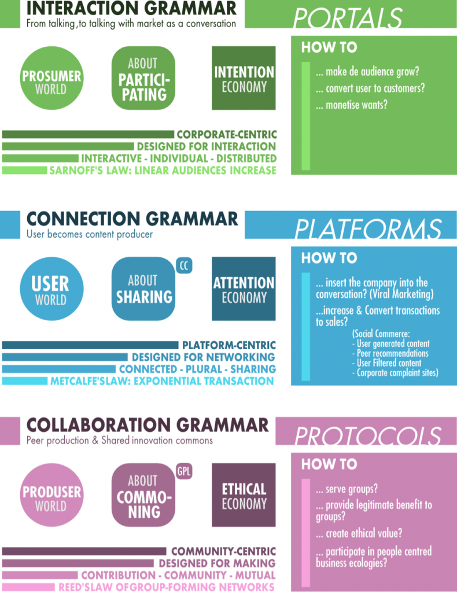

## Первая категоризация экономики сотрудничества

Обширное поле практик экономики сотрудничества можно разделить по признаку фокусирования на нематериальном социальном сотрудничестве или производстве физических объектов.

===

### Экономика сотрудничества в нематериальной сфере:

- Ориентированное на создание общего результата распределённое производство знания и программного обеспечения (Wikipedia, программы с открытым кодом),
- Платформы, где пользователи делятся своим творчеством или находками в сети, но не создают общего кода или знания (Facebook, Youtube, Flickr и другие).

### Экономика сотрудничества со смешанным фокусом: распределённые инфраструктуры для созидания:

- Дизайн и продукты на краудсорсинге
  - соревновательные платформы обнаруживают наилучшие творческие решения задач
  - инструменты управления идями помогают находить и развивать подходящие предложения.
  - платформы для представления и продажи дизайнерами своих работ с некоторой степенью сотрудничества,
  - сервисы, дающие компаниям доступ к распределённым пулам идей, талантов, услуг:
- Общий дизайн и распределённое производство (3D-печать, ФабЛаб, DIY)
- Открытые инновационные краудсорсинговые платформы и интегрированные в цепочку создания стоимости принципы совместной разработки и производства.

### Экономика сотрудничества с фокусом на материальное производство:

- Общественная пользовательская инфраструктура (совместное потребление):
  - системы товар-услуга вроде байк- и каршеринга (основаны на функциональной логике, в которой потребитель получает выгоды использования товара без необходимости им владеть),
  - рынки перераспределения вроде Freecycle и eBay (ненужные кому-то вещи перераспределяются в пользу тех, кто в них нуждается),
  - совместный стиль жизни наподобие Couchsurfing и Lending club (разделение и обмен такими ресурсами как время, пища, пространство, навыки и деньги, а также разделение материальной инфраструктуры как это наблюдается в коворкингах).
- Цифровые торговые площадки (места, где встречается спрос и предложение товаров, услуг, подарков, бартера, обмена и аренды и т.д.)
  - рынки вещей,
  - рынки труда и услуг,
  - рынки идей и инноваций,
  - рынки денег.

 

## Пользователь как создатель стоимости и проявление пользователецентричных экосистем

Эволюция экономики сотрудничества обладает также культурной и социологической подоплёкой.

### Массовое любительство и революция “профессиональных любителей”

В последние десятилетия ХХ века проявлися новый тип продвинутых пользователей, работающих по профессиональным стандартам. Это умные, образованные, увлечённые новыми технологиями и взаимодействующие друг с другом люди, способные бросить вызов сложившимся иерархичным системам, построенным на профессионализме, создавая новые распределённые организационные модели, более инновационные, гибкие и экономичные.

Такие профессиональные любители формируются из выпускников образовательных учреждений, полупрофессионалов, получающих значительную часть своего бюджета за счёт своего ремесла, а также постпрофессионалов, завершивших свою карьеру, но не готовых отказаться от своего дела и продолжающих заниматься своим призванием уже самостоятельно. Все эти люди легко становятся лидерами общественного мнения в сфере своих увлечений и способны придать новый толчок процессу развития различных технологий.

> “Не важно, насколько вы любите свою работу, однажды вы обнаружите, что делаете что-то похожее на работу лишь потому что его попросил начальник или таково требование рынка. В этой ситуации ваши профессиональные навыки могут оказаться сведены на нет отсутствием истинной мотивации. Любители же — добровольцы по определению. Они сами выбирают на что потратить своё время и они движутся напрямую к тому, к чему их тянет их страсть, интерес, знания и личность, не далее того. Если они теряют интерес, они двигаются дальше, оставляя место для следующего полного свежей энергии заинтересованного человека. Самоопределение гарантирует вовлечённость.”
>
>    Крис Андерсон

### Познавательный излишек

“Суть в том, что экономические перемены дают нам свободное время и каждое поколение находит способы во что-то его вложить. Для вновь индустриализированного Лондона в 1700ых решением был джин. Для 1950ых годом в США это были ситкомы. Для этого поколения это Интернет и инструменты связи. Вот так, когнитивный излишек этого поколения больше не выбрасывается в пустоту: люди действительно могут что-то создавать и делиться этим друг с другом.”

> “Как велик этот излишек? Итак, если вы сложите всю Википедию целиком как проект, страница за страницей, каждую правку и каждое обсуждение, каждую строчку кода на представленных языках, вы получите сумму в 100 миллионов часов человеческой мысли.
>
>А просмотр телевидения? 200 миллиардов часов в одних только США, каждый год. Иными словами, у нас же теперь есть своя единица измерения, это 2 000 проектов Википедия в год тратится на телевизор. Или, иначе, мы в США тратим 100 миллионов часов каждый уикэнд только на просмотр рекламы. Это довольно большой излишек. Люди, которые спрашивают “Где они берут на это время?”, смотря на проекты, подобные Википедии, не понимают, насколько мал весь этот проект, урывки, ставшие вкладом благодаря тому, что Тим назвал архитектурой участия.”
>
>Clay Shirky, Cognitive Surplus

[plugin:youtube](https://youtu.be/qu7ZpWecIS8)

### Возникновние лидеров пользования

Уже на рассвете промышленной эры обнаруживались первые примеры коллективных изобретений. В современной промышленной эре существуют наглядные свидетельства значительного вклада пользовательских инноваций в производство (пример — линейка продукции компании 3М). На рассвете информационной эры наблюдается заметный рост подобных возможностей, например создание полноценного горного велосипеда автономным спортивным сообществом.  В конце концов в эпоху распределённых инноваций новые виды потребительской электроники вроде Arduino, Buglabs и Chumby изначально создаются в расчёте на сообщества пользовательских инноваций.

#### Ключевые характеристики пользовательских инноваций:

- для новых технологических разработок требуется “липкая” информация, дорогая в сборе и обработке, но необходимая для определения потребностей пользователей и особенностей функционирования устройства в конкретных условиях. Пользователь, в отличие от производителя, сразу обладает всей этой информацией и может первым изобрести новый технологический манёвр,
- свободное раскрытие или желание пользователей поделиться своими находками, тем самым делая вклад в экологию предпринимателей и пользователей, а не в конкретную фирму,
- коллективное изобретательство проявляется когда достаточое количество отдельных инноваторов осваивают подходы свободного раскрытия своих изобретений и встраиваются в изобретательский цикл,
- поддержка сообщества,
- распределенный производственный цикл:
  - пользователь разрабатывает инновацию,
  - пользователь распространяет инновацию через сетевые средства информации,
  - вокруг изобретения формируется сообщество, которое разрабатывает рабочий прототип изделия,
  - производитель разрабатывает коммерческую версию, добавляя некоторые дополнительные возможности.

## Открывая инновации для участия толпы

### Открытые инновации

Теория открытых инноваций построена на том наблюдении, что различные институты окружены целыми экосистемами информированных индивидов и других институций, но в досетевом мире транзакционные издержки доступа к создаваемым ими инновациям были слишком высоки для их внедрения. Из-за этого организации разрабатывали свои собственные системы создания и управления знаниями. В сетевых культурах обнаруживается возможность присоединения всё большего количества людей к миссии организации. Такая модель используется некоторыми крупными корпорациями и критикуется за “фирмоцентричность” и запутанность взаимоотношений прав интеллектуальной собственности.

### Сотворчество

Сотворчество становится логическим развитием открытых инноваций, способствуя более глубокому взаимопроникновению экономических ролей. Сотворчество отличается от сотрудничества намерением создать вместе что-то заранее неизвестное. Его можно рассматривать как совместную работу над проектом с теми, для кого этот проект предназначается.

- Традиционно потребительская ценность товара определялась его качеством.
- Продуктовые инновации с открытым кодом (со-производство, не сотворчество) вовлекает покупателей в активное сотрудничество в сфере дизайна, тестирования улучшений различных вещей, объектов, технологий.
- В последствии ценность смещается с продуктов к опыту, который получает покупатель в поисках удовлетворения своих ситуативных потребностей. Этому способствует спрос на улучшение опыта взаимодействия, технологические рывки, развитие мышления, новые источники информации, повышенная социализация, сходство функционала продуктов и другие факторы.
- Всё большее внимание покупатели уделяют опыту взаимодействия с фирмами и их продукцией.
- Качество опыта определяется тем, насколько релевантным или персонализированным оказывается он для потребителя. Качество опыта — это комбинация функциональных и эмоциональных элементов, специфичных для конкретной ситуации и момента взаимодействия.
- Фокус создания ценности смещается с качества товара и инновационного дизайна к дизайну пользовательского опыта и инновационного качества или сервисного дизайна.
- Процессы инновации становятся все более распределёнными для предоставления уникального персонализированного адаптируемого опыта отдельных покупателей в уникальных пространстенно-временно-событийных контекстах.
- В таких распределённых окружениях фирмы и отдельные люди встречаются вместе для создания ценности в форме уникального персонализированного покупательского опыта. Побочным продуктом такого взаимодействия становится знание о том, как воспроизводить и совершенствовать этот опыт в дальнейшем.
- Сотворчество направлено на совершенствование процесса познания в широком смысле и идёт дальше рационального сотрудничества и обмена ноу-хау, включая восприятие, интерпретацию, ценностную оценку, нравственность, эмоции и ощущения.
- Рынки в этом случае становятся форумами для совместного создания персонализированного опыта, оцениваемого по качеству и релевантности запросам потребителя.
- Сотворчество остро нуждается в платформах для создания гетерогенных, персонализированных пользовательских опытов или разнообразных уникальных ценностей.

### Культурные адаптации, происходящие в компаниях под давлением запросов проявляющейся сотворческой публики

- Диалог на каждой стандии создания ценности порождает не просто обмен знаниями, но, что еще важнее, понимание между компаниями и потребителями. Это также даёт потребителям больше возможностей по внедрению своих ценностей в производственный процесс.
- Доступ бросает вызов предположению о том, что владение является единственным способом потребителю испытать ценность продукта. Фокусируясь на доступе к цености в множестве точек взаимодействия, в отличие от простого владения продуктом, компании могут расширить свои бизнес-возможности.
- Потребители, становящиеся со-творцами ценности вместе с компанией требуют больше информации о потенциальных рисках и преимуществах продукта и услуг, что на фоне повышения их личной ответственности, способствует общему снижению рисков.
- Для создания доверия между институтами и отдельными индивидами необходима максимальная информационная прозрачность.

### Место сотворчества в общей истории производства и потребления

- Мелкосерийное производство и производство на заказ оставались доминирующими до наступления промышленной революции в середине XIX века
- Массовое производство предоставило широким массам доступ ко многим продуктам, являвшимся до того привилегией богатых слоёв. В результате роста стоимости труда и производства в Европе и в Северной Америке, производство переместилось на Дальний Восток и в Восточную Европу в стремлении поддержания низких цен на массово произведённую продукцию. Массовое производство породило массовую стандартизацию и унификацию продукции.
- В дальнейшем развитии стандартизированная продукция потрела свою былую привлекательность и началось движение к кастомизации. Массовая кастомизация пришла к господству только в 80—90ых годах. Потребители, руководимые потребностью в выборе и персонализированных продуктах, формировали спрос на несколько моделей или типов продукции. Несмотря на успех отдельных компаний, во многих случаях компании не могли удовлетворить потребителей, которые не находили среди предлагаемой продукции того, в чем нуждались.
- Неудовлетворённые продукцией массовой кастомизации, потребители стали искать большего участия в создании продуктов, которые они приобретают. С развитием средств связи они могут общаться не только с другими такими же потребителями, но и непосредственно с компаниями-производителями. Переход к сотворчеству требует не только изменения бизнес-процессов, но и смены управленческой логики компании.
- От сотворчества в создании продукта логичен переход к сотворчеству самого бизнеса. Проявляются все новые компании, построенные при активном контроле и прямом участии потребителей.
- Вполне возможно, что проявляющееся распределённое производство становится развитием малосерийного и заказного производства на новом историческом витке.

### Идеальные требования к процессу для возникновения сотворчества

- Пробудите участие. Воодушевляйте людей присоединиться к вашим вызовам: откройтесь и покажите, что они могут из этого получить.
- Выбирайте лучшее. Чтобы справиться с сложными требованиями современности вам понадобятся лучшие идеи и лучше люди.
- Соедините творческие умы. Дайте ярким людям возможность опереться на идеи друг друга, как онлайн, так и оффлайн.
- Делитесь результатами. Крайне важно находить правильные способы отплатить вовлечённым людям.
- Продолжайте развитие. Сотворчество — это долгосрочное начинание как внутри, так и вне вашей компании, только в этом случае оно приносит результаты.

### Результаты анализа сотворческих инициатив

- Чрезмерный упор на технологические платформы как инструменты сотворчества. Оффлайновые и смешанные техники получают меньше внимания и недоиспользуются.
- Центральная роль фасилитатора. Умелая модерация становится особенностью сотворческого подхода, что отличает его, например, от массовой кастомизации.
- Важность содействия развитию переходных пространств и “игры” как составляющих ингредиентов процесса инновации и сотворчества.
- Потенциал сотворчества снижать риски и увеличивать скорость разработки и вывода новых товаров на рынок, а также усиливать эффект сарафанного радио и повышать доверие и фокус.
- Ощутимый недостаток методов измерений и механизмов определения успеха в сотворчестве.

## Соразработка

Соразработка — это особый вид сотворчества, при котором коллективное творчество охватывает весь процесс дизайна продукта. Такое сотрудничество может принимать различные формы от единоразовых состязаний и конкурсов до продолжительных структурных форм сотрудничества, включающих сложный инструментарий соразработки, предоставляемый компаниями своим потребителям.

### Массовая кастомизация как упрощенное пользовательское творчество

Массовая кастомизация не может рассматриваться как полноценная соразработка по причине покупательского выбора, ограниченного определённым числом конфигураций. Однако развитие производственных процессов позволяет совместить всё большие уровни кастомизации с крупномасштабной экономикой, требуя при этом большей вовлечённости потребителей в производственную цепочку.

Массовая кастомизация стремится совместить растущий спрос на персонализацию с конкурентной ценой, предлагаемой промышленным способом производства. Встроенные в процесс создания ценности потребители пользуются пространством решений, определяя, конфигурируя и модицифируя своё индивидуальное решение внутри диапазона доступных опций. Без глубокого участия потребителей производитель не сможет адекватно удовлетворить каждый индивидуализированный запрос.

Массовая кастомизация предлагает компаниям гибкость, снижающую риски при разработке новой продукции, но это даётся небесплатно. Эта стратегия требует переработки продуктов и процессов, что включает создание модульных структур продуктовых экосистем и нередко ведёт к значительным инвестициям в новое гибкое производственное оборудование.

Развитие технологий быстрого прототипирования и персональной фабрикации, таких как 3D-печать, ведёт к новой фазе развития массового производства с меньшим вовлечением человека в производственный процесс.

### Тройственная типология массовой кастомизации

1. Цифровой фронт-энд + цифровой бэк-энд. Полностью виртуальная персонализация, повышающая ценность и полезность предложений и рекомендаций.
2. Цифровой фронт-энд + физическая сборка, где выбор потребителя приводит к сборке персонализированного продукта.
3. Производство с минимальным участием человека на основе автоматизированного сбора и обработки информации и автоматических производственных единиц.

### Классификация кастомизации (Joseph Pine)

- Принцип общих компонентов. Использование одних и тех же компонентов в качестве модулей для создания различной продукции (электроника).

- Принцип заменяемых компонентов. Добавление значительной ценности промышленным товарам путём присоединения пользовательских модулей (например, печать по требованию, где основой служат чистые листы бумаги, открытки, книги и кружки).

- Принцип притёсывания. Представление товара с излишком и возможность приобрести ровно столько, сколько требуется покупателю (ткань, мыло).

- Принцип смешивания. Создание стоимости смешиванием двух или более компонентов продукта (мыло, энергетические батончики).

- Принцип шины. Шина представляет собой архитектуру, способную включать набор различных компонентов, сохраняя при этом контроль за конечным продуктом (комплекты для сборки).

- Принцип секций. Преодоставление пользователю возможности создать что-то из набора частей и, при необходимости, всё переделать (офисные кьюбиклы и конструкторы).

## Экосистема пользовательского творчества

Развитие партисипативных средств публикации информации (Web 2.0) и социальных сетей, направленных на обмен отфильтрованным или созданным пользователями контентом, стало средством для независимого взаимодействия пользователей, а также серьезно повлияло на становление пользователе-центричной инфраструктуры и соответствующих бизнес-практик и моделей.

### Становление пользовательского контента

Пользователи не только делают вклад в производство или производственно-центричные процессы, но также движутся и к самостоятельному производству, причем как к нематериальному созданию контента, так и в контексте проявляющихся творческих сообществ мэйкеров.

Пользователи создают не просто контент, но целые экосистемы взаимных услуг на основе созданного для этих целей сервиса (создаваемого не без их участия).

Все этапы создания творческого контента подвергаются децентрализации и становятся “любительскими”:

- Создание. Организованное фирмоцентричное производство, неизбежное во многих творческих сферах, например — в кинематографе, уступает место индивидуальному и любительскому творчеству, поддержанному бурным развитием технологий.
- Отбор. От централизованных систем высокорискового отбора “хитов” фокус смещается к алгоритмизированным распределённым системам пользовательских оценок и рейтингов, становящихся основой для умных прогнозов и рекомендаций.
- Производство. Крупные инвестиции в массовое производство носителей информации сменяется распределённым творческим процессом, где каждый получает прямой доступ к инструментам публикации.
- Рассеивание. Распределение копий продукта по конечным точкам продаж с помощью сложных цепочек поставок отходит на второй план на фоне развития мгновенного обмена информацией (и не только) через Интернет.
- Продвижение. Сформировавшаяся система рекламы и рыночного продвижения произведений, требовавшая поиска путей соединения покупателя и товара, теряет своё влияние в результате развития распределённых оценочных и рекомендательных систем, совмещающих в себе задачи отбора и продвижения продукции.
- Продажа. Традиционная модель продажи прав доступа к произведению углубляется и приходит к расширенному использованию готового контента, который становится материалом для цепочек пользовательских адаптаций, передач и переделок.

### Особые формы пользовательского контента

- Круговые развлечения. Пользователи не только создают свой контент, но перерабатывают, смешивают и передают его в среде своих социальных групп.
- Игровой контент, пользовательские миры и фанфики соединяют людей в сложные игровые экономики и сетевые экосистемы.

## Новые средства для создания пользовательского контента

### Экономика кураторства

Контент не только создаётся пользователями, но и распространяется, пересылается, комментируется и оценивается ими с использованием специально созданных для этого площадок вроде Digg или Reddit.

Со снижением стоимости создания контента в сети появляется всё большее количество творцов. Это создаёт настоящие потоки нефильтрованного материала, что создаёт значительный спрос на фильтры и редакторов, которые смогли бы найти, отсортировать, отобрать и порекомендовать контекстуально качественный контент. Функция “курирования” имеет потенциал дать средствам массовой информации, испытывающим серьезное давление на свои прежние бизнес-модели, новую важную роль в мире сетевых медиа. Центральным ресурсом в этой новой экономике является не капитал, а знание. Это становится драйвером для появления нового класса предпринимателей, готовых превратить свои доверенные персональные бренды в источники высококачественного отобранного контента. С взрывным ростом публикаторов потребители всё больше будут нуждаться в ресурсах, заслуживающих доверия, что станет средой для появления новых бизнес-моделей.

### Гражданская журналистика и гражданские средства информации

Гражданская журналистика, также известная как партисипативная журналистика, играет активную роль в сборе, сообщении, анализе и распространении новостей и прочей информации. В сетевой журналистике группы людей собираются вместе чтобы работать над общей историей. Сетевая журналистика опирается на два принципа:

1. “мудрость толпы”, предполагающая превосходство коллективного интеллекта над каким-либо отдельным репортёром,
2. “краудсорсинг”, утверждающий, что группа людей способна совершить большое исследование более эффективно, чем репортёр-одиночка.

### Иерархия гражданской журналистики

1. Открытость к публичным комментариям.
2. Дополнения к профессиональным статьям, созданные горожанами.
3. Репортёрство с “открытым кодом” — сотрудничество между репортёром и читателями истории, которые приглашаются делиться своими знаниями, опытом, ответами на воросы в качестве элементов будущего произведения.
4. Гражданский блоггинг, где каждый может завести свой личный журнал.
5. “Прозрачный” блог новостной редакции, включающий читателей во внутренние процессы организации.
6. Отдельный сайт для гражданской журналистики (редактируемая версия) полностью или почти полностью посвящаются предоставленному сообществом контенту.
7. Отдельный сайт для гражданской журналистики (нередактируемая версия) пропускает любые высказывания, включая всевозможные шероховатости, опечатки и прочее.
8. То же самое плюс печатная версия.
9. Гибридная журналистика сочетает работу профессиональных журналистов с гражданским материалом.
10. Объединение гражданской и профессиональной журналистики под одной крышей с пометками на каждой статье о том, была ли она оплачена или предоставлена бесплатно.
11. Вики-журналистика, где читатели сами становятся редакторами, строятся на теории что групповые знания и интеллект способен создавать заслуживающие доверия сбалансированные источники новостей.

## От контента к инструментам: новые распеределённые инфраструктуры

### Инфраструктуры, создаваемые пользователями

Пользователи продукта могут мобилизоваться или быть мобилизованными для построения сложных технических инфраструктур. Так, например, был построен Skype, использующий излишки пропускной способности подключения пользователей для создания распределённой сетевой системы. Одноранговые распределённые сети позволяют использовать незадействованные ресурсы сети и сокращают издержки обмена информацией практически до нуля.

Пример — инициатива создания объединенной wi-fi сети FON. Те, кто установил на свой роутер бесплатную прошивку и включился в единую сеть становятся “фонерос”, не сделавшие этого считаются “чужими”. Фонерос в обмен на своё участие получают бесплатный доступ к Интернету в любой точке доступа Fon. Таких называют “Линусами” в честь основателя Linux Линуса Торвальдса. Тех же, кто решил платить за доступ через эти точки, называют “Биллами” (в честь Гейтса). Они получают часть средств от оплаты “чужими” подключения через их роутер. Раньше строительство международной телекоммуникационной инфраструктуры и увеличение её рыночной доли потребовало бы колоссальных капиталовложений, а сегодня обе эти функции “фонерос” успешно берут на себя.

### Создаваемые пользователями приложения

В новой экономике приложений, не существовавшей до представления iPhone в 2007 году, разработчики могут создавать приложения, получая доступ к уникальным особенностям платформы, распространять свои приложения среди широкой аудитории пользователей и регулярно обновлять свои программы. Каждая такая экосистема состоит из центральной компании, создающей и поддерживающей платформу, рыночной площадки для продажи приложений и малых и крупных компаний, производящих приложения и/или мобильные устройства для этой платформы.

Основные драйверы экономики приложений — это развитие интерфейсов мобильных устройств, включащие встроенные акселерометры, световые сенсоры, сенсорные экраны, двойные камеры, GPS, клавиатуры, мыши и другие датчики с одной стороны и ростом мобильности и коммуникационной взаимосвязанности устройств. Аналогично тому как потребители контента превратились в создателей благодаря платформам вроде Youtube, платформы вроде Android и iOS способствуют превращению пользователей приложений в их разработчиков.
