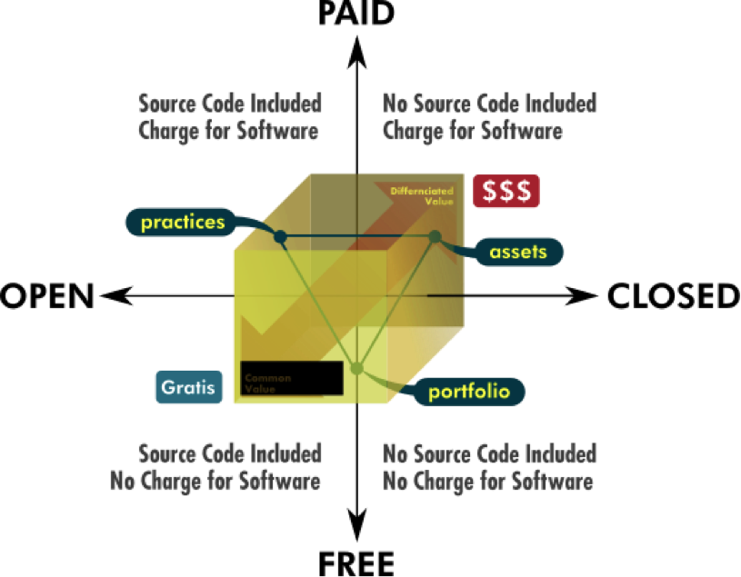
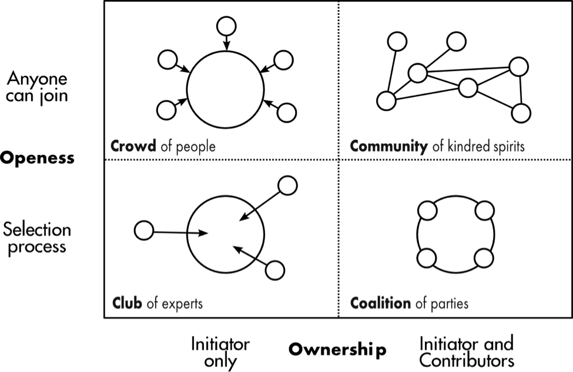

В апреле 2012 года фонд P2P Foundation выпустил доклад, ставший итогом масштабного пятилетнего исследования стремительно развивающихся распределённых тенденций в мировой экономике и культуре. Главной темой доклада стала горизонтализация производственных взаимоотношений, ставшая возможной благодаря коммуникационным сетям, в том числе Интернету. Несмотря на большое количество наблюдений и размышлений различных исследователей, рассмотревших и давших определения распределённому производству общественных ценностей, викиномике, краудсорсингу, открытым инновациям, потребительскому сотрудничеству и некоторым другим областям новых практик, для ясности картины не хватало полномасштабного анализа всех этих явлений как различных граней единого процесса глубокой трансформации общества.

Для этой трансформации обнаруживается две основные причины. Первая состоит в проявлении активной роли сообщества в предпринимательской практике. Проходят те времена, когда отдельные автономные корпорации поставляли товары изолированным друг от друга потребителям. Теперь экономические агенты глубоко взаимосвязаны в сетевые сообщества по обмену как информацией, так и произведённой продукцией. Вторая причина трансформации — следствия развития цифрового производства и возрастающей роли совместных усилий в производстве стоимости, делающие личную и корпоративную приватизацию интеллектуальной собственности если не совсем несостоятельной, то, по крайней мере, затруднительной и контрпродуктивной.

### Новая горизонтальность и диагональность

Новая экономика сотрудничества проявляется через Интернет. Первым аспектом новых форм вертикальных практик является постоянно расширяющаяся аудитория, получающая доступ к информации через множество различных устройств. Во многом это продолжение мира средств массовой информации и их экономики внимания, однако на этом пути не обходится без новаторских и даже разрушительных поворотов. К тому же аудитория теперь может отвечать. Люди могут реагировать, распространять свои реакции по всему миру и с всевозрастающей скоростью. Они могут декларировать свои намерения, давая почву для развития экономики намерения. Потребители теперь могут объединять свои намерения и получать все выгоды от образования всевозможных групп.

Важно, что теперь люди могут больше, чем просто общаться, как это происходит в расширяющемся мире социальных сетей. Они могут объединяться и формировать группы, а коммерческий мир может мобилизовать их возможности для открытых и распределённых инноваций, используя толпу в качестве особого ресурса. Соединяясь и обмениваясь, люди создают контент, фильтруют и распространяют его множеством новых путей.

Наиболее революционные перемены заключаются в том, что люди могут самоорганизоваться для создания общих ценностей, тем самым строя новую социальную систему совместного производства общественных ценностей и её институты. Новая вертикальность заключается в том, как существующие игроки рынка адаптируются, выживают и даже преуспевают в этой новой динамике. Новая горизонтальность — новая динамика и новые игроки возникающие через социальное взаимодействие, фактически целое новое институциональное поле. Новая диагональность — взгляд как на новые гибридные адаптации, которые случаются когда вертикаль встречается с горизонталью, так и на новых промежуточных игроков, которые могут возникнуть после того, как разрушительная неуправляемость сделает свою работу.

### Проявление логики горизонтального посредничества

Вновь проявляющаяся логика горизонтального посредничества предстаёт перед нами как три взаимосвязанных потенциальности, каждая из которых порождает новые практики взаимодействия, социальные запросы и адаптации копоративного мира.

- Логика интерактивности, где производители и потребители, медиа и их аудитория теперь имеют возможность постоянного взаимного диалога. Потребитель становится активным “просьюмером” (англ. prosumer, от producer + consumer). Запрос потребителей теперь виден непосредственно и экономическая логика начинает смещаться от экономики сбыта к экономике запроса.
- Логика одноранговой взаимосвязанности, где потребители/пользователи/читатели могут общаться друг с другом напрямую, без посредничества доминировавших прежде средств массовой информации. Просьюмер стал активным создателем пользовательской информации. В результате логика массовых медиа смещается к экономике внимания, ведомой вирусными эффектами, где горизонтальные рекомендации могут стать важнее, чем массовый маркетинг.
- Логика сотрудничества, где пользователи отныне могут объединять усилия для создания ценностей вне контроля прежде доминирующих игроков. Пользователь становится “продъюзером”, вовлеченным в распределенное производство стоимости. Сообщества, каждое со своим набором внутренних норм и правил, становятся действующими лицами, создавая ориентированную на ценности “этическую экономику”, в которой социальный эффект становится более важным ориентиром, чем накопление денег.

### Новые концептуализации бизнес-практик

- Экономика намерения, где взаимосвязанная аудитория может высказывать и обсуждать свои пожелания как друг с другом, так и с коммерческим миром. В такой экономике потребитель оповещает рынок и своем намерении что-то приобрести, а продавцы выполняют его продажей. [Публикация запросов на проведение мероприятий на Eventful.com], [китайский феномен коллективных закупок tuángòu].
- Экономика запроса, где гибкие открытые производственные платформы используют сетевые технологии для удовлетворения запросов взаимосвязанных сообществ, зачастую предоставляя возможности общественного взаимообмена и сотрудничества без использования рынка. Игроки такой экономики поддерживают интерес, вовлечённость и желание учиться у своей аудитории, предоставляя людям на периферии все необходимые инструменты и ресурсы для принятия на себя инициативы и творческого использования существующих возможностей.
- “Вирусная” экономика внимания, проявляющаяся как кульминация развития информационной экономики, где уже можно констатировать факт перепроизводства её основного товара — информации. Ценность теперь всё больше определяется естественно ограниченным ресурсом — человеческим вниманием, что порождает серьезную конкуренцию за него. Общественное мнение во всё большей степени определяется “звёздами”, привлекающими к себе максимальное внимание. Экономика внимания развивается также из неравноценности внимания, оказанного разными людьми. Правило таково, что чем большим капиталом внимания обладает человек, тем большей ценностью обладает его собственное внимание. Постепенно большей ценностью начинает обладать информация о вещах, нежели сами вещи.

На фоне давно сложившейся рыночной корпоративной логикой всё более явно провляется логика сообщества и человеческого участия. Участие людей в совместном создании добавленной стоимости играет всё большую роль и вот в чем это проявляется:

- Принцип работы социальных сетей и прочих шеринговых сервисов, где пользователи, группы и компании просто делятся информацией, уступает место принципу принципу совместного производства общей ценности.
- Простая фильтрация потока информации пользователями, как это происходит на общественных новостных площадках вроде [Digg] и [Slashdot], сменяется непосредственным созданием ими новых и усовершенствованием ими существующих информационных материалов.
- На смену исключительно товарному производству приходит коллективное создание общественного достояния, которое не может быть напрямую продано, но может стать средой для развития рынков, связанных с производными товарами и сопуствующими услугами.
- Всё чаще корпоративный контроль правил и условий взаимодействия уступает необходимости крупных компаний подстраиваться под сложившиеся внутри распределенных производственных сообществ правил, норм и процедур.
- Некогда резкая грань частной собственности активно размывается и проявляется множество новых промежуточных форм, при которых общественные ценности накапливаются в руках некоммерческих организаций или остаются личной собственностью участвующих лиц. Открытые лицензии в значительной степени меняют ландшафт рынков интеллектуальной собственности.

В среде распределённой экономики существующие бизнес-модели неизбежно видоизменяются, перестраиваясь на новые ценности способы функционирования:

- Внешняя денежная мотивация сотрудников сменяется внутренней позитивной само-мотивацией заинтересованных участников деятельности.
- Неповоротливая вертикальная структура корпоративного менеджмента сменяется общественными системами распределения заданий, модульной инфраструктурой задач, с взаимной перепроверкой и общественным утверждением результатов как гарантами качества.
- Частные знания и подчинение изобретательства руководству компаний теряют своё влияние на процесс инноваций, и открытая аккумуляция вкладов различных участников значительно ускоряет и расширяет технологическую эволюцию.

Недостижимые для централизованного корпоративного производства сферы активно осваиваются сетями общественного сотрудничества, формируя новую распределённую инфраструктуру для материального производства. Объединяясь вокруг обобществлённых технологических инноваций, небольшие игроки формируют новые сетевые экологии и предпринимательские коалиции, способные бросить вызов крупному капиталу. Процессы глобально-локальной взаимной координации наблюдаются в производстве знаний [Wikipedia](https://wikipedia.org) и программного обеспечения [Linux](https://lunux.org) и такая методология и экосистемы стремительно проникают в сферу материального производства [Arduino](https://www.arduino.cc/).

Небольшие локальные объединения людей могут обрести влияние в крупном масштабе в качестве узлов глобальной сети. Гибкие сетевые структуры, формируемые простыми, локальными, открытыми и взаимосвязанными (ПЛОВ) участниками оказываются наиболее приспособленными к сложным стремительно меняющимся современным условиям и активно формируют новые социотехнические системы: распределенную системную архитектуру. Сочетание глобальной базы знаний с локальным производством уже доказывает свою эффективность.

Существуют проекты, реализованные практически полностью без контакта с традиционными производственными структурами и опирающиеся на новую распределённую инфраструктуру. Штатив для телефона Glif собрал средства на краудфандинговой площадке Kickstarter, разрабатывался совместно с помощью сервиса 3D-печати Shapeways, продавается через сервис поддержки продаж Shopify, производится по запросу сервисом быстрого прототипирования Premier Source, оплачивается через агрегатор платежей Braintree и доставляется логистическим сервисом Shipwire.

Рассматривая корпоративный и кооперативный способы производства как противоположные полюса, можно построить шкалу экономических моделей по степени вовлечённости потребителей в производственный процесс.

- Модели с преобладающей ролью корпорации:
  - классическая потребительская модель,
  - самообслуживание (банкоматы, АЗС),
  - самостоятельная сборка (Икея),
  - корпоративный краудсорсинг (сотрудничество с публикой под контролем компании),
  - совместная разработка (сообщества пользователей активно развивают продукт внутри границ, заданных компанией).

- Модели с преобладающей ролью сообщества:
  - совместное создание (“просьюмер” выступает равным партнёром в разработка новых продуктов в то время как компания контролирует цепочку создания добавленной стоимости),
  - социальные сети (сообщества создают ценности на базе Web 2.0 платформ без особенного вмешательства их владельцев, однако владельцы определяют параметры и дизайн платформы и монетизируют “капитал внимания”, создаваемый пользователями),
  - распределённое производство в узком смысле (сообщества создают ценности на общей основе при поддержке компаний, которые пытаются создать сопутствующие потоки добавленной стоимости),
  - распределённое производство в сочетании с кооперативным производством (распределённые производители находят свои собственные способы монетизации),
  - сообщества распределённого производства или сообщества обмена (позиционируют себя полностью вне денежной экономики).

  
