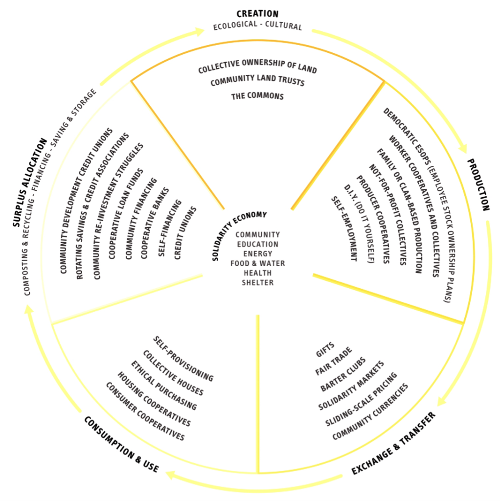

### Проявление совместного потребления

Причины перехода от потребления, подразумевающего личную собственность на продукты, к системам, предоставляющим продукты в качестве услуг, кроется во взаимодействии нескольких факторов. Среди движущих сил этой трансформации выделяют развитие технологий, в особенности сетевых, рост экологического самосознания, возрастание открытости людей к формированию сообществ, а также глобальный экономический кризис.

===

#### Культурный сдвиг

Пост-материалистские практики замещения владения предметами (нередко направленное на повышение статуса) доступом к ним в качестве услуги широко проявились в корпоративном мире в форме лизинговой экономики и находят пути проникновения в потребительский мир.

Взросление поколения Миллениума, цифровых аборигенов, социализирующихся посредством горизонтальной взаимосвязанности Интернета, значительно усиливает этот тренд, делая личность и общество куда более устойчивым перед лицом глобального экономического кризиса.

Повсеместно наблюдается тенденция дематериализации товаров, всё больше состоящих из битов и байтов, а не атомов и молекул. Практики обращения с информацией в сетевой среде неизбежно распространяются и на физические объекты, смещая приоритет от владения предметами к удобному и предсказуемому доступу к ним. Всевозможные ограничения по ремонту и внесению изменений в покупные товары постепенно приводят к деградации института частной собственности на товары. Отсутствие же права на модификацию в случае аренды и лизинга дополняется широкими возможностями по улучшению и персонализации продукции в рамках растущей отрасли производства с открытым исходным кодом. В глазах потребителя все большую ценность обретает не сам товар, а опыт его использования.

#### Драматичное снижение транзакционных издержек

Вторым двигателем раскрытия совместного потребления является значительное снижение транзакционных, координационных и коммуникационных издержек. Это снижение делает распределённые рыночные площадки и управление коллективными ресурсами намного более доступными, чем раньше. Так, например, ранние схемы обмена велосипедами, не находившие простого способа мониторинга и обнаружения велосипедов, часто страдали от вандализма. Внедрение дешевеющих геолокационных сенсоров и автономных устройств организации доступа решают подобные проблемы.

#### Война против мусора и неиспользуемых ресурсов

Третья причина развития коллективного потребления — экологическая, связанная с растущей осведомленностью и непосредственным столкновением с ограниченностью ресурсов. Через обобществление некогда частной инфраструктуры, например автомобилей, общество значительно повышает свою эффективность и устойчивость. Колоссальное количество отходов и простоев потребительского общества теперь можно снизить за счёт вторичной переработки и переиспользования свободных ресурсов.

Среднее время использования для более чем 50 миллионов электродрелей в США составляет от 6 до 13 минут за весь период их службы. 80% предметов в собственности используется реже, чем раз в месяц. Большинство пользователей Интернета проникаются практиками информационного сетевого обмена и готовы распространить эти практики и на физические вещи. Уже существуют библиотеки инструментов, сервисы по обмену инструментами, а также компании, предоставляющие разнообразные устройства в аренду. И эти практики только расширяют сферу своего применения.

Более половины энергии, потребляемой автомобилем за время службы, идёт на его производство и утилизацию, что делает попытки экономии при использовании личного транспорта малоэффективными. Действенным решением транспортного вопроса в городах становятся стремительно развивающиеся сервисы краткосрочной аренды автомобилей — каршеринг.

Всё более популярны становятся сервисы байкшеринга, предполагающие совместное использование общественных велосипедов. Sobi Social Bicycles разрабатывает систему обмена велосипедами без использования базовых станций, которую можно развернуть где угодно. Оснащение велосипедов GPS-метками решают важную проблему их распределения. Оператор определяет точки сбора и границы зоны действия сервиса. Если пользователь оставляет велосипед вне точки сбора, с него взимается плата. Эта плата публикуется на карте и следующий человек, который возьмет велосипед и вернёт его на точку сбора, получит эти средства на свой счёт. В случае оставления велосипеда вне зоны действия сервиса с него взимается повышенная плата для компенсации его возвращения.

#### Необходимость локальной устойчивости во времена экономических трудностей

Богатые люди давно осознали и пользуются преимуществами коллективного владения, создавая корпорации для совместного использования охотничих угодий и полей для гольфа. Теперь настало время сообществам простых людей среднего класса объединить усилия и средства для обеспечения устойчивого качества жизни в меняющихся условиях. Новая распределённая экономика развивается незамеченной централизованными финансовыми и правительственными силами. Эта сфера жизни развивается не из утопических идей и мечтаний, а в процессе практической итеративной адаптации бедняков и людей из беднеющего среднего класса к угнетающему ухудшению экологической и экономической обстановок.

#### Интересы бизнеса и инвестиции

Некоторые эксперты считают совместное потребление новым “мегатрендом”, сопоставимым по размаху с социальными сетями и поставкой данных в реальном времени. Многие крупные инвесторы уже вложили миллионы долларов во всевозможные стартапы и инициативы в этой области, уже успевшие доказать свои экономические перспективы.

### Типология шэринговых практик

- Системы продуктов-услуг, например байк- и каршэринг, построенные на “пользовательском мировоззрении”, где вы платите за пользу, получаемую от использования продукта, без необходимости лично владеть им.
  - Основанные на использовании, такие системы предполагают получение пользователями доступа к товарам, находящимся в собственности компании, через специализированные сервисы. Наилучшим образом подходят для товаров:
    - с высокими возможностями простоя (автомобили, домашняя утварь),
    - подверженные переменчивости моды (сумки и аксессуары),
    - временной необходимости (детские и подростковые товары).
  - Сервисы “продления жизни” товаров, актуальные для дорогостоящих или требующих особых компетенций для ремонта (электроника), а также для товаров, требующих частого обновления.
- Рынки перераспределения вроде Freecycle и Ebay используются для перераспределения бывших в употреблении вещей, кому-то не нужных, но подходящих для кого-то другого. Проявляются в разных формах:
  - крупные торговые площадки — Ebay, Craigslist, Flippid, Gumtree,
  - бесплатный обмен вещами — Freecycle, Kashless, Around again,
  - сайты обмена книгами — BookHopper, Thebookswap, Paperbackswap, Bookmooch,
  - сайты обмена детскими товарами и игрушками — Toyswap, thredUp, Swapitbaby, Swapkidsclothes,
  - обмен одеждой — Swapstyle, Clothing Exchange, 99Dresses, Big Wardrobe,
  - сайты мультимедиа обмена (фильмы, игры, музыка) — Swap, SwapSimple, Dig’n’swap.
- Совместный образ жизни вроде Couchsurfing и Lending club. Такие площадки позволяют делиться и обмениваться такими ценностями как время, пища, пространство, навыки и деньги. Примеров много:
  - коворкинги — Citizen space, Hub culture,
  - общественное кредитование — Zopa, Prosper,
  - общественные валюты — Ven, Quid, Timebank, LETSystems, SPICE Timebank,
  - одноранговые путешествия — Couchsurfing, Airbnb, Roomorama, Crashpadder.

####  Примеры шэринговых сайтов по категориям:

- Транспорт
  - RelayRides позволяет делиться своим автомобилем с другими и пользоваться образующейся распределённой транспортной системой,
  - Weeels превращает традиционные такси и личные автомобили в сетевую систему социального транзита,
  - Go Car Share — рынок свободных мест в автомобилях,
  - Park At My House предоставляет удобную и недорогую альтернативу парковкам,
  - Bcycle организует недорогую аренду общественных велосипедов в городе.
- Добрососедские практики
  - Hey, Neighbor! — социальная сеть, возвращающая старое доброе бесплатное одалживание вещей, собирающих пыть в гараже. Также можно обменяться любезностями вроде полива домашних растений во время отпуска.
  - NeighborGoods позволяет делиться вещами с соседями,
  - Rentoid — рыночная площадка для взаимной аренды вещей,
  - Frents — социальная сеть вещей, где люди выставляют свою собственность на виртуальные полки и определяют условия, на которых они готовы ими поделиться с кругом своих друзей или со всем сообществом,
  - SnapGoods направлен на то, чтобы сделать одалживание, аренду и опробование вещей стандартным потребительской возможностью и практикой,
  - RentCycle — портал для аренды,
  - Bid and Borrow — сайт, продвигающий устойчивое переиспользование существующих ресурсов
  - Sharehood.
- Энергия
  - One block off the grid
- Обмен навыками и услугами
  - TaskRabbit помогает найти оплачиваемую помощь среди соседей,
  - Skillshare — возможность учиться чему угодно у кого угодно со своей системой аккредитации
- Искусство и культура
  - Studio Share нацелен на серьезное снижение стоимости фотосъемок и создания музыки, делая создание общественных фото- и аудиостудий как можно более простым делом
- Путешествия
  - Airbnb соединяет людей со свободным пространством с теми, кто ищет себе место для ночлега или жизни. Компания проводит все платежи и собирает комиссию в размере 3 % с каждой сделки принимающей стороны, а также удерживая 6-12% с взноса гостя при бронировании.
  - Crashpadder — сеть жилья, позволяющая гостям экономить, хозяевам зарабатывать и всем находить новых друзей,
  - Vayable.com — сервис для того, чтобы разделить путешествие на яхте с кем-нибудь ещё.

### Совместное потребление = объединение

Совместное потребление показывает нам новый тренд в секторе материальной инфраструктуры, которые переосмысляются как системы снабжения, сочетающие системы продуктового сервиса и пользовательские сообщества. Это влечёт за собой сдвиг от изолированных рыночных потребителей, соревнующихся друг с другом за ограниченные личные ресурсы и предметы потребления, которыми им необходимо владеть, к инфраструктурам совместного доступа. В таком свете индивидуальная ограниченность видится как коллективное изобилие, к тому же по намного более низкой цене. Как следствие наблюдаются различные виды обобществления, связанные с различными решениями проблемы собственности и различными механизмами управления.

Наиболее наглядно эти различия можно увидеть в различных кар-шеринговых инфраструктурах:
- ZipCar — пример владения флотом автомобилей одним дружественным к сообществу коропоративным владельцем. Такой подход имеет преимущества реализации профессиональных стандартов обслуживания, но также и недостатки, заключающиеся в необходимости значительных инвестиций в централизованный флот.
- В одноранговом кар-шеринге корпоративная платформа выступает как посредник между отдельными владельцами автомобилей и теми, кто с радостью арендовал бы эти машины по мере необходимости. Для таких посредников уже нет необходимости в значительных предварительных инвестициях. Примеры: RelayRides, Whipcar, Wheelz, Getaround.
- Некоммерческие кооперативные каршеринги и подобные общественные инициативы ставят цель изменения водительских привычек выше прибыли. Примеры: City Car Share, PhillyCarShare, I-GO Chicago, Autolib.

Помимо вопросов собственности существует также деление по целям. Так, например, Airbnb — коммерческий гостиничный сервис, монетизирующий простаивающие пространства в частых домохозяйствах, в то время как Couchsurfing — корпорация, нацеленная на общее благо, дающая возможность безденежного обмена возможностями жилья.

Очевидно, что проявляющаяся экономика одноранговых транзакций намного менее видима, чем традиционная тщательно регулируемая гостиничная отрасль, и ставит трудные вопросы перед властями с точки зрения налогообложения, сходные с возникающими в сфере неформальной экономикой.

### Проявление гражданской и/или социальной экономики
#### Гражданская безденежная экономика обмена и раздачи

Шеринговая экономика часто понимается как монетизированное совместное потребление, но оно сосуществует с равно важным трендом к этически вдохновлённым экономическим практикам, сочетающим материальные выгоды с более ясными ценностными системами. Таким образом экономику обмена можно понимать и как гражданскую экономику, где граждане обмениваются ресурсами без монетизации, для целей добрососедства и взаимной поддержки на местном уровне.

Пример: ежемесячные встречи сообщества для обмена, где люди отдают и обменивают всё от домашнего яблочного варенья и авторских произведений искусства, до уроков музыки и сессий массажа. Такие обмены становятся весёлыми общественными событиями, часто включающими собираемые вскладчину еду, музыку и поделки. Еще пример: Freecycle — локальные группы почтовой рассылки, модерируемые волонтёрами, собирающие и распространяющие информацию о ненужных вещах, которые подписчики могут попросить и забрать у их владельцев совершенно бесплатно.

Еще пример: велокухни, широко распространяющиеся по всему миру. Большинство таких мастерских требуют небольшой платы за однодневный доступ или периодических членских взносов. Экологически ориентированные, они принимают ненужные велозапчасти, а также пожертвования от велосипедных компаний для продажи их по сниженной цене сообществу или в качестве “права покопаться” для более крупных велопроектов. Иногда устанавливается плоская плата за “строительство” целого велосипеда для покрытия расходов на инструктирование персонала, запчасти, рамы и т.д., колеблющаяся от 30 до 60 долларов или 6 часов волонтёрского труда. Мастерские готовы к бартеру, что позволяет вместо денег использовать личный труд и снижает барьеры доступа для самых разнообразных малообеспеченных групп населения. По этой причине некоторые велокухни и вовсе не прибегают к использованию денег (Collectivelo).

Кухни отличаются от обычных веломастерских тем, что вовлекают своих участников в обучение самостоятельному ремонту своих велосипедов, делая их самодостаточными механиками. Сотрудники-волонтёры могут направить или преподать определённые классы, но сама работа делается по методу обучения в процессе, что критично в освоении обслуживания и ремонта велосипедов. Для поддержания устойчивости мастерской участники набираются в качестве волонтёрского персонала, обучающего других независимо от уровня собственных навыков. Такие сотрудники велокухни любят своё дело, обожают велосипеды и стабильно появляются на еженедельных пятичасовых сменах. Нередко управление велокухней осуществляется непосредственно сообществом участников, что может быть не всегда наиболее эффективно, но способствует поддержанию здорового духа и стабильности целей организации.

#### Растущая социальная экономика и экономика солидарности

Во Франции, например, этот сектор состоит из 4 категорий деятелей: фондов, организаций взаимопомощи, кооперативов и ассоциаций, которые разделяют некоммерческие ценности и поддерживают друг друга в различных аспектах своей деятельности. Организации экономической солидарности — часть глобального движения к ориентации экономики на социальную справедливость и поэтому они часто добавляют социальные и политические цели в свои обоснования.

Факты о секторе кооперативного предпринимательства:
- 300 крупнейших кооперативов имеют ежегодные продажи свыше 1 триллиона долларов.
- Кооперативы нанимают 100 миллионов людей по всему миру, на 20% больше, чем транснациональные корпорации.

> “Более 800 миллионов людей по всему миру принадлежать к той или иной экономической сети. Кооперативы процветают во всех секторах современного общества, доказывая, что экономика раздачи — практическая экономическая модель. Они представляют альтернативу, основанную на общинной собственности, как для частного предпринимательства, так и для госкорпораций. 4 из 10 канадцев — члены кооперативов (в Квебеке — 70% населения). В США 25% популяции принадлежит хотя бы к одному из разнообразных кооперативов от кредитных союзов и пищевых кооперативов до крупных фирм вроде REI и Land O’Lakes diary. В Бельгии кооперативы отвечают за 20% рынка фармацевтики. В Бразилии 37% всей сельскохозяйственной продукции идёт от кооперативов. В Сингапуре они же отвечают за 55% продаж в супермаркетах. В Боливии 1 кредитный союз владеет 25% всех накоплений. В Корее и Японии более 90% фермеров состоят в кооперативах. В Кении кооперативы отвечают за 45% ВВП… “
>
> Jay Walljasper, “On the commons”:

