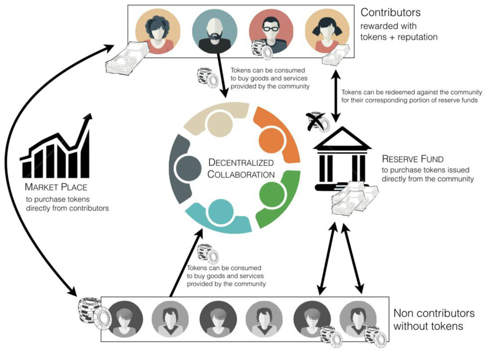

Предлагаем вашему вниманию перевод документа, описывающего прорывные идеи предложенного в 2016 году Матаном Филдом протокола децентрализованной кооперации на основе блокчейн-технологии. 

===

##  Децентрализованная кооперация

Недавние технологические разработки открывают новые и по большей части неисследованные формы человеческого взаимодействия и координации. Блокчейн создаёт новую технологическую инфраструктуру для возникновения Децентрализованной Кооперации (ДК) – это термин, который мы используем чтобы обозначать спонтанные вклады агентов, заинтересованных в достижении общих целей, совершаемые без центральной координации, наблюдения и управляющей власти. Примеров ДК множество: от децентрализованных платежных систем до взаимных страховок, от распределённых социальных сетей до децентрализованных музыкальных лейблов. И все же эти примеры – только вершина айсберга. Наше нынешнее понимание возможностей, которые предоставляют возникающие блокчейн-технологии можно сравнить с ранним периодом Интернета, когда никто не мог предсказать успех таких компаний как Facebook, Google или Airbnb.

Возникающие в пространстве блокчейна инициативы определяют значительные юридические, социальные и политические вызовы существующим институтам, включающим традиционные законодательные и регулирующие органы. При этом важно не забывать экономические преимущества, которые они влекут за собой. С блокчейном возможны новые формы создания и распределения ценностей через выпуск и передачу цифровых токенов. Хоть и находящиеся в своём младенчестве, по мере взросления новых экономических моделей, понадобятся инновационные решения чтобы понять, как эти токены могут поместиться в традиционных категориях правовой системы.

## Протокол

Backfeed находится на острие исследования и развития пространства ДК. Протокол Backfeed включает новые методы создания ценности как внутри сообщества ДК, так и снаружи между сообществом и третьими лицами. Они сопровождаются новой экономической моделью, опирающейся на формирование цифровых токенов, связанных с услугами, предоставляемыми ДК.

Для того, чтобы способствовать внедрению этих новых приложений, основанных на блокчейне, мы предлагаем общий обзор блокчейн-экосистемы, как это представляет Backfeed. Ключевая задача в этом усилии – описание и прояснение экономической модели, которая потенциально могла быть применена многими сообществами для развёртывания, управления, координации и поддержания деятельности децентрализованной кооперации. Эта экономическая модель изначально связана с жизненным циклом цифровых токенов ДК и состоит из трёх главных фаз, связанных с различными фазами эволюции ДК.

## Цифровые токены как доли

В соответствии с протоколом Backfeed в момент первичного запуска ДК человеком или группой людей автоматически возникает новый тип цифровых токенов, которые будут использоваться для вознаграждения помощникам за ценность, которую они предоставляют ДК.

В большинстве сегодняшних блокчейн-приложений цифровые токены получаются через операцию, описываемую как “копание руды”. **Майнинг** обозначает процесс, с помощью которого узлы децентрализованной сети делают вклад в её функционирование, а взамен вознаграждаются токенами сети. Сетевые токены обретают ценность также своей востребованностью для операций поверх сети ДК. Например, в сети Биткоин майнинг обозначает процесс подтверждения транзакций и добавления их в блокчейн. Процесс майнинга – хитроумный механизм, позволяющий ДК действовать автономно, без поддержки третьей стороны, через предоставление экономических стимулов людям делать вклад в работу ДК. А также он является средством, с помощью которого в сети выпускаются в циркуляцию новые токены.

На сегодня самый проверенный и широко используемый протокол консенсуса основан на алгоритме **PoW** (Proof of Work — «подтверждение работы»), который (статистически) вознаграждает узлы сети в соответствии с количеством вычислительных ресурсов, которые они инвестировали в сеть. Учитывая высокую стоимость PoW, наиболее заметную в терминах электроэнергии, разрабатываются альтернативные протоколы консенсуса, наиболее многообещающий из которых – протокол **PoS** (Proof of Stake — «подтверждение ставки»), который вознаграждает индивидуумов в соответствии с их вкладом в сеть. Оба алгоритма опираются на экономические стимулы (или антистимулы) чтобы гарантировать консенсус предсказуемо устойчивым путём, в котором они требуют от узлов сети инвестировать (или “профинансировать”) доказуемые ресурсы для влияния на консенсус. И все же, хотя и отличаясь по принципу работы, оба этих протокола консенсуса в конце концов опираются на агентов, предоставляющих алгоритмически исчислимые ресурсы, необходимые для фундаментальных операций сети (как, например, подтверждение транзакций в сети Биткоин).

Протокол Backfeed, как протокол консенсуса, включает аналогичный алгоритм, **PoV** (Proof of Value – «подтверждение ценности»). В противоположность существующим протоколам консенсуса между машинами, которые должны согласиться на объективную меру ценности, протокол Backfeed разработан для закрепления консенсуса между людьми, которые могут согласиться с субъективными мерами ценности. Как таковой алгоритм Подтверждения ценности отличает себя от двух предыдущих алгоритмов тем, что обобщает процесс майнинга до чего-угодно, что создаёт ценность для конкретной сети или сообщества. Он опирается на человеческое внимание и суждение в деле вознаграждения индивидуумов за действия, выходящие за рамки алгоритмически вычислимых компьютером.

Вне зависимости от используемого протокола консенсуса процесс майнинга представляет для ДК средство обеспечения первоначального притока вкладов через выпуск цифровых токенов в любой момент создания или добавления новой ценности. Эти токены распределяются внутри первичного сообщества участников, которые стойко верят в долгосрочный успех ДК и желают прикладывать для этого усилия. На этом этапе ценность токенов чисто спекулятивна, так как они могут пока не иметь никакого осязаемого применения. Это может быть обусловлено недостатком инфраструктуры или технических компонентов (и индивиды в этом случае будут вознаграждены за вклад этих недостающих частей) или недостатком критической массы участвующих узлов в сети (и ранние приверженцы при этом будут вознаграждены за добавление ценности работе сети). В любом случае ценность токенов ДК в конце концов зависит от будущего успеха ДК: если проект будет успешен в предоставлении ценного продукта, который привлечёт достаточное количество пользователей, то токены могут обрести реальную ценность (так как они нужны для получения удовольствия от продукта); в противном случае они могут полностью обесцениться. Как таковые, токены в течение этой фазы лучше всего описываются как доля, то есть они представляют долю участия в предприятии ДК. Как доля эти токены несут потенциальную ценность проекта и могут быть приобретены заинтересованными инвесторами (как у ранних участников, заработавших их, так и, как будет предложено после, напрямую у ДК).

> Необходимо заметить, что Подтверждение Ценности (и протокол Backfeed в целом) не ограничивается обеспечением консенсуса между людьми, также как и между машинами. Ключевая особенность протокола Backfeed в том, что он позволяет возникать и одновременно сосуществовать множеству ценностных систем, вместо требования выбора из нескольких предопределенных. Как таковое Подтверждение ценности (PoV) может применяться в равной степени для обеспечения консенсуса независимых ботов или агентов Интернета вещей, применяющих различные стратегии (и, как следствие, различные системы ценности).

На ранней стадии ценность токенов ДК относительно низка. Начиная с нулевой отметки, когда проект еще не более чем идея, ценность постепенно растет по мере материализации этой идеи во что-то более ощутимое с помощью первоначальных вкладов основателей.

С одной стороны, по мере взросления проекта большие предпосылки успеха с большей вероятностью привлекут новых участников (отличных от основателей), которые с помощью своих вкладов постепенно ещё увеличат вероятность успеха, а значит и воспринимаемую ценность, проекта, тем самым приводя к поступательному росту ценности токенов ДК.

С другой стороны растущая ценность токенов ДК в конечном счёте гарантирует более высокие вознаграждения для (наиболее ранних) участников, которые продают свои токены потенциальным инвесторам, желающим спекулировать на будущей ценности токенов. Эти растущие возможности быть вознагражденным будут привлекать больше участников, чьи вклады с большей вероятностью превратятся в будущую экономическую компенсацию.

Это порождает эффект снежного кома, когда чем большее количество людей делают свои вклады, тем больше становится воспринимаемая ценность проекта и он также становится более привлекательным для совершения вкладов остальными.

Этот механизм развертывания в чем-то похож на то, что происходит с обыкновенными стартапами. В стартап-компаниях ранние приверженцы — это, как правило, основатели, которые обычно работают месяцами без оплаты пока их усилия могут быть возмещены, также как мы часто видим в контексте ДК. Только когда стартап взрослеет и начинает извлекаться прибыль, компания может компенсировать труд своих работников — ситуация сходная с моментом, когда токены ДК обретают действительную применимую ценность и, следовательно, также рыночную ценность.

И все же полезно отметить различия между обычными стартапами и ДК: Раскрутка. Одна важная возможность, доступная ДК — это способность раскрутить себя без необходимости в получении предварительного финансирования. Для множества стартапов в фазе раскрутки бывает сложно привлекать людей вкладываться без какого-либо начального финансирования ( конечно, стартап всегда может обратиться к компенсации долями, этот механизм обычно применим для небольшого количества работников). В контексте ДК каждый индивид или группа индивидуумов, делающие свои вклады в проект, получают определенные доли в ДК. Это позволяет ДК стремительно расти, двигаясь от нескольких основателей к сотням и тысячам обособленных индивидуумов. Такая большая группа людей может легко завершить успешный проект с намного меньшими усилиями на каждого человека.

Управление. В дополнение к лучшей масштабируемости ДК в сравнении с обычными стартапами, ДК также намного более гибкая и динамичная в структуре управления: новые участники будут запускать непрекращающееся перераспределение власти, переходящей от основателей к новым участникам. Таким образом по мере времени ДК уже не будет контролироваться лично и исключительно горсткой основателей, а скорее станет субъектом динамики протокола Backfeed. Здесь стоит заметить, что в контексте ДК существует важное разделение между долями в управлении (репутация) и финансовыми долями (токены): в то время как и те и другие выпускаются по мере получения положительных результатов от новых вкладов, только последние могут быть переданы третьим лицам. Следовательно, в отличие от ситуации в обычных стартап-компаниях, где основатели как правило сдают контроль над компанией (долю в управлении) для получения финансирования от инвесторов, в ДК инвесторы могут только приобрести токены ДК. Доли в управлении невозможно приобрести, их можно только получить через активное участие во вкладах, создающих ценность. В результате контроль остается в руках участников (т.е. тех, кто вложился в действительную ценность ДК). Это не отменяет возможности инвесторам получить солидные доходы через покупку ранних токенов.

## Цифровые токены как предмет потребления

Фаза предмета потребления начинается когда ДК достигает определенной степени зрелости и начинает предлагать услуги, которые можно получить с помощью токенов ДК. Принимая во внимание то, что потенциально существует множество способов людям платить за услуги, есть важное требование для того, чтобы ДК извлек выгоды из данной экономической модели: доступ к услугам должен быть подлежать оплате только токенами ДК. В этой второй фазе помимо простой доли в проекте токены ДК приобретают реальную полезную ценность, т.е. они являются предметом потребления, необходимым для того, чтобы люди могли получить пользу от услуг, предоставляемых ДК. Следовательно, ценность токенов теперь зависит не от ожидаемого успеха ДК, но скорее от воспринимаемой ценности услуг, которые она предоставляет. Эта фаза, в определенной степени оправдывает усилия, которые ранние приверженцы вложили в ДК на ее ранних стадиях, а теперь они могут наслаждаться услугами ДК просто тратя токены, которые они накопили. Напротив, те, кто ещё не сделали свой вклад в ДК теперь имеют больший стимул к этому, ведь они могут немедленно использовать полученные токены для доступа к услугам ДК.

По мере совершенствования услуг ожидается, что все больше и больше людей (как внутри, так и снаружи ДК) захотят получить к ним доступ. Эти люди могут как сделать вклад непосредственно в ДК с целью накопления токенов, так и купить токены ДК у их настоящих держателей, т.е. у участников, кто накопил больше токенов, чем им в действительности нужно. Таким образом в итоге возникает новый рынок токенов ДК, с торговлей, основанной на равноправных сделках. Ценность токена крайне нестабильна на этой фазе, ведь рыночная цена в конце концов определяется законом спроса и предложения: чем больше число людей желает получить доступ к услугам ДК и чем меньше число людей, участвующих в ДК, тем выше будет рыночная стоимость (и наоборот). Следовательно, в дополнение к возможности получить доступ к услугам ДК в обмена на накопленные до этого токены, участники теперь имеют дополнительный экономический стимул делать вклады в ДК, так как они могут зарабатывать на продаже токенов третьим лицам.

Учитывая это важно отметить, что в целом рыночная цена токенов с большой вероятностью будет со временем расти, ведь чем больше людей будет делать вклады в ДК, тем выше будет качество ее услуг. В то же время, учитывая их растущее качество, больше людей будут хотеть получить доступ к этим услугам, тем самым создавая стимул либо к прямому участию в ДК (и, соответственно, дальнейшему улучшению ее услуг), либо к покупке токенов у других участников (чем еще более мотивируя их на дальнейшее совершенствование услуг с учетом новых возможностей экономического вознаграждения). Возникает цикл добродетели с растущим потоком вкладов, ведущих к растущему спросу на услуги ДК, что в свою очередь мотивирует больше и больше людей участвовать в ДК.

Экспоненциальный рост фазы продукта потребления подходит к концу по мере обретения услугой, предоставляемой ДК, зрелости. В этот момент участие необходимо только для поддержания и, периодически, улучшения услуги (например через поэтапные инновации). В то время как спрос на услугу склонен расти со временем (требующий расходования новых токенов ДК), нужда во вкладах поступательно уменьшается вместе с числом новых токенов, выпускаемых ДК.

Это может стать проблематичным при условии, что цена токенов ДК в итоге определяется рыночным спросом на услуги ДК и количеством токенов в обороте. Следуя законам спроса и предложения, в фазе насыщения цена токенов может быть склонна выстреливать вверх, чем давая возможность ранним приверженцам окупить свои вложения. Однако, это также делает действительно дорогим доступ к услугам тем, кто не участвовал в ранних стадиях развития ДК. Это тот момент, когда становится желательно чтобы ДК вмешался с целью регулирования рыночной цены токенов для избежания риска чрезмерной дефляции.

## Токены как валюта

В определенный момент после обретения услугами ДК зрелости, ДК может решить вмешаться и регулировать рынок своих собственных токенов, с целью способствовать интересам как членов, так и пользователей ДК. Как было объяснено выше, когда услуги ДК правильно развернуты и достигают некоторой устойчивой точки, где есть стабильная база пользователей, поставка новых токенов в систему становится очень ограниченной, приводящая к высокой волатильности цены токена по сценарию дефляции.

Для стабилизации рыночной цены токенов ДК может решить вмешаться и стать действительным эмитентом собственных токенов, не только для вознаграждения участников, но и на чисто монетарной основе. Мы представляем здесь модель (основанную на так называемом механизме частичного поддержания курса), которая может позволить токенам ДК принять на себя новую функцию, которая близка к той, что есть у существующих цифровых валют.

ДК определяет Верхний Предел (ВП) в соответствии с которым токены предлагаются обществу. В любой момент, когда рыночная цена становится выше определенного ВП, люди покупают токены непосредственно у ДК. ДК будет выпускать новые токены, чем увеличивая количество токенов в обороте и тем постепенно снижая рыночную цену до тех пора пока она не упадет ниже ВП.

В дополнение к определению потолка рыночной цены цифровых токенов с помощью ВП, этот механизм также выгоден допущением органического возникновения Нижнего Предела (НП) через укрепление растущего резервного фонда. Средства, полученные ДК в обмен на ее токены, аккумулируются в отдельном фонде, который может быть использован для обеспечения существующих токенов обычными фиатными валютами (или другими цифровыми токенами). Этот фонд следует схеме 100%-ного резервирования, таким образом:

НП = Ф/Т, где Ф — это количество средств в фонде, а Т — общее число токенов в обороте.

НП гарантирует минимальную ставку, по которой токены могут быть возмещены. Каждый раз, когда новые токены приобретаются у ДК, резервный фонд растет в соответствии с ВП, при том что каждый раз, когда токены возмещаются ДК, резервный фонд уменьшается в соответствии с НП. До тех пор пока ВП выше НП, рыночная цена токенов ДК вынуждена колебаться между этими двумя пределами: каждый раз, когда рыночная цена поднимается над ВП, люди покупают непосредственно у ДК, при том что каждый раз, когда рыночная цена падает ниже НП, люди будут продавать (или возмещать) свои токены напрямую в ДК. Кроме того, схема 100%-ного резервирования, поддерживаемая ДК страхует ее от панического изъятия вкладов: возмещение токенов не затрагивает НП, который уменьшается когда вкладчики вознаграждаются за свои свеже-отчеканенные токены.

>  Мы обсуждаем здесь наиболее простой вариант механизма частичного поддержания курса (т.е. фиксированный верхний предел). Другие более сложные варианты механизма частичного поддержания курса обсуждаются в Приложении.

По мере достижения продуктом полной зрелости покупка токенов на ВП становится основным источником новых токенов (потому что требуется меньше вкладов участников), в то время как выпуск токенов как результат участия в ДК падает. Со временем все больше и больше токенов покупаются напрямую у ДК, ДК накапливает больший объем фондов в своих резервах и значение НП постепенно достигает значения ВП. В этот момент токены ДК более не могут использоваться как спекулятивная инвестиция по мере приобретения свойств стабильной цифровой валюты, которая возмещается по фиксированной цене.

Важно заметить, все же, что экономическая модель, представленная здесь, является скорее предложением, чем общим и систематическим принципом работы ДК. Как правило ДК начинаются с фазы долей и в впоследствии достигают фазы продукта потребления в момент начала предоставления услуг обществу. Только некоторые в действительности достигнут достаточной зрелости чтобы войти в заключительную фазу, где токены превратятся в (более или менее стабильную) цифровую валюту.

## Механизм дивидендов

В предыдущем разделе мы описали то, как ценность токенов ДК (как цифровой валюты) может стабилизироваться и регулироваться ДК через определение верхнего предела (ВП), который, в связке с требованием 100%-ного резервирования, порождает органически возникающий нижний предел (НП). Этот механизм используется как средство ограничения колебаний обменных курсов. Это постепенно снижает волатильность токенов ДК в то же время увеличивая резервные фонды ДК и, как следствие, стоимость, по которой каждый токен может быть эффективно возмещен.

Однако, этот механизм также во что-то обойдется и настоящим держателям токенов. Для лучшего понимания этой цены важно различать два фундаментальных фактора, которые ведут к выпуску новых монет: вклады и покупки.

Выпуск токенов как результат новых вкладов, который ведет к увеличению общей стоимости ДК и, как следствие, ее токенов. В этом случае выпуск токенов разбавляет резервные фонды (из-за требования 100%-ного резервирования), но не влияет на стоимость отдельного токена, чья ценность будет расти в соответствии с общей стоимостью ДК. Выпуск токенов при покупке их у ДК, который увеличивает резервный фонд ДК, но также имеет эффект разбавления стоимости токенов ДК, чем причиняет ущерб настоящим держателям токенов. Более того, объявление ВП (который ниже текущей рыночной цены) может наложить ограничение на потенциальные прибыли настоящих держателей токенов, ведь гипотетическая рыночная цена в ином случае могла вырасти значительно больше.

Следовательно, чтобы стимулировать участие на ранних этапах, по этой причине желательно предложить средства для компенсации этой потери для держателей токенов. Протокол Backfeed справляется с этой проблемой использованием механизма «дивидендов», в котором на каждый новый токен, созданный ДК (не важно, в результате ли покупки токенов напрямую у ДК или вследствие сделанных новых вкладов в ДК) существующие держатели токенов получат маленький дивиденд для компенсации (потенциального) разбавления стоимости их токенов.

В обоих случаях, размер дивидендов рассчитывается в соответствии с особой процентной ставкой, которая может быть выбрана ДК независимо и в соответствии с ее специфическими потребностями. Да, можно допустить, что когда новые токены чеканятся как результат нового вклада, процентная ставка будет определяться членами ДК в соответствии с репутацией, которой они обладают в ДК (в зависимости от того, как она соотносится с воспринимаемой добавочной стоимостью, которую приносят ДК новые вклады). Вместе с тем, когда новые токены выпускаются в результате продажи напрямую ДК, процентная ставка может определяться теми, кто обладает финансовой долей в ДК (т.е. в соответствии с объемом накопленных ими токенов).

Не существует идеальной формулы для определения реальной процентной ставки. Это решение, которое необходимо принимать в каждом конкретном случае самой ДК с учётом её собственной специфики и потребностей. Да, важно отметить, что существует две конкурирующие динамики в долях: в то время как дивидендный механизм предназначен для снижения потерь, которые настоящие держатели токенов могут понести в результате выпуска новых токенов ДК, также верно и то, что чем выше будет процентная ставка, тем больше будет общее разбавление ценности этих токенов. В действительности в то время как покупки токенов в итоге увеличивают резервный фонд ДК, этот рост умаляется тем фактом, что дополнительные токены создаются и перераспределяются между предыдущими держателями токенов в форме дивидендов. Подобным образом, по мере того как новые токены постоянно выпускаются в качестве вознаграждений за вклады, каждый новый вклад, возмещенный ДК будет необходимо приводить к снижению нижнего предела, учитывая то, что те же резервные фонды должны будут подразделяться на большее количество токенов для сохранения требования 100%-ного резервирования. И такое разбавление становится сильнее в том случае если в дополнение к вознаграждениям участников новые токены будут выпускаться в форме дивидендов всем текущим держателям токенов.

Поэтому выбор правильной процентной ставки — деликатное решение, которое требует сбалансировать, с одной стороны, желание настоящих держателей токенов сохранить (и даже увеличить) ценность их сбережений и, с другой стороны, необходимость для ДК минимизировать инфляцию её собственных токенов. В случае вкладов ожидается, что стремление держателей токенов к прибыли будет сбалансировано снижением ценности токена из-за инфляции, создаваемой высокими процентными ставками и желанием членов ДК (тех, кто обладает репутацией в ДК вне зависимости от количества токенов, которыми они обладают) поддержать постоянный или растущий нижний предел.

В случае покупки токенов мы можем избежать снижения нижнего предела если процентная ставка выбрана в соответствии с данной формулой:

С < (П / Т) * (ВП-НП)/НП = Cmax, где С — процентная ставка, П — чисто покупаемых токенов, Т — общее число токенов и ВП и НП — верхний и нижний пределы соответственно. Это условие просто утверждает, что если выпускается больше токенов, чем было бы выпущено если бы покупка была на нижнем пределе цены, тогда нижний предел будет снижаться.

Нет нужды говорить, что инструменты, представленные здесь — это просто способы для ДК определить как компенсировать вклады ранних участников и инвесторов. Одна ДК может решить выплачивать дивиденды только когда покупаются токены, а другая может предпочесть выплачивать дивиденды только когда вознаграждаются новые вклады, или вовсе не использовать ни одну из этих опций.

Обзор динамики модели Жизненный цикл ДК складывается из соотношения трёх фаз, описанных выше. Однако, эти три фазы, будучи различными по своей природе, в действительности сосуществуют в более широкой экосистеме, где один и тот же токен принимает разные функции в зависимости от контекста, в котором он применяется.

В общем случае, токены ДК могут быть получены тремя разными способами, а именно:

*     те, кто делают вклад в ДК вознаграждаются токенами в соответствии с ценностью, которую они добавляют,
*     те, кто не делал вклада, могут приобрести эти токены у участников на рынке,
*     или, если ДК предлагает свои токены по определенной цене, они могут приобрести токены напрямую у ДК.

Ценность токенов ДК можно связать с тремя различными факторами, а именно:

*     их реальная потребительская стоимость, которая зависит от воспринимаемой ценности услуг, предоставляемых ДК,
*     их рыночная цена, которая колеблется в соответствии с настоящей и ожидаемой потребительской стоимостью токена,
*     цена, по которой они могут быть возмещены в ДК фиатной валютой или цифровыми токенами.

## Жизненный цикл ДК

Наиболее заметным аспектом этой модели является то, что она открывает возможность запуска новых организаций, проектов или инициатив без необходимости в первоначальном финансировании. В первой фазе модель делает возможным отдельным участникам, которые вкладывают свой труд в ДК, накопить токены в прямой пропорции с ценностью, которую они вложили в него. Изначально эти токены представляют долю в капитале ДК, чья ценность неразрывно связана с вероятностью ее успеха. Во второй фазе токены ДК получают реальную рыночную стоимость, которая в конечном счёте зависит от воспринимаемой, т.е. субъективной ценности услуг, предоставляемых ДК. В этом контексте ожидается стабильный рост стоимости токенов, так как все больше людей втягивается в участие в ДК, чем дополнительно улучшая качество качество предоставляемых услуг. И, наконец, в последней фазе стоимость токенов может кристаллизоваться в более объективную стоимость, как следствие решения ДК установить потолок цены (или верхний предел), на котором она начнет продавать токены.

С течением времени токены ДК в конце концов становятся обеспеченными определенным количеством фиатной валюты или цифровых токенов, тем самым завершая жизненный цикл ДК. Эта последняя фаза в действительности есть самый инновационный и интересный аспект модели, ведь она позволяет токенам быть использованными как реальное хранилище ценности, прямо как любая другая валюта. Однако, насколько нам известно, ни одна из ДК существующих на данный момент не экспериментировала с последней фазой модели, которая на данный момент проверена только теоретически.

Чтобы завершить описание модели, мы должны также проанализировать как эти разные фазы соотносятся с риском, который индивидуумы готовы понести. Фаза долей подходит только для наиболее рискованных индивидов, т.е. основателей или пионеров, т.к. она включает высокий риск провала, хотя и с возможными высокими доходами в случае успеха. Ожидается, что эта фаза будет продвигаться только относительно небольшим числом визионеров и крепких духом участников. Далее, фаза товара потребления наиболее подходит ранним приверженцам наравне с более или менее заинтересованными пользователями. Здесь уровень риска, также как и возможных доходов, поступательно снижается со временем по мере постепенной материализации проекта во что-то более конкретное, имеющее реальную потребительскую стоимость. И, наконец, валютная фаза, вытекающая из механизма частичного поддержания курса необходима для наименее рискованных индивидов, например вовлекающихся в проект как при найме на обычную работу, осознавая, что они могут возместить эти токены обычными фиатными деньгами (как зарплату). Третья фаза поэтому крайне важна для обеспечения возможности повсеместного распространения ДК, т.к. только стабильный запас стоимости будет мотивировать людей делать вклады даже если они не разделяют видения или просто не могут увидеть его как успешную инвестицию.

## Навстречу многообразию систем ценности

За несколько последних лет мы стали свидетелями значительного числа инноваций в финансовом секторе, в основном в результате растущей популярности Биткоина, первой децентрализованной криптовалюты. Приход Биткоина поставил под вопрос традиционные концепции ценности и открыл двери для большой доли экспериментирования в контексте монетарного производства и взаимообмена. Люди начали понимать, что монолитное видение денег как «творения Государства» может оказаться не актуальным по мере того как альтернативные валюты с легкостью создаются каждым и разработаны чтобы лучше подходить их собственным представлениям о ценности.

Инновационность Биткоина по сравнению с традиционными монетарными системами была ограничена введением децентрализованной валюты и платежной системы, не управляемой никаким государством или правительством. Система ценностей, зашитая в сети Биткоина, при этом, очень похожа на традиционную рыночную систему. В модели, которую мы предлагаем, каждая ДК может запустить свои собственные токены, представляющие ценностную модель, органически возникающую по мере становления ДК. Некоторые ДК могут больше ценить эффективность, чем креативность или инновации, другие могут предпочитать честность или равенство продуктивности — хотя большинство будут включать смесь различных ценностей, объединенных в особой ценностной системе. В этом смысле каждый набор токенов ДК — это выражение как минимум двух вещей:

*     особых концепций ценности, характеризующих ДК и определяющих сколько токенов выпустит ДК и для кого, и
*     ценности, предоставляемая ДК в контексте более широкой экосистемы, которая будет определять обменный курс между токенами ДК и фиатной валютой или другими цифровыми токенами.

Следовательно, в более широкой перспективе, по мере возникновения из различных ДК разнообразия ценностных систем, мы можем представить целую экосистему взаимодействующих ДК, каждую со своим собственным набором токенов, которые отражают широкое разнообразие систем ценностей, обеспечивая друг друга в соответствии с тем, насколько ими востребованы услуги друг друга.

По мере возникновения экосистемы, может сложиться такая ситуация, когда определенная ДК вместо поддержания своих резервных фондов в обычной фиатной валюте может обратиться к другой, вероятно, более сложившейся ДК, чти услуги высоко востребованы или, возможно, просто соответствует потребностям других ДК. Динамический обменный курс таким образом устанавливается между различными типами токенов в зависимости от относительной ценности соответствующей ДК в общей экосистеме. Это может привести со временем к формированию многовекторного рынка токенов ДК, который однажды может превратиться в замкнутую вселенную экономических транзакций, в конце концов делая возможным людям совместно обходиться без фиатной валюты.
