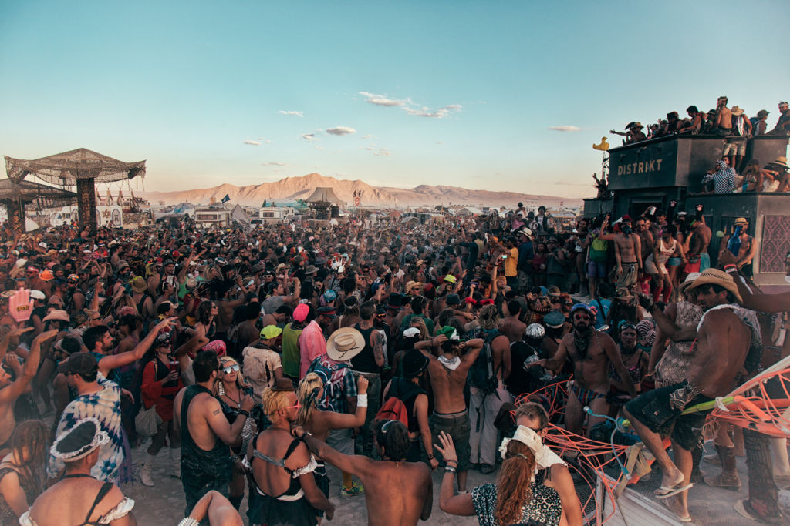
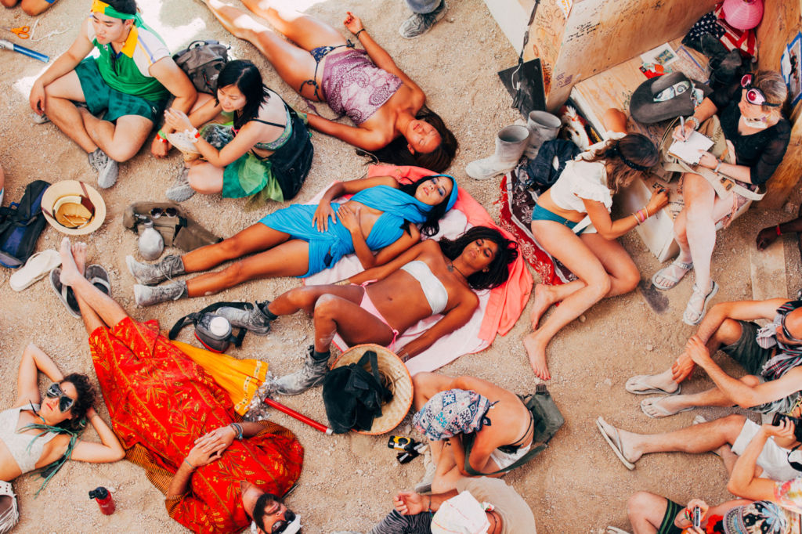

Основатель ежегодного события в пустыне Ларри Харви написал эти 10 принципов в 2004 году в качестве ориентиров для вновь сформировавшейся региональной сети. Они были созданы не как указания людям как им быть и действовать, но как рефлексия этоса и культуры сообщества которая органически развивалась с момента зарождения события. 

===

1.     **Всеобщее вовлечение.** Каждый может быть частью Burning Man’а. Мы уважаем и рады принять любого человека. Не существует никаких обязательных требований для участия в нашем сообществе.
2.     **Дарение.** В основе Burning Man’a – акт дарения. Ценность дара безусловна. Дарение не предполагает возврата или обмена на что-либо равноценное.
3.     **Отсутствие коммерческого начала.** Чтобы сохранить дух дарения, наше комьюнити стремится создать социальную среду, свободную от коммерческого спонсорства, транзакций или рекламы. Мы защищаем нашу культуру от подобной эксплуатации. Мы настаиваем на замене потребления опытом соучастия.
4.     **Радикальная опора на себя.** Burning Man вдохновляет человека обнаруживать, совершенствовать и использовать в качестве опоры свои внутренние ресурсы.
5.     **Радикальное самовыражение.** Радикальное самовыражение происходит из уникальных даров участника. Никто кроме самого участника или творческой группы не может определять содержание того, что предлагается в качестве дара другим. Поэтому, дарящий должен уважать права и свободы принимающего дар.
6.     **Совместная работа.** В нашем сообществе ценятся кооперация и сотрудничество. Мы стремимся создавать, поддерживать и защищать социальные образования, публичные пространства, произведения искусства и методы коммуникации, которые поддерживают такие взаимодействия.
7.     **Гражданская ответственность.** Мы ценим гражданское общество. Члены сообщества, которые организуют события принимают на себя ответственность за общественное благополучие и стараются уведомить участников об их гражданской ответственности. Также они обязаны следить за соблюдением локальных, федеральных и государственных законов.
8.     **Не оставляй следа.** Наше комьюнити бережно относится к природе. Мы никогда не оставляем никаких физических следов нашей активности, где бы мы ни собирались. Мы убираем все, и, по возможности, стараемся оставить после себя место в лучшем состоянии, чем оно было до нас.
9.     **Участие.** Наше сообщество привержено этике радикального включения. Мы верим, что трансформация, происходящая с человеком или социумом, возможна только через активное персональное участие. Мы достигаем существования — деланием. Все приглашены работать. Все приглашены играть. Мы делаем мир реальным через действия, открывающие сердца.
10.     **Непосредственность.** Непосредственный опыт – один из самых важных постулатов нашей культуры. Мы стремимся преодолевать барьеры, отделяющие нас от понимания нашего внутреннего “я”, реальности окружающих, участия в обществе и контакта с миром природы, превосходящим человеческие силы. Никакая идея не заменит этого опыта.

